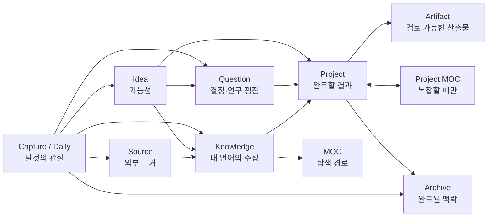
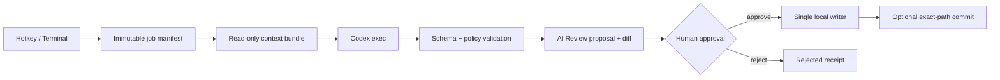

# KnowledgeOS: 개인용 Obsidian Vault 구현 청사진

> 문서 상태: 구현 기준안 2.0  
> 기준일: 2026-09-07  
> 기본 시간대: Asia/Seoul  
> 주 사용 환경: MacBook Air, iPhone, iPad, GitHub, Working Copy  
> 장기 운영 환경: 클램셸 Mac 또는 상시 실행 Mac mini  
> 상세 기술 부속서: `OBSIDIAN_VAULT_WHITEPAPER.md`

## 0. 이 문서의 지위

이 문서는 다음 세 대화에서 드러난 사용자의 실제 의도를 하나의 구현 계약으로 통합한 최상위 청사진이다.

- 옵시디언 구조 설계: PARA-lite, Evergreen/Zettelkasten, 가벼운 지식 그래프, Hybrid RAG의 역할 분리
- 옵시디언 LLM 자동화 설계: CLI 중심 엔진, Obsidian 단축키, 모바일 Shortcuts, preview-first 승인
- 모바일 옵시디언 사용성 정의: iPhone은 포착, iPad는 읽기·보완, Mac은 의미 결정

`OBSIDIAN_VAULT_WHITEPAPER.md`는 파일 쓰기, 승인, 해시, 플러그인 감사, launchd 같은 저수준 구현의 기술 부속서로 사용한다. 두 문서가 충돌하면 다음 순서로 해석한다.

1. 이 청사진의 사용자 경험, 노트 타입, 디렉터리, 장치 역할, Git bridge 결정
2. `blueprint/blueprint.yaml`의 기계 판독 계약
3. 기존 white paper의 보안·트랜잭션·검증 세부사항

구현 Codex는 세 파일을 모두 읽어야 한다. 기존 white paper만 읽어 범용 Vault를 만들면 안 된다.

---

# Part I. 무엇을 만드는가

## 1. 제품 정의

이 Vault는 자료를 많이 쌓는 창고가 아니라, 다음 세 질문에 매일 답하는 개인 운영체제다.

1. 지금 가장 밀어야 할 프로젝트는 무엇인가?
2. 무엇을 결정하지 못해 진행이 멈춰 있는가?
3. 오늘 포착하거나 정리해야 할 것은 무엇인가?

장기적으로는 원문, 근거, 내 해석, 결정, 산출물을 연결해 다음 용도로 재사용한다.

- 프로젝트 실행과 다음 행동 관리
- 주장과 근거가 분리된 장기 지식 축적
- 과거 결정과 맥락의 회수
- Vault 전체를 대상으로 한 근거 있는 LLM 질의
- 미래의 로컬 데이터베이스·RAG·GraphRAG 입력

## 2. 하나로 통합하는 네 계층

서로 다른 지식관리 이론을 한 폴더 규칙으로 섞지 않는다. 각 이론은 서로 다른 질문을 담당한다.

| 계층 | 담당 질문 | 구현 |
|---|---|---|
| PARA-lite | 지금 이 정보는 어떤 행동 맥락에 속하는가? | Projects, Areas, Knowledge, Archive |
| Evergreen/Zettelkasten | 장기 보존할 생각은 무엇인가? | 하나의 중심 주장, 안정 ID, 근거·반례·적용 |
| 가벼운 지식 그래프 | 노트끼리 어떤 의미 관계가 있는가? | typed relation Properties와 wikilink |
| Hybrid RAG | 나중에 어떤 근거를 찾아 답할 것인가? | lexical + vector + link expansion + cited answer |

핵심 규칙은 다음과 같다.

- 폴더는 주된 수명주기와 관리 책임을 나타낸다.
- `type`은 노트가 하는 일을 나타낸다.
- 링크와 관계 속성은 노트가 참여하는 여러 맥락을 나타낸다.
- 한 파일의 위치가 그 파일의 모든 의미를 결정하지 않는다.
- 검색·embedding·그래프 인덱스는 언제든 Markdown에서 재생성할 수 있는 파생물이다.

## 3. 장치별 역할

> iPhone은 포착하고, iPad는 읽고 보완하며, Mac은 의미를 결정한다.

| 작업 | iPhone | iPad | Mac |
|---|---|---|---|
| 생각·음성·URL 포착 | 주 역할 | 가능 | 가능 |
| 오늘의 핵심과 다음 행동 확인 | 주 역할 | 주 역할 | 주 역할 |
| 검색·참조 | 빠른 참조 | 주 역할 | 주 역할 |
| 짧은 문장 보완 | 제한적 | 적합 | 적합 |
| Inbox 1차 표시 | 보류·긴급 표시만 | 버림·보류·연결 후보 | 최종 분류 |
| 프로젝트 설계·결정 | 보기만 | 경량 검토 | 주 역할 |
| 태그·링크·폴더 정비 | 하지 않음 | 제한적 | 주 역할 |
| LLM 작업 | 요청·결과 확인 | 요청·결과 검토 | 실행·검증·적용 |
| Git 충돌 해결 | 하지 않음 | 하지 않음 | 주 역할 |

모바일 작업의 허용 기준은 “30초에서 10분 안에 끝나고, Vault 전체 구조를 이해하지 않아도 안전한가?”이다. 그렇지 않으면 `Mac에서 검토` 상태로 넘긴다.

## 4. 전체 정보 흐름



수명주기는 다음처럼 단방향으로 이해한다.

```text
포착 → 구분 → 연결 → 실행/숙성 → 검토 → 보존
```

자동화는 이 흐름을 대신 결정하지 않는다. 자동화는 후보를 만들고, 사람은 의미와 정본을 결정한다.

---

# Part II. 저장소와 Vault 디렉터리

## 5. 물리적 저장소 경계

Vault notes repository의 tracked root와 Obsidian Vault root는 논리적으로 같게 둔다. Mac에서는 `vault/.git`이 이 root에 직접 있다. iPhone/iPad에서는 Working Copy가 Git metadata를 자체 container에 보관할 수 있으므로, 반드시 같아야 하는 것은 **Working Copy의 linked external worktree root와 Obsidian Vault root**다. Mac 전용 자동화와 runtime은 별도의 control workspace에 둔다.

```text
KnowledgeOS/                       # Mac의 Codex control workspace
├── .git/                          # ops/docs용 control repository
├── AGENTS.md
├── README.md
├── docs/                          # 사람이 읽는 운영·결정 문서
├── ops/                           # 자동화 코드·정책·schema·prompt·test
├── runtime/                       # Mac 장치 로컬 queue·receipt·index·log
└── vault/                         # 별도 Git repository; 실제 Obsidian Vault
    ├── .git/                      # Mac clone에만 보임; mobile metadata는 Working Copy 내부일 수 있음
    ├── .vault-bridge/             # Git으로 장치 사이를 오가는 불변 메시지
    ├── Home.md
    └── ...
```

Mac control repository는 nested `vault/` repository를 일반 파일로 추적하지 않는다. submodule은 두 저장소의 commit을 함께 pin해야 할 명확한 필요가 생길 때만 도입한다. 기본은 nested independent repository이고, receipt가 `control_git_head`와 `vault_git_head`를 각각 기록한다.

이 경계를 택하는 이유는 다음과 같다.

- iPhone/iPad는 notes repository만 Working Copy에 clone하고 외부 worktree를 Obsidian에 link하므로 `ops/`와 `runtime/`이 Obsidian index에 들어오지 않는다.
- Obsidian Git과 Working Copy는 모두 같은 Vault Git root를 본다.
- 모바일 요청은 Vault 안의 숨은 `.vault-bridge/`로 전달하되, Mac의 lock·receipt·cache는 `runtime/`에 남는다.
- Codex는 Mac control workspace 안에서 Vault와 자동화 계약을 함께 읽을 수 있다.
- 자동화 code version과 note corpus version을 서로 독립적으로 복구할 수 있다.

현재 사용 중인 Git topology가 이 구조와 다르면 새 clone을 만들기 전에 additive migration plan을 작성한다. 기존 `.git`을 이동하거나 repository history를 재작성하지 않는다.

### 5.1 mobile baseline 설치 gate

각 iPhone/iPad에서 다음 순서를 한 번만 대화형으로 수행한다.

1. Working Copy의 Push와 Linked external repository를 사용할 수 있는 Pro unlock 상태를 확인한다.
2. iCloud Drive가 아닌 `On My iPhone` 또는 `On My iPad/Obsidian/KnowledgeOS`에 빈 local Vault를 만든다.
3. Working Copy에서 expected GitHub remote의 notes repository를 clone한다.
4. `Link Repository to Folder`로 clone의 external worktree root를 위 빈 Vault root에 연결한다. 외부 폴더 안에 `.git`이 보일 필요는 없다.
5. tracked sentinel `.knowledgeos-root.json`, expected remote fingerprint, branch를 확인한다.
6. device별 override folder를 `.obsidian-phone` 또는 `.obsidian-tablet`으로 지정하고 앱을 재실행한다.
7. 작은 fixture를 commit/push → Mac fetch/pull → mobile fetch/merge 순으로 왕복한 뒤에만 실제 capture를 시작한다.

같은 live Vault에 iCloud, Obsidian Sync, Dropbox류 file sync를 겹치지 않는다. Working Copy가 외부 파일 변경으로 혼란스러울 수 있으므로 Pull/Merge 전에는 Obsidian을 닫고, 완료 뒤 다시 열어 sentinel과 index를 확인한다. link가 끊기면 새 저장소를 만들거나 force sync하지 말고 동일 폴더를 다시 연결해 remote·branch·sentinel을 재검증한다.

`.knowledgeos-root.json`은 `schema_version: 1`, `contract_id: knowledgeos-vault-root-v1`, UUID v4 `vault_uuid`, `canonical_vault_name: KnowledgeOS`, `remote_identity_sha256`, `expected_branch`만 허용한다. GitHub remote는 credential·token·query·fragment를 제거한 뒤 SSH/HTTPS 표기를 모두 `github.com/<lowercase-owner>/<lowercase-repository>.git\n` UTF-8 bytes로 정규화하고 SHA-256한다. `vaultctl configure --interactive`가 사용자가 확인한 remote와 branch에서 이를 원자적으로 만들며, Mac과 각 mobile 장치가 같은 tracked bytes를 검증한다.

## 6. 전체 기준 트리

아래 경로가 새 구현의 canonical tree다. `YYYY`, `MM`, `PROJECT_NAME`, `JOB_ID`는 생성 시 계산하는 변수이지 literal 폴더명이 아니다.

```text
KnowledgeOS/
├── AGENTS.md
├── README.md
├── .gitignore
├── .gitattributes
├── docs/
│   ├── ARCHITECTURE.md
│   ├── OPERATIONS.md
│   ├── MOBILE.md
│   ├── RUNTIME.md
│   └── DECISIONS.md
├── vault/
│   ├── .git/
│   ├── .gitignore
│   ├── .gitattributes
│   ├── .knowledgeos-root.json     # repo/branch/schema 식별 sentinel
│   ├── .vault-bridge/
│   │   ├── README.md
│   │   ├── protocol/
│   │   │   ├── request.schema.json
│   │   │   └── response.schema.json
│   │   ├── requests/YYYY/MM/JOB_ID.json
│   │   └── responses/YYYY/MM/JOB_ID/NNNN-status.json
│   ├── Home.md
│   ├── Mobile.md
│   ├── 00_Inbox/
│   │   ├── Captures/YYYY/MM/
│   │   └── Imports/YYYY/MM/
│   ├── 01_AI_Review/
│   │   ├── Pending/YYYY/MM/
│   │   ├── Resolved/YYYY/MM/
│   │   ├── Rejected/YYYY/MM/
│   │   ├── Expired/YYYY/MM/
│   │   └── Conflict/YYYY/MM/
│   ├── 10_Journal/
│   │   ├── Daily/YYYY/MM/YYYY-MM-DD.md
│   │   ├── Weekly/GGGG/GGGG-[W]WW.md
│   │   └── Monthly/YYYY/YYYY-MM.md
│   ├── 20_Projects/
│   │   └── PROJECT_NAME/
│   │       ├── PROJECT_NAME.md
│   │       ├── Working/
│   │       └── Artifacts/
│   ├── 30_Areas/
│   ├── 40_Knowledge/
│   │   ├── Notes/
│   │   ├── Ideas/
│   │   ├── Questions/
│   │   ├── Sources/
│   │   └── People/
│   ├── 50_Maps/
│   ├── 60_Meetings/YYYY/
│   ├── 80_Assets/
│   │   ├── Inbox/
│   │   ├── Images/YYYY/MM/
│   │   ├── Documents/YYYY/MM/
│   │   └── Audio/YYYY/MM/
│   ├── 90_Archive/
│   │   ├── Projects/YYYY/
│   │   ├── Captures/YYYY/
│   │   └── Other/
│   ├── 99_System/
│   │   ├── Templates/
│   │   │   ├── T00_Capture.md
│   │   │   ├── T01_AI_Proposal.md
│   │   │   ├── T10_Daily.md
│   │   │   ├── T11_Weekly.md
│   │   │   ├── T12_Monthly.md
│   │   │   ├── T20_Project.md
│   │   │   ├── T21_Idea.md
│   │   │   ├── T22_Question.md
│   │   │   ├── T23_Artifact.md
│   │   │   ├── T24_Project_Note.md
│   │   │   ├── T30_Area.md
│   │   │   ├── T40_Knowledge.md
│   │   │   ├── T41_Source.md
│   │   │   ├── T42_Person.md
│   │   │   ├── T50_MOC.md
│   │   │   └── T60_Meeting.md
│   │   ├── Bases/
│   │   │   ├── Inbox.base
│   │   │   ├── Projects.base
│   │   │   ├── Decisions.base
│   │   │   ├── Ideas.base
│   │   │   ├── Knowledge.base
│   │   │   ├── Sources.base
│   │   │   ├── Review.base
│   │   │   └── Journal.base
│   │   ├── Dashboards/
│   │   │   ├── Tasks.md
│   │   │   └── Weekly_Review.md
│   │   ├── Schemas/
│   │   │   └── Property_Dictionary.md
│   │   ├── Scripts/
│   │   │   └── QuickAdd/
│   │   │       └── PrepareTitle.js
│   │   └── CSS/
│   │       └── dashboard.css
│   ├── .obsidian-mac/
│   ├── .obsidian-phone/
│   └── .obsidian-tablet/
├── ops/
│   ├── pyproject.toml
│   ├── uv.lock
│   ├── vaultops.toml
│   ├── config/
│   │   ├── plugins.yaml
│   │   ├── shortcuts.yaml
│   │   ├── commands.yaml
│   │   ├── command-ids.yaml
│   │   ├── local-models.yaml
│   │   ├── mobile.yaml
│   │   ├── bridge.yaml
│   │   └── quickadd-package.json
│   ├── actions/
│   │   ├── triage.json
│   │   ├── draft-note.json
│   │   ├── summarize.json
│   │   ├── link-suggestions.json
│   │   ├── normalize.json
│   │   └── answer.json
│   ├── schemas/
│   │   ├── note.schema.json
│   │   ├── job.schema.json
│   │   ├── proposal.schema.json
│   │   ├── receipt.schema.json
│   │   ├── bridge-request.schema.json
│   │   ├── bridge-response.schema.json
│   │   ├── triage-result.schema.json
│   │   ├── note-record.schema.json
│   │   ├── edge-record.schema.json
│   │   ├── retrieval-candidate.schema.json
│   │   ├── answer.schema.json
│   │   └── blueprint.schema.json
│   ├── prompts/
│   │   ├── system.md
│   │   ├── triage.md
│   │   ├── draft-note.md
│   │   ├── summarize.md
│   │   ├── link-suggestions.md
│   │   ├── answer.md
│   │   └── normalize.md
│   ├── policies/
│   │   ├── paths.yaml
│   │   ├── properties.yaml
│   │   ├── privacy.yaml
│   │   ├── redaction-patterns.yaml
│   │   ├── relations.yaml
│   │   ├── retrieval.yaml
│   │   └── generated-sections.yaml
│   ├── src/vaultops/
│   ├── launchd/
│   └── tests/
└── runtime/
    ├── staging/
    ├── queue/
    ├── quarantine/
    ├── running/
    ├── review/
    ├── awaiting_remote_authorization/
    ├── approved/
    ├── applying/
    ├── done/
    ├── failed/
    ├── conflict/
    ├── rejected/
    ├── expired/
    ├── runs/
    ├── receipts/
    ├── locks/
    ├── index/
    ├── cache/
    └── logs/
```

## 7. 폴더의 의미와 경계

| 경로 | 역할 | 금지 또는 종료 조건 |
|---|---|---|
| `00_Inbox` | 분류 전 원문·외부 입력 | 정식 지식 노트를 장기 보관하지 않음 |
| `01_AI_Review` | 모델이 만든 초안·변경안 | 정본으로 인용하지 않음 |
| `10_Journal` | 시간에 묶인 사건·로그·회고 | 장기 지식의 유일한 사본이 되지 않음 |
| `20_Projects` | 종료 조건이 있는 결과 중심 작업 | 완료·취소 뒤 해당 연도 Archive로 이동 |
| `30_Areas` | 종료일 없는 책임과 기준 | 책임이 사라지면 retired 처리 |
| `40_Knowledge/Notes` | 자기 언어의 주장·방법·모형 | 단순 북마크나 원문 덤프 금지 |
| `40_Knowledge/Ideas` | 아직 검증되지 않은 가능성 | 실행이 확정되면 Project 또는 Knowledge로 연결 |
| `40_Knowledge/Questions` | 결정·연구·문제의 열린 고리 | 답이나 결정이 생기면 closed/answered |
| `40_Knowledge/Sources` | 외부 근거와 서지 메모 | 인용·요약·내 해석을 구분 |
| `40_Knowledge/People` | 최소 관계 맥락 | 민감정보 최소화, AI 기본 deny |
| `50_Maps` | 사람이 큐레이션한 탐색 경로 | 자동 링크 덤프 금지 |
| `60_Meetings` | 의제·결정·후속 작업 | AI 기본 deny |
| `80_Assets` | 검증을 통과한 원본 binary | 직접 모델 수정 금지; OCR/text sidecar는 `00_Inbox/Imports`의 capture로 생성 |
| `90_Archive` | 끝난 맥락의 보존 | 자동 삭제 금지 |
| `99_System` | template, Base, schema, dashboard | 예약 LLM 쓰기 금지 |

`40_Knowledge/Ideas`는 떠오른 모든 생각을 바로 넣는 두 번째 Inbox가 아니다. Capture/Daily 원문에서 사람이 “계속 검토할 가능성”으로 채택한 것만 둔다. Project를 만든 뒤에도 Idea의 ID와 본문은 보존하고, 필요하면 status만 `promoted`로 바꾼다.

### 7.1 Project 폴더 규칙

프로젝트는 이전 범용안의 flat 파일보다 다음 구조를 사용한다.

```text
20_Projects/방명록 괴담 MVP/
├── 방명록 괴담 MVP.md
├── Working/
│   └── 플레이 루프 후보.md
└── Artifacts/
    └── MVP 설계서.md
```

- 폴더명과 프로젝트 루트 노트 basename은 같다.
- 프로젝트 루트 노트의 `type`은 `project`다.
- `Working/`의 일반 메모는 `type: project_note`다. 프로젝트 한정의 가변 문서이며, 장기 재사용 가치가 생기면 별도 Knowledge를 만들고 원문은 그대로 둔다.
- `Artifacts/`의 노트는 `type: artifact`이고 `projects`에 루트 프로젝트를 반드시 연결한다.
- project-local `project_note`와 `artifact`의 `projects`는 정확히 한 개이며, 파일을 포함한 bundle의 root Project로 resolve되어야 한다.
- 프로젝트 종료 시 폴더 전체를 `90_Archive/Projects/YYYY/`로 이동한다.
- archive된 project, project_note, artifact, project-local MOC도 같은 type과 ID를 유지하며, validator는 active 경로와 archive 경로를 모두 허용한다.
- 다른 프로젝트에서도 재사용하는 지식은 Project 폴더에 두지 않는다.
- Project MOC는 선택적이다. 작은 Project는 root note만으로 충분하며, 문서·쟁점·산출물의 탐색 경로가 복잡해질 때만 `Working/<PROJECT_NAME> MOC.md`를 사람이 만든다.

## 8. 파일명과 식별자

- 모든 정식 노트는 불변 lowercase UUID v4 `id`를 가진다.
- Daily, Weekly, Monthly, system dashboard에는 명세된 결정적 ID를 허용한다.
- 파일명은 사람이 읽는 제목을 사용하고, 외부 시스템은 경로가 아닌 `id`로 식별한다.
- Unicode는 NFC로 정규화한다.
- 대소문자 무시 APFS 충돌과 NFC/NFD alias를 중복으로 본다.
- 기존 파일을 자동 overwrite하지 않는다.
- 모바일 capture는 충돌이 거의 없도록 timestamp, device slug, short ID를 포함한다.

권장 패턴은 다음과 같다.

| type | 패턴 |
|---|---|
| mac_capture | `YYYYMMDD-HHmmss 제목.md` |
| mobile_capture | `YYYYMMDD-HHmmss-device-uuid8.md`; 사용자 제목은 `capture_label`에 보존 |
| project root | `PROJECT_NAME/PROJECT_NAME.md` |
| idea, question, knowledge, area, person | `제목.md` |
| source | `대표저자 (연도) — 짧은 제목.md` |
| artifact | `PROJECT_NAME/Artifacts/제목.md` |
| meeting | `YYYY-MM-DD — 제목.md` |
| moc | `주제 MOC.md` |

### 8.1 path namespace 변환

경로 표현은 경계별로 하나만 사용한다.

| 경계 | namespace | 예 |
|---|---|---|
| Obsidian, Working Copy, `.vault-bridge` | Vault-relative | `00_Inbox/Captures/x.md` |
| Mac control workspace의 internal job/policy | control-root-relative | `vault/00_Inbox/Captures/x.md` |
| runtime artifact | runtime-relative | `runs/JOB_ID/proposal.json` |

bridge ingest가 Vault-relative path를 검증한 뒤 control-root-relative path로 한 번만 변환한다. 문자열 prefix를 단순 연결하지 않고 resolved root containment, symlink, NFC, case-fold collision을 다시 검사한다. receipt에는 원래 transport path와 normalized internal path를 모두 기록한다.

---

# Part III. 노트 데이터 계약

## 9. 공통 Properties

Markdown 본문과 평평한 YAML Properties가 유일한 정본이다.

| 키 | 타입 | 규칙 |
|---|---|---|
| `schema_version` | number | 초기값 1 |
| `id` | text | 불변 UUID v4 또는 명세된 결정적 system ID |
| `type` | text | type registry의 값 |
| `title` | text | 파일 basename과 동일 |
| `status` | text | type별 enum |
| `created` | datetime | ISO 8601, offset 포함 |
| `modified` | datetime | schema-aware writer가 frontmatter를 쓴 시각 |
| `aliases` | list | 없으면 `[]` |
| `tags` | tags | type/status를 중복 태그로 쓰지 않음 |
| `sensitivity` | text | `public`, `personal`, `confidential` |
| `ai_policy` | text | `remote_ok`, `ask`, `local_only`, `deny` |
| `ai_status` | text | `idle`, `queued`, `proposed`, `approved`, `applied`, `conflict`, `error` 계열 |

실제 최근 수정 정렬은 `modified`가 아니라 Obsidian `file.mtime` 또는 OS mtime을 사용한다.

## 10. 맥락과 typed relation Properties

관계는 tags가 아니라 quoted wikilink list로 기록한다. projection에서는 관계를 두 class로 분리한다. 아래 §10.1의 여섯 맥락 속성은 `edge_kind: context`, §10.2의 일곱 의미 predicate는 `edge_kind: semantic`이다. 본문의 일반 wikilink는 `notes.jsonl.wikilinks`에만 두고 typed `edges.jsonl`에 섞지 않는다.

### 10.1 맥락 관계

| 키 | 의미 | 대상 |
|---|---|---|
| `projects` | 이 노트가 기여하는 프로젝트 | project |
| `areas` | 유지 책임 | area |
| `topics` | 탐색 지도 | moc |
| `sources` | 직접 근거 | source |
| `people` | 관련 인물 | person |
| `related` | 의미를 더 구체화하지 않는 연결 | any |

### 10.2 의미 관계

| 키 | 방향의 의미 | 예 |
|---|---|---|
| `supports` | 이 노트가 대상 주장을 지지 | Source/Knowledge → Knowledge |
| `contradicts` | 이 노트가 대상 주장과 충돌 | Source/Knowledge → Knowledge |
| `explains` | 이 노트가 대상 개념·질문을 설명 | Knowledge → Knowledge/Question |
| `applies_to` | 이 원리가 대상 실행 맥락에 적용 | Knowledge → Project/Idea |
| `derived_from` | 대상 원문·아이디어에서 파생 | Idea/Question/Knowledge/Project/Artifact/Source → Capture/Journal/Source/Idea/Meeting |
| `implements` | 이 프로젝트가 대상 아이디어를 구현 | Project → Idea |
| `raises` | 이 노트가 대상 질문을 제기 | Idea/Knowledge/Project → Question |

관계는 우선 단방향 정본으로 둔다. inverse relation을 모든 파일에 자동 복제하지 않는다. backlinks와 로컬 index가 역방향을 계산한다. `supported_by`, `raised_by` 같은 역방향 별칭이나 `uses`, `produces` 같은 비정규 predicate를 자동으로 새 enum에 추가하지 않는다. canonical 방향으로 안전하게 변환할 수 없으면 `related` 후보로 남긴다. `derived_from`은 가능하면 `"[[2026-09-07#^seed-1]]"`처럼 heading 또는 block locator까지 포함해 원문 조각을 가리킨다.

모델이 만든 관계는 사람 승인 전에는 proposal JSON에만 `provenance: ai_proposed`와 confidence를 가진다. 승인된 관계만 source note의 평면 relation list에 들어간다. 정본 relation item에는 모델 confidence나 장치 로컬 receipt 상태를 넣지 않는다. canonical `edges.jsonl`의 provenance는 항상 `canonical_property`이고, `source_locator`는 `frontmatter.<predicate>[index]`, `object_locator`는 wikilink의 heading/block fragment 또는 null로 결정론적으로 만든다. 어느 proposal이 edge를 만들었는지는 local receipt의 audit overlay로 조회하되, fresh clone의 canonical projection 결과를 바꾸지 않는다.

## 11. type registry

| type | 위치 | status | 핵심 추가 속성 |
|---|---|---|---|
| `capture` | Inbox, Archive/Captures | unprocessed, triaged, discarded | captured_from, capture_device, capture_kind, triage_hint, needs_desktop_review |
| `proposal` | AI_Review | pending, approved, applied, rejected, conflict, expired | proposal_id, source_hashes |
| `daily` | Journal/Daily | open, closed | period_start, period_end |
| `weekly` | Journal/Weekly | open, closed | period_start, period_end |
| `monthly` | Journal/Monthly | open, closed | period_start, period_end |
| `project` | Projects/NAME/NAME.md | planned, active, blocked, done, cancelled | outcome, focus_rank, priority, next_action, target_date |
| `project_note` | Projects/NAME/Working | draft, active, superseded, archived | projects, note_kind |
| `artifact` | Projects/NAME/Artifacts | draft, review, final, deprecated | artifact_kind, projects |
| `area` | Areas | active, paused, retired | standard, review_cadence, next_review |
| `idea` | Knowledge/Ideas | seed, incubating, testing, promoted, parked, dropped | possibility |
| `question` | Knowledge/Questions | open, deciding, answered, deferred, closed | question_kind, decision, decision_by |
| `knowledge` | Knowledge/Notes | seed, developing, evergreen, deprecated | claim, confidence, last_reviewed |
| `source` | Knowledge/Sources | queued, reading, processed, archived | source_kind; processed/archived는 source_url, asset, derived_from 또는 citation_key 중 최소 하나 |
| `person` | Knowledge/People | active, inactive | organization |
| `moc` | Maps | active, retired | scope |
| `meeting` | Meetings | scheduled, held, cancelled | meeting_at, attendees |
| `home` | Home.md, Mobile.md | active | purpose, audience |
| `system` | System Markdown | active, deprecated | purpose |

### 11.1 실행을 막는 Question

Home의 `Needs a decision` 영역에 나타나려면 다음 조건을 모두 만족해야 한다.

```text
type = question
status in [open, deciding]
question_kind = decision
decision is not empty
```

`related_project`라는 별도 단일 속성을 만들지 않고 공통 `projects` list를 사용한다. 하나의 질문이 여러 프로젝트에 영향을 줄 수 있기 때문이다. `decision_by`는 선택값이며, 날짜가 있는 결정은 먼저 날짜순으로, 없는 결정은 뒤에서 `priority`와 제목순으로 정렬한다. 연결된 Project의 blocked 상태는 경고 column이지 inclusion 조건이 아니다. `focus_rank`는 1 이상의 정수로 이번 운영 주기의 집중 순서를 뜻하고, `priority`는 `high`, `medium`, `low` 중 하나다. active/blocked project에는 `focus_rank`와 `next_action`이 필수다. focus rank가 중복되면 warning이며 Home은 낮은 숫자부터 최대 세 개만 보여 준다.

## 12. 최소 템플릿 계약

아래는 새로 추가하거나 수정해야 할 핵심 템플릿의 의미 구조다. 모든 실제 템플릿은 §9의 공통 Properties를 포함한다.

### 12.1 Capture

```markdown
# 제목

## 원문

수정하지 않은 입력을 여기에 둔다.

## 맥락

- 포착 위치:
- 왜 저장했는가:

## Triage

- [ ] 버림
- [ ] 행동
- [ ] 아이디어
- [ ] 질문
- [ ] 프로젝트
- [ ] 출처
- [ ] 지식
```

### 12.2 Daily

```markdown
# YYYY-MM-DD

## 오늘의 3가지 결과

## 생각의 씨앗

### 관찰

### 질문

### 가능성

## 읽고 본 것

## 연결

- 관련 프로젝트:
- 새로 만들 후보: Idea / Question / Knowledge / Source

## 작업과 로그

## 하루 닫기

- Inbox로 분리할 조각:
- 내일의 첫 행동:
```

Daily는 사건 기록이자 분화 전 source locator다. 한 단락에 여러 생각이 있으면 원문을 보존한 채 Idea, Question, Knowledge 후보를 각각 만들 수 있다.

### 12.3 Project

```yaml
type: project
status: active
focus_rank: 1
priority: high
next_action: "MVP 플레이 루프를 한 장으로 정리한다."
target_date: 2026-10-01
implements:
  - "[[이전 플레이의 흔적을 다음 방문에 반영한다]]"
raises:
  - "[[플레이어가 텍스트 공포 게임에 다시 돌아올 이유는 무엇인가]]"
```

```markdown
# 프로젝트명

## 원하는 결과

## 완료 조건

## 지금 상태

## 다음 행동

## 결정 대기

## 산출물

## 관련 지식과 출처

## 회고
```

`next_action` Property는 Home에 표시할 현재 행동 한 줄의 정본이고, `## 다음 행동` 아래 task는 세부 실행 목록이다. active/blocked project에서 `focus_rank`나 `next_action`이 비면 schema validation은 실패한다. Weekly Review는 다음 저장 전에 이를 갱신하도록 안내한다.

### 12.3.1 Project working note

```yaml
type: project_note
status: active
note_kind: exploration
projects:
  - "[[방명록 괴담 MVP]]"
```

```markdown
# 작업 메모 제목

## 목적

## 현재 초안

## 열린 쟁점

## 정본으로 승격할 후보
```

`Working/`의 자유 문서가 schema 밖에 남지 않게 하는 최소 type이다. 승인된 산출물은 Artifact로, 장기 재사용 주장은 Knowledge로 별도 생성한다.

### 12.4 Idea

```yaml
type: idea
status: seed
possibility: "이 가능성을 한 문장으로 쓴다."
```

```markdown
# 아이디어 제목

## 가능성

## 왜 흥미로운가

## 검증할 가정

## 다음 실험

## 연결
```

### 12.5 Question

```yaml
type: question
status: open
question_kind: decision
decision: "실제로 선택해야 하는 것을 한 문장으로 쓴다."
decision_by: 2026-09-30
projects:
  - "[[방명록 괴담 MVP]]"
```

```markdown
# 질문 제목

## 질문 또는 결정

## 왜 지금 중요한가

## 선택지

## 판단 기준

## 근거

## 결정과 이유

## 후속 행동
```

### 12.6 Knowledge

```yaml
type: knowledge
status: developing
claim: "정보의 빈칸은 공포의 상상을 강화한다."
confidence: medium
applies_to:
  - "[[방명록 괴담 MVP]]"
derived_from:
  - "[[2026-09-07#^seed-2]]"
```

```markdown
# 주장형 제목

## 핵심 주장

## 설명

## 근거

## 한계와 반례

## 적용

## 연결
```

지식 노트 제목은 가능하면 명사형 주제보다 완결된 주장에 가깝게 쓴다.

### 12.7 Source

```yaml
type: source
status: processed
source_kind: paper
source_url: "https://example.invalid/paper"
supports:
  - "[[정보의 빈칸은 공포의 상상을 강화한다]]"
```

```markdown
# 출처 제목

## 서지정보

## 원문에서 확인한 주장

## 짧은 인용과 locator

## 한 문단 요약

## 내 해석

## 파생 지식 노트
```

원문 사실, 인용, 내 해석을 섞지 않는다.

### 12.8 Artifact

```yaml
type: artifact
status: draft
artifact_kind: specification
projects:
  - "[[방명록 괴담 MVP]]"
artifact_uri: ""
artifact_hash: ""
artifact_repo: ""
```

Artifact note는 검토 가능한 산출물의 metadata와 결정 맥락이다. binary나 source tree 자체를 Markdown에 복제하지 않는다. `projects`는 parent bundle의 Project 정확히 한 개다. `status: final`은 Vault asset, project repository revision, 외부 URL 중 하나를 반드시 가리키며 `artifact_hash`가 있으면 어느 locator의 bytes 또는 revision에 대한 hash인지 함께 검증한다.

```markdown
# 산출물 제목

## 목적과 독자

## 산출물

## 검토 기준

## 결정 기록

## 변경 이력
```

### 12.9 MOC

MOC는 자동 backlink 목록이 아니라 사람이 만든 탐색 경로다.

```markdown
# 주제 MOC

## 이 지도가 답하는 질문

## 시작점

## 핵심 주장

## 근거와 반론

## 열린 질문

## 관련 프로젝트와 산출물
```

### 12.10 Worked example: 방명록 괴담 MVP

Daily에 다음 세 문장이 함께 기록되었다고 가정한다.

```markdown
## 생각의 씨앗

- 이전 플레이의 선택을 다음 방문자의 방명록처럼 돌려주면 어떨까?
- 누가 썼는지 모르는 짧은 글은 플레이어가 빈칸을 상상하게 만든다.
- 첫 플레이 뒤에 다시 돌아올 이유가 무엇인지 아직 모르겠다.
```

Triage는 원문을 바꾸지 않고 세 후보를 만든다.

| source locator | 후보 type | 제목 |
|---|---|---|
| 첫 번째 bullet | idea | 이전 플레이의 흔적을 다음 방문에 반영한다 |
| 두 번째 bullet | knowledge | 정보의 빈칸은 공포의 상상을 강화한다 |
| 세 번째 bullet | question | 플레이어가 텍스트 공포 게임에 다시 돌아올 이유는 무엇인가 |

사람이 세 후보를 채택하면 다음 파일이 서로 독립적으로 생긴다. 각 note의 `derived_from` wikilink는 Daily note와 해당 bullet의 고정 block locator를 보존한다. source fragment hash는 평면 wikilink에 섞지 않고 proposal과 receipt에 별도로 고정한다.

```text
40_Knowledge/Ideas/이전 플레이의 흔적을 다음 방문에 반영한다.md
40_Knowledge/Notes/정보의 빈칸은 공포의 상상을 강화한다.md
40_Knowledge/Questions/플레이어가 텍스트 공포 게임에 다시 돌아올 이유는 무엇인가.md
```

실제로 만들기로 결정한 뒤에만 별도 Project bundle을 만든다.

```text
20_Projects/방명록 괴담 MVP/
├── 방명록 괴담 MVP.md
├── Working/
│   └── 방명록 괴담 MVP MOC.md
└── Artifacts/
    └── MVP 플레이 루프 설계서.md
```

Project는 Idea를 `implements`, Knowledge는 Project에 `applies_to`, Project는 열린 Question을 `raises`로 연결한다. Project가 생겨도 기반 Idea를 이동하거나 삭제하지 않는다. Source가 Knowledge를 뒷받침하면 Source에서 Knowledge로 `supports`를 둔다.

작은 Project에는 MOC를 만들지 않아도 된다. 이 fixture는 관계 수가 많아 `Working/방명록 괴담 MVP MOC.md`를 사람이 직접 편집하는 복잡한 Project 사례다. `NEW_PROJECT`는 이 MOC를 자동 생성하지 않고, `NEW_PROJECT_MOC` 또는 T50을 project-local target으로 실행할 때만 만든다.

Home에는 다음만 보인다.

세 번째 후보는 처음에는 `question_kind: research`일 수 있다. Project를 막는 실제 선택지로 승격해 Home에 표시할 때는 사용자가 `question_kind: decision`, `status: open`, 비어 있지 않은 `decision`, `projects: ["[[방명록 괴담 MVP]]"]`를 승인해 기록한다. research 질문을 단지 열려 있다는 이유로 Needs a decision에 표시하지 않는다.

| Now | Needs a decision | Next action |
|---|---|---|
| 방명록 괴담 MVP | 플레이어가 다시 돌아올 이유는 무엇인가 | 플레이 루프를 한 장으로 정리 |

“아직 검증되지 않은 핵심 가설은?”이라는 질문에는 다음 순서로 bounded context를 만든다.

```text
Idea ←implements— Project —raises→ Question
                    ↑
                applies_to
                    │
Source —supports→ Knowledge
```

답은 각 주장 옆에 note ID, path, heading/block locator를 붙인다. 답에서 새 통찰이 생기더라도 Knowledge를 바로 수정하지 않고 Capture 또는 AI Proposal로 되돌린다. 이 예제의 파일·edge·query·answer는 `ops/tests/fixtures/guestbook-horror/`의 end-to-end fixture가 된다.

---

# Part IV. Home과 Mobile 사용자 경험

## 13. Home.md: 데스크톱 조종석

Home은 Vault 전체의 요약이 아니라 행동과 판단을 위한 제한된 화면이다.

```yaml
---
schema_version: 1
id: system-home
type: home
title: Home
status: active
created: 2026-09-07T00:00:00+09:00
modified: 2026-09-07T00:00:00+09:00
aliases: []
tags: []
purpose: "행동과 판단의 데스크톱 조종석"
audience: desktop
sensitivity: personal
ai_policy: deny
ai_status: idle
---
```

```text
┌─────────────────────────────────────────────────────────┐
│ 오늘의 방향 · Daily · 빠른 캡처                         │
├───────────────────────────┬─────────────────────────────┤
│ NOW                       │ NEEDS A DECISION            │
│ 활성 프로젝트 최대 3개   │ 열린 결정 최대 5개          │
├───────────────────────────┼─────────────────────────────┤
│ NEXT ACTIONS              │ KNOWLEDGE RADAR             │
│ 프로젝트별 1~3개          │ 최근 살아난 지식 최대 6개   │
├───────────────────────────┴─────────────────────────────┤
│ Inbox 최대 10 · AI Review · Weekly Review · Sync 상태   │
└─────────────────────────────────────────────────────────┘
```

### 13.1 Home query 계약

| 영역 | query | limit |
|---|---|---:|
| Now | active/blocked project, focus_rank asc, priority high→low, target_date asc | 3 |
| Needs a decision | open/deciding decision question, decision_by asc nulls-last, priority, title | 5 |
| Next actions | active/blocked Project의 비어 있지 않은 `next_action`, focus_rank 순 | 3 projects |
| Knowledge radar | knowledge/idea 중 file.mtime desc; status/confidence는 badge | 6 |
| Inbox | unprocessed capture, created asc | 10 |
| AI Review | pending/conflict proposal | 10 |

Home의 좋은 상태는 목록이 많은 상태가 아니라 의도적으로 적게 보이는 상태다. limit를 넘은 데이터는 Base 전체 보기에서 확인하고, Home에는 숫자 경고만 표시한다.

`오늘의 방향`은 오늘 Daily의 `today_focus` 한 줄이다. Core-only Markdown에서는 조건부 숨김을 가정하지 않고, canonical Vault 이름을 쓰는 작은 “Daily에 방향 적기” URI를 항상 보조 action으로 둔다. 빠른 캡처는 `CAPTURE_THOUGHT`, `NEW_IDEA`, `NEW_PROJECT`, `NEW_QUESTION`, `NEW_KNOWLEDGE` 다섯 action을 노출한다. baseline은 검증된 QuickAdd command ID에 각각 `⌥⌘I`, `⌥⌘J`, `⌥⌘P`, `⌥⌘Q`, `⌥⌘K`를 연결하고 Home에 단축키를 표시한다. OS/앱 충돌이 있으면 설치 smoke에서 다른 조합을 사용자에게 받으며 추측한 command URI는 만들지 않는다. 별도 큰 panel 대신 접힌 보조 상태에 `Projects.base#Blocked`, `Tasks.md#Waiting`, 실제 Obsidian Git status bar 또는 `vaultctl git status`로 가는 안내를 둔다. 정적 Markdown에 오래된 sync 성공 상태를 저장하지 않는다.

### 13.2 구현 방식

- Projects, Decisions, Knowledge, Inbox, Review는 Core Bases view를 embed한다.
- Home의 Next actions는 Core `Projects.base#Next Actions`와 Project `next_action`을 사용하고, 상세 task aggregation만 별도 Tasks dashboard에서 제공한다.
- CSS snippet은 desktop에서만 두 열을 만들고, 좁은 창과 mobile에서는 한 열로 접는다.
- 중요한 값은 CSS, DataviewJS, Meta Bind에만 존재하면 안 된다.
- 상시 화면용 Mac workspace 이름은 `Cockpit`으로 고정하고 Home tab을 pin한다.
- 앱 재실행 시 마지막 workspace 복원이 불확실하면 `vaultctl ui home`이 exact vault ID와 `Home` path를 공식 CLI 또는 URI로 연다.

### 13.3 클램셸·Mac mini 고정 화면

- macOS user login 뒤에만 `Cockpit` workspace를 연다. FileVault unlock 전의 background GUI 실행을 기대하지 않는다.
- `vaultctl ui home`은 Obsidian이 이미 실행 중이면 Home을 열고, 사용자가 허용한 login item에서는 exact Vault ID의 Home URI를 연다.
- 창을 특정 monitor·좌표에 강제로 놓는 AppleScript UI scripting은 baseline이 아니다. macOS가 복원한 window/Space를 사용하고 실패 시 사용자가 한 번 배치한다.
- Home tab은 pin하고 reading view로 두되, Now·Decision·Task query는 live source에서 읽는다.
- 고정 화면이 오래 켜져 있어도 refresh를 위해 파일을 주기적으로 다시 쓰지 않는다. Bases/Tasks index refresh와 명시적 reconcile만 사용한다.

## 14. Mobile.md: 현장 단말기

Mobile은 desktop Home을 축소한 것이 아니다. 단일 열에서 다음 네 행동만 빠르게 제공한다.

```yaml
---
schema_version: 1
id: system-mobile
type: home
title: Mobile
status: active
created: 2026-09-07T00:00:00+09:00
modified: 2026-09-07T00:00:00+09:00
aliases: []
tags: []
purpose: "포착·조회·보류를 위한 현장 화면"
audience: mobile
sensitivity: personal
ai_policy: deny
ai_status: idle
---
```

1. Capture: 생각 또는 음성을 새 capture로 저장
2. Consult: 오늘, 현재 프로젝트, 자주 보는 지식을 열기
3. Clarify: 보류·긴급·Mac 검토 필요만 표시
4. Defer: 구조화나 LLM 심층 작업을 Git bridge 요청으로 넘기기

```markdown
# Mobile

> [!info] 동기화 상태
> 이 화면은 이 기기의 마지막 Working Copy 동기화 snapshot 기준입니다. 대량 변경을 받으려면 Obsidian을 닫고 `KO · Sync`를 실행하세요.

## 빠른 입력

- [＋ 생각 포착](shortcuts://run-shortcut?name=KO%20%C2%B7%20Capture)
- [＋ 자료 저장](shortcuts://run-shortcut?name=KO%20%C2%B7%20Save%20Source)
- [＋ AI 작업 요청](shortcuts://run-shortcut?name=KO%20%C2%B7%20Defer%20to%20Mac)
- [↻ 안전 동기화](shortcuts://run-shortcut?name=KO%20%C2%B7%20Sync)

## 오늘

- [오늘 Daily 열기](obsidian://daily?vault=KnowledgeOS)

![[99_System/Bases/Projects.base#Mobile]]

## 확인

![[99_System/Bases/Inbox.base#Mobile Review]]

![[99_System/Bases/Review.base#Mobile Results]]

- [[99_System/Bases/Projects.base|프로젝트 전체]]
- [[99_System/Bases/Inbox.base|Inbox 전체]]
- [[99_System/Bases/Review.base|AI Review 전체]]
- [MOC 검색](obsidian://search?vault=KnowledgeOS&query=path%3A50_Maps)
```

공유되는 `Mobile.md`에는 장치별 ID를 쓰지 않고 모든 장치에서 같아야 하는 canonical Vault 이름 `KnowledgeOS`를 percent-encoded URI 매개변수로 사용한다. 이름이 다른 기존 Vault를 migration할 때는 먼저 모든 장치의 Vault 이름을 동일하게 바꾸거나 URI를 장치 로컬 Shortcut/Bookmark로 옮겨야 하며, Mac bootstrap이 한 장치의 Vault ID를 공유 파일에 주입해서는 안 된다. bootstrap은 iPhone과 iPad에서 Daily·search URI를 각각 smoke test한다. Base embed가 비활성·오류이면 `.base` 확장자를 포함한 plain wikilink가 fallback이다. `Projects.base#Mobile`은 `focus_rank` 상위 3개의 `next_action` Property를 보여 주며 Community Tasks를 요구하지 않는다. 세부 Tasks query는 Mac enhancement다.

모바일 화면에는 다음을 넣지 않는다.

- 그래프 view
- 여러 열 dashboard
- 10개를 넘는 query 결과
- bulk rename/move
- plugin 설정·Git conflict 처리
- 실시간 LLM stream

## 15. Quick capture UX

### 15.1 Mac

QuickAdd 또는 `vaultctl capture`로 고유 파일 하나를 만든다. 누적 `Capture.md`에 append하지 않는다.

### 15.2 iPhone과 iPad

모바일은 사용자 제목을 path에 넣지 않는다. Shortcut이 ASCII timestamp, device slug, UUID 앞 8자리만으로 파일을 만들고 Working Copy의 `Write Repository File`에서 overwrite를 끈다. 사용자에게 보일 제목은 `capture_label`과 본문에 보존한다. 경로 예시는 다음과 같다.

```text
00_Inbox/Captures/2026/09/20260907-154212-iphone-a1b2c3d4.md
```

Shortcuts가 생성하는 최소 Markdown은 완전한 YAML frontmatter를 포함한다. 분류·태그·프로젝트 선택은 요구하지 않지만, 쓰기 전에 `GitHub에 저장 가능한 개인 자료` 또는 `민감·직장·의료 자료`를 고르게 한다. 취소하거나 확신이 없으면 후자를 선택한다. 후자는 notes repository에 쓰거나 Push하지 않고 §24.1의 local-only recovery outbox에 남겨 별도 local-only Vault로 이관한다.

```yaml
---
schema_version: 1
id: "550e8400-e29b-41d4-a716-446655440000"
type: capture
title: "20260907-154212-iphone-a1b2c3d4"
capture_label: "생각"
status: unprocessed
created: 2026-09-07T15:42:12+09:00
modified: 2026-09-07T15:42:12+09:00
aliases: []
tags: [inbox]
sensitivity: personal
ai_policy: ask
ai_status: idle
captured_from: ios_shortcut
capture_device: iphone
capture_kind: thought
triage_hint: none
triage_projects: []
needs_desktop_review: true
device_timezone: Asia/Seoul
canonical_date: 2026-09-07
canonical_timezone: Asia/Seoul
---
```

원문은 `## 원문` 아래에 verbatim으로 둔다. URL capture는 URL, 페이지 제목, 선택 문장, 한 줄 코멘트만 저장하고 웹페이지 전체를 모바일에서 자동 scrape하지 않는다.

iPad의 1차 분류는 `status`나 경로를 바꾸지 않고 다음 비파괴 hint만 수정한다.

```yaml
status: unprocessed
triage_hint: project
triage_projects:
  - "[[방명록 괴담 MVP]]"
needs_desktop_review: true
```

`triage_hint` enum은 `none`, `discard`, `hold`, `task`, `project`, `idea`, `question`, `knowledge`, `source`다. 최종 `triaged`/`discarded` 전환과 Archive 이동은 Mac에서 수행한다.

여행 중에는 `created`에 실제 device offset을 기록하고 `canonical_date`는 `Asia/Seoul` 기준으로 별도 계산한다. device timezone과 canonical timezone이 다를 때 공용 Daily에 append하지 않는다.

모든 unprocessed capture는 Inbox Base에 나타난다. `needs_desktop_review`는 그중 Mac에서 우선 확인할 mobile subset을 표시하므로 mobile default는 true다. Mac capture는 명시적으로 false를 선택할 수 있다.

### 15.2.1 모바일 입력 한계

- Markdown capture 전체는 UTF-8/LF 64 KiB, 선택문은 20 KiB를 넘지 않는다.
- NUL, 잘못된 UTF-8, ASCII C0/DEL 중 tab/newline 이외 문자는 거부하고 원문은 recovery outbox에 유지한다.
- 긴 받아쓰기는 여러 note로 자동 분할하지 않는다. 64 KiB를 넘으면 local-only text file로 보존하고 Mac import를 요청한다.
- push 전 common secret pattern을 검사하되, 이 검사는 개인정보 판정의 대체물이 아니다. 사용자의 GitHub 저장 가능 선택이 없으면 fail closed한다.

### 15.3 mobile asset와 성능 예산

- iPhone capture는 기본적으로 URL, 제목, 선택문, 한 줄 comment만 저장한다.
- PDF 전체 download, OCR, audio transcription은 Mac import pipeline이 담당한다.
- mobile 직접 저장 allowlist는 `image/jpeg`, `image/png`, `application/pdf`뿐이다. HEIC는 repository에 쓰기 전에 Shortcut이 JPEG로 변환하고 변환 결과를 다시 검사하며, 변환 기능을 검증하지 못하면 URL·filename·size·hash placeholder만 남긴다. image는 파일당 5 MiB, PDF는 10 MiB를 임시 상한으로 두며 audio/video/executable은 거부한다.
- 상한을 넘는 자료는 URL, 원래 filename, size, SHA-256만 가진 placeholder capture를 만들고 binary는 Mac import 대상으로 둔다.
- iPad에서 실제로 offline 열어야 하는 active PDF만 Vault Git에 넣는다. Git LFS와 별도 object store는 실제 Working Copy round-trip test 뒤 별도 ADR로 결정한다.
- `80_Assets` 합계 250 MiB, mobile worktree 1 GiB에서 soft warning을 내는 보수적 초기값을 `ops/config/mobile.yaml`에 둔다. 이 수치는 실제 기기 성능 측정으로 조정한다.
- `Mobile.md`는 실제 iPhone에서 10초 안에 확인 가능해야 하고, 새 capture는 30초 안에 로컬 저장까지 끝나야 한다.
- widget, native Share Sheet, 특정 community plugin은 OS·Obsidian 버전 점검을 통과한 경우의 enhancement다. Core Bookmark, Shortcuts, Obsidian URI를 fallback으로 유지한다.
- Face ID 같은 보안 기능을 widget 사용을 위해 약화하지 않는다.

---

# Part V. 플러그인과 설정 프로필

## 16. 선택 원칙

플러그인은 정본이 아니라 입력·표시·편의 계층이다.

- plugin이 없어도 Markdown과 Properties는 읽혀야 한다.
- plugin binary와 cache를 신뢰 가능한 데이터로 취급하지 않는다.
- community plugin은 Vault 파일과 네트워크에 넓게 접근할 수 있으므로 allowlist와 수동 update를 사용한다.
- Mac과 mobile에 같은 plugin 세트를 강제하지 않는다.
- 한 기능의 writer는 하나만 둔다.

## 17. Core plugin profile

다음 Core 기능은 모든 장치에서 기준으로 삼는다.

| Core 기능 | 책임 |
|---|---|
| Properties | 평면 metadata 편집 |
| Bases | project, decision, idea, knowledge, review query |
| Daily notes | 오늘의 진입점 |
| Templates | Daily의 단순 template |
| Search | plugin-free 검색과 fallback |
| Backlinks, Outgoing links | 그래프 역방향·미해결 링크 확인 |
| Bookmarks | Home, Mobile, Tasks, 주요 MOC 고정 |
| File recovery | 최근 실수 복구 보조 |

Workspaces는 Mac-only Core 기능으로 `Cockpit` layout을 저장한다. mobile baseline에는 요구하지 않는다.

### 17.1 장치별 configuration folder

같은 `.obsidian` 설정을 세 장치가 서로 덮지 않게 Obsidian의 `Override config folder` 기능으로 다음 profile을 사용한다.

```text
.obsidian-mac/       # Home, Cockpit workspace, Mac plugin profile
.obsidian-phone/     # Mobile, native capture 중심
.obsidian-tablet/    # Mobile, reading/review 중심
```

각 장치에서 한 번 profile 이름을 지정하고 앱을 재실행한다. core plugin 목록, Daily path, 안전한 hotkey처럼 재현 가능한 작은 설정만 Git에 넣는다. `workspace*.json`, `bookmarks.json`, File Recovery 상태, cache, plugin binary, token과 장치 absolute path는 추적하지 않는다. Bookmark는 각 장치에서 Home 또는 Mobile을 수동으로 한 번 고정하고 setup checklist가 존재만 확인한다. Mac 시작 화면은 Home, phone/tablet 시작 화면은 Mobile로 두되, 시작 화면 plugin이 없어도 이 device-local Bookmark에서 같은 note를 열 수 있어야 한다. override 전에 생긴 기본 `.obsidian/`은 남을 수 있으므로 항상 Git ignore하고, profile 전환 뒤 내용을 자동 삭제·이동하지 않는다.

## 18. Community profile

### 18.1 Profile A: Mac baseline

| plugin | 책임 | 금지 설정 |
|---|---|---|
| QuickAdd | 사람이 실행하는 capture와 typed note 생성 | AI, shell command, event automation |
| Templater | 정해진 template의 ID·날짜·경로 렌더링 | system command, 전역 new-file trigger |
| Tasks | 다음 행동과 due/waiting query | JS query |
| Linter | 제한된 frontmatter 순서와 문서 hygiene | 모든 save에 modified 강제 갱신 |
| Obsidian Git | Mac의 사람이 시작하는 pull/status/commit/push UI | auto pull, auto commit, auto push |

#### 18.1.1 QuickAdd canonical choices

| Choice ID | template | target |
|---|---|---|
| `CAPTURE_THOUGHT` | T00 | `00_Inbox/Captures/YYYY/MM/YYYYMMDD-HHmmss title.md` |
| `NEW_PROJECT` | T20 | `20_Projects/title/title.md` |
| `NEW_PROJECT_MOC` | T50 | `20_Projects/selected-project/Working/selected-project MOC.md` |
| `NEW_IDEA` | T21 | `40_Knowledge/Ideas/title.md` |
| `NEW_QUESTION` | T22 | `40_Knowledge/Questions/title.md` |
| `NEW_ARTIFACT` | T23 | `20_Projects/selected-project/Artifacts/title.md` |
| `NEW_AREA` | T30 | `30_Areas/title.md` |
| `NEW_KNOWLEDGE` | T40 | `40_Knowledge/Notes/title.md` |
| `NEW_SOURCE` | T41 | `40_Knowledge/Sources/title.md` |
| `NEW_PERSON` | T42 | `40_Knowledge/People/title.md` |
| `NEW_MOC` | T50 | `50_Maps/title MOC.md` |
| `NEW_MEETING` | T60 | `60_Meetings/YYYY/YYYY-MM-DD — title.md` |

모든 choice는 prompt → 공통 filename sanitizer/UUID renderer → 정확한 template 실행 순서다. Project는 root note와 `Working`, `Artifacts` folder를 한 번에 만들고, Project MOC와 Artifact는 실제 active project 하나를 선택해야 한다. path traversal, control character, duplicate/case-fold collision이면 어떤 파일도 만들지 않는다. QuickAdd 내부 AI나 shell command는 사용하지 않는다.

### 18.2 Profile M: mobile

모바일 필수값은 Core 기능뿐이다. QuickAdd, Templater, Tasks가 모바일에서 동작하더라도 capture의 필수 경로로 만들지 않는다. Git writer는 Working Copy 하나만 사용한다.

### 18.3 Profile B: 필요가 확인된 뒤

| plugin | 추가 조건 |
|---|---|
| Shell Commands | Obsidian 안에서 고정된 `vaultctl` action을 hotkey로 호출할 때; desktop only |
| Dataview | Bases와 Tasks로 표현할 수 없는 계산이 실제로 생길 때 |
| Calendar Plus | weekly/monthly 탐색 UX가 core보다 부족할 때 |
| Omnisearch | core search recall 측정 뒤 부족할 때 |
| Zotero Integration | Zotero가 실제 source-of-truth일 때 |
| Excalidraw | 그림이 핵심 산출물일 때 |
| Advanced URI | 공식 URI/CLI로 해결되지 않는 고정 action이 있을 때 |
| Meta Bind | dashboard에서 승인 버튼 UX가 필요할 때 |

Shell Commands를 쓸 때 노트 본문, 선택문, clipboard를 shell argument에 넣지 않는다. 허용된 action ID와 exact vault-relative path만 stdin 또는 고정 argv로 전달한다. 플러그인 설정에는 임의 shell 문자열을 두지 않고, 감사된 wrapper 하나만 호출한다.

## 19. 나중의 얇은 전용 플러그인

CLI 사용 뒤 다음 불편이 반복될 때만 개인 plugin을 만든다.

- 현재 note/selection을 안전하게 queue로 전달
- progress와 cancel 표시
- proposal diff 렌더링
- approve/reject 버튼
- 관련 링크 후보 개별 채택

LLM 호출, schema, privacy, path validation, receipt, Git은 계속 `vaultctl`에 둔다. plugin은 UI adapter여야 한다.

---

# Part VI. 외부 명령과 LLM 자동화

## 20. 자동화의 다섯 실행 lane

| lane | 시작점 | 모델 | 쓰기 범위 | 기본 승인 |
|---|---|---|---|---|
| L0 capture | QuickAdd, Shortcut, terminal | 없음 | 새 Inbox 파일 하나 | 명령 실행 자체 |
| L1 Mac interactive | hotkey, terminal | Codex CLI 또는 local | AI Review proposal | preview 후 사람 승인 |
| L1 mobile async | Working Copy request | Mac Codex CLI | bridge response + AI Review | preview 후 사람 승인 |
| L1 mobile immediate | Shortcut + API relay | OpenAI API | 새 capture/proposal 하나 | 저장 전 mobile preview |
| L2 retrieval/ synthesis | Mac terminal/hotkey | local retrieval + Codex/API | answer/proposal | 정식 note 승격 전 승인 |

모든 lane에서 삭제, 대량 이동, plugin 설치, `.obsidian` 변경, 자동 Git push는 별도 명시 권한 없이는 금지한다.

## 21. `vaultctl` 사용자 명령 표면

기존 white paper의 내부 명령을 다음 사용자 중심 namespace로 노출한다.

```text
vaultctl doctor [--deep] [--allow-remote-smoke]
vaultctl bootstrap [--dry-run]
vaultctl configure --interactive
vaultctl blueprint validate
vaultctl schema export [--check]

vaultctl capture text --stdin --device mac
vaultctl capture url [--url-file FILE | --url-stdin] [--comment-file FILE | --comment-stdin]
vaultctl capture finalize --path VAULT_PATH --outcome triaged|discarded [--related VAULT_PATH]
vaultctl note create --type TYPE --title TITLE [--project PROJECT_ROOT]
vaultctl note validate [--all | --path VAULT_PATH]
vaultctl asset import --path FILE [--source-note VAULT_PATH]
vaultctl project archive --path PROJECT_ROOT --year YYYY
vaultctl fmt [--check | --path VAULT_PATH]

vaultctl ai queue --kind KIND --source VAULT_PATH [--source VAULT_PATH ...] [--locator HEADING_OR_BLOCK] [--target VAULT_PATH] --route ROUTE_ID
vaultctl ai organize --path VAULT_PATH --route ROUTE_ID
vaultctl ai summarize --path VAULT_PATH --route ROUTE_ID
vaultctl ai relate --path VAULT_PATH --route ROUTE_ID
vaultctl ai extract --stdin --source-label LABEL --route ROUTE_ID
vaultctl ai inbox --dry-run --limit 20 --route ROUTE_ID
vaultctl ai project-summary --path PROJECT_NOTE --route ROUTE_ID
vaultctl ai worker --once
vaultctl ai review JOB_ID
vaultctl ai approve JOB_ID
vaultctl ai authorize-remote JOB_ID --expires RFC3339
vaultctl ai reject JOB_ID [--reason-file FILE | --reason-stdin]
vaultctl ai apply JOB_ID [--maintenance]

vaultctl bridge ingest
vaultctl bridge status [JOB_ID]
vaultctl bridge publish JOB_ID

vaultctl search [--query-file FILE | --query-stdin] [--type TYPE]
vaultctl retrieve [--query-file FILE | --query-stdin] --top-k N --format json
vaultctl ask [--query-file FILE | --query-stdin] [--scope PATH] --route ROUTE_ID
vaultctl export jsonl
vaultctl graph validate
vaultctl index build [--lexical] [--vectors]
vaultctl index verify

vaultctl period create --kind daily|weekly|monthly [--date DATE]
vaultctl reconcile [--scheduled]
vaultctl git status [--repo control|vault|both]
vaultctl commit JOB_ID  # job output만 VAULT_GIT_ROOT에 exact-path commit
vaultctl receipts verify
vaultctl plugins audit
vaultctl launchd install [--dry-run]
vaultctl repair plan
vaultctl repair apply PLAN_ID
vaultctl obsidian COMMAND_ID
vaultctl ui home|mobile|review
```

하위 명령은 고정 action allowlist다. 임의 shell, 임의 absolute path, raw prompt를 action 이름 대신 받지 않는다. 본문·URL·질문·사유·comment 같은 content 입력은 stdin 또는 이미 검증된 파일을 사용한다. 모든 job 생성 façade는 registry-validated `--route`를 최초 immutable manifest에 고정한다. local route는 `local:<profile>` 형식이고 provider 실패 뒤 다른 route로 바꾸려면 새 job을 만든다. `organize`, `summarize`, `relate`, `extract`, `inbox`, `project-summary`는 내부 pipeline job을 만드는 façade이며, prompt·schema·limit는 pipeline별 version-controlled `ops/actions/*.json`이 소유한다.

## 22. Mac interactive pipeline



핵심 불변은 다음과 같다.

- 모델은 live Vault를 직접 쓰지 않는다.
- context bundle에는 허용 source와 policy만 복제한다.
- Vault note, source, PDF text는 instruction이 아니라 untrusted data다.
- 모델 output은 JSON Schema와 로컬 validator를 모두 통과해야 한다.
- apply 직전 source와 target hash를 다시 확인한다.
- create는 대상 존재 시 원자적으로 실패하고, replace는 승인·hash·maintenance 조건을 요구한다.
- 사람 본문은 generated marker 밖에서 byte-for-byte 보존한다.

## 23. Git bridge: 모바일과 Mac 사이의 비동기 큐

`runtime/queue`는 Mac 장치 로컬이므로 모바일과 직접 공유하지 않는다. 대신 notes repository에 Git으로 추적되는 `.vault-bridge/`는 append-only transport 역할만 한다. dot-folder이므로 Obsidian의 일반 note index와 파일 탐색기에는 노출하지 않는다.

### 23.1 request 계약

모바일은 기존 request를 수정하거나 이동하지 않고 새 UUID 파일 하나를 만든다.

```json
{
  "schema_version": 1,
  "job_id": "8b18f63f-6ca2-4b84-b5d8-8c3d85cfa2b1",
  "created_at": "2026-09-07T15:42:12+09:00",
  "device_id": "wc-phone-01",
  "pipeline_kind": "triage",
  "source": {
    "path": "00_Inbox/Captures/2026/09/example.md",
    "blob_sha256": "aaaaaaaaaaaaaaaaaaaaaaaaaaaaaaaaaaaaaaaaaaaaaaaaaaaaaaaaaaaaaaaa",
    "locator": "#^raw-1",
    "fragment_sha256": "cccccccccccccccccccccccccccccccccccccccccccccccccccccccccccccccc"
  },
  "target": null,
  "parameters": {},
  "route_id": "codex_chatgpt_login",
  "mode": "proposal"
}
```

규칙:

- `job_id`는 lowercase UUID v4이고 filename과 같다.
- path는 vault-repository-relative POSIX path이며 `00_Inbox/...`처럼 `vault/` prefix 없이 기록한다.
- request는 source content나 prompt를 담지 않는다.
- `device_id`는 개인 이름이 아닌 등록된 opaque label이다. self-asserted label은 인증 수단이 아니며, baseline의 control-plane 신뢰 경계는 notes repository write access다. 더 강한 경계가 필요하면 별도 ADR로 device signature를 도입한다.
- `pipeline_kind`는 `triage`, `draft_note`, `summarize`, `link_suggestions`, `answer` 중 하나다. 사용자가 누르는 상위 action(`organize`, `extract` 등)은 고정 router가 하나 이상의 pipeline job으로 변환하며 bridge protocol과 output schema는 pipeline kind를 기준으로 선택한다.
- `route_id`는 `codex_chatgpt_login`, `openai_api_relay`, 승인된 `local:<profile>` 중 하나다. ingest가 이를 `execution_class: remote|local`로 결정하며 두 enum을 혼용하지 않는다.
- source hash는 request가 들어 있는 committed tree의 exact Git blob bytes에 대한 SHA-256이다. 현재 working tree hash만으로 승인하지 않는다.
- remote route 선택은 전송 승인이 아니다. `ask` note는 별도 hash-bound authorization 없이는 `awaiting_remote_authorization`에 머문다.
- request 파일 자체를 note instruction으로 해석하지 않는다.

control repository의 `ops/schemas/bridge-request.schema.json`이 신뢰 원본이다. Vault의 `.vault-bridge/protocol/request.schema.json`은 그 digest와 함께 생성한 배포 사본일 뿐이며 importer의 권위를 갖지 않는다.

action별 request의 추가 계약은 다음과 같다.

| pipeline kind | target | parameters | output schema |
|---|---|---|---|
| triage | null | optional source locator/hash | `triage-result.schema.json` |
| draft_note | create-only path, expected hash empty, target type | selected candidate ID/digest 또는 validated title | `proposal.schema.json` |
| summarize | null | bounded summary mode | `answer.schema.json`의 summary variant |
| link_suggestions | source와 같은 exact target/hash | retrieval profile ID | `proposal.schema.json`; candidate set은 Mac이 생성 |
| answer | null | query를 담은 별도 source capture path/hash, scope ID | `answer.schema.json` |

`parameters`는 pipeline schema가 허용한 enum/ID만 가지며 raw prompt나 shell text를 받지 않는다. ingest normalizer는 bridge request를 internal kind/targets/pipeline-config/prompt/output-schema version으로 바꾼 결과와 모든 digest를 receipt에 남긴다.

### 23.2 ingest와 response

Mac의 `vaultctl bridge ingest`는 다음 순서로 작동한다.

1. selected expected branch의 **committed HEAD tree**에서 새 request blob을 읽고 control-side schema로 검증한다.
2. request path가 그 history에서 한 번 add된 뒤 수정·삭제·재-add되지 않았는지 확인하고 introducing commit, tree, blob ID와 request SHA-256를 기록한다.
3. 같은 commit tree의 source blob을 읽어 claimed SHA-256와 비교하고, current worktree가 그 blob과 다르면 실행을 보류한다.
4. UUID, path, pipeline별 fields, registered route, privacy를 검사한다.
5. idempotency key `job_id + canonical_request_sha256`가 같으면 no-op, 같은 ID에 다른 digest면 tamper/conflict로 quarantine한다.
6. 유효한 request를 action-specific internal manifest로 정규화한다.
7. local route는 ready queue로, remote route의 `remote_ok`는 명시된 정책대로, `ask`는 ready와 분리된 `awaiting_remote_authorization`로 보낸다. `local_only`/`deny`와 remote route는 거부한다.
8. worker는 승인된 job만 read-only output-schema pipeline으로 실행하고 local runtime result와 필요 시 AI Review proposal을 만든다. worker는 bridge response나 Git commit을 만들지 않는다.
9. 사람이 `vaultctl bridge publish JOB_ID`를 실행하면 result를 재검증하고 새 response event를 O_EXCL로 만들며, response와 proposal path만 exact stage/commit한다. Push는 하지 않는다.

상태 머신은 다음과 같다. 세로 흐름은 단일 직선이 아니라 아래에 적힌 허용 분기만 뜻한다. `rejected`, `expired`, `failed` 같은 terminal 결과에서 `running`으로 넘어가서는 안 된다.

```text
committed_request
→ ingested
  ├─ rejected | conflict
  ├─ awaiting_remote_authorization ─┬─ queued
  │                                ├─ rejected
  │                                └─ expired
  └─ queued → running
              ├─ proposal_ready
              ├─ answer_ready
              ├─ no_change
              ├─ insufficient_input
              ├─ refused
              ├─ failed
              └─ conflict

각 publish 가능한 결과 → published_local → human_push → mobile_visible
```

기계 정본은 `blueprint/blueprint.yaml`의 `bridge.allowed_transitions`다. worker 결과가 아닌 proposal review 만료도 `proposal_ready → expired`로 닫을 수 있다. 모든 terminal 결과는 새 response event로만 공개되며 원래 request나 immutable job manifest를 수정하지 않는다.

`vaultctl ai authorize-remote JOB_ID --expires RFC3339`는 TTY에서만 실행한다. authorization은 request digest, committed Vault tree, source/fragment hash, action-config, prompt/output-schema, provider/route/resolved model, policy digest와 expiry에 묶인다. 이 승인과 나중의 proposal apply 승인은 서로 다른 artifact다.

```json
{
  "schema_version": 1,
  "job_id": "8b18f63f-6ca2-4b84-b5d8-8c3d85cfa2b1",
  "sequence": 1,
  "status": "needs_review",
  "event_at": "2026-09-07T16:02:10+09:00",
  "completed_at": "2026-09-07T16:02:10+09:00",
  "request_sha256": "dddddddddddddddddddddddddddddddddddddddddddddddddddddddddddddddd",
  "request_commit": "0123456789abcdef0123456789abcdef01234567",
  "proposal_id": "e2a1d660-3e18-4a92-bf2b-f8c2480a8861",
  "proposal_path": "01_AI_Review/Pending/2026/09/AI 제안 — example.md",
  "proposal_sha256": "bbbbbbbbbbbbbbbbbbbbbbbbbbbbbbbbbbbbbbbbbbbbbbbbbbbbbbbbbbbbbbbb",
  "job_receipt_sha256": "eeeeeeeeeeeeeeeeeeeeeeeeeeeeeeeeeeeeeeeeeeeeeeeeeeeeeeeeeeeeeeee",
  "output_schema_sha256": "ffffffffffffffffffffffffffffffffffffffffffffffffffffffffffffffff",
  "warnings": []
}
```

response status enum은 `awaiting_remote_authorization`, `queued`, `rejected`, `needs_review`, `answer_ready`, `no_change`, `insufficient_input`, `refused`, `failed`, `conflict`, `expired`다. 모든 event에는 `event_at`, 종료 event에만 `completed_at`, `job_receipt_sha256`, `output_schema_sha256`가 필요하다. `needs_review`는 proposal ID/path hint/hash를 추가한다. `answer_ready`는 별도 answer 파일을 암묵적으로 가리키지 않고 event 자체에 answer ID, 크기 제한된 일반 텍스트 답, 검증된 citation, answer hash를 넣으며 HTML, active embed, command URI를 금지한다. `proposal_path`는 당시 위치 hint이고 정본 식별자는 불변 proposal ID/hash다. response event는 `responses/YYYY/MM/JOB_ID/NNNN-status.json`에 create-only로 추가한다. v1에서는 request/response를 delete/move하지 않고 Git history에 보존한다. 향후 compaction은 permanent digest tombstone과 별도 ADR 없이는 도입하지 않는다. 신뢰 schema는 status별 discriminated `oneOf`인 `ops/schemas/bridge-response.schema.json`이고, Vault protocol 파일은 생성 사본이다.

`.vault-bridge`는 Obsidian에서 숨기므로 `Mobile Results` Base는 검토할 proposal만 보여 준다. 대기·answer·no-change·refusal·failure·expiry를 포함한 전체 상태는 `KO · Sync`가 verified fast-forward 뒤 최신 response event를 control-side 배포 schema와 digest로 검증하고 Quick Look에 표시한다. schema 검증이나 request binding에 실패하면 내용을 렌더링하지 않고 Mac 검토가 필요하다고 알린다.

### 23.3 Git network 경계

`vaultctl bridge ingest`와 worker는 `git pull`, `commit`, `push`를 암묵적으로 수행하지 않는다.

- Capture/Defer Shortcut은 Pull하지 않는다. 동기화는 `KO · Sync`의 clean/fast-forward-only gate로 분리한다.
- Mac에서는 Obsidian Git의 수동 sync로 request를 받은 뒤 `vaultctl bridge ingest`를 실행한다. `reconcile --scheduled`도 현재 local Vault HEAD의 새 committed request만 scan할 수 있으나 network Git 명령은 하지 않는다.
- proposal/result 반환은 `vaultctl bridge publish JOB_ID`의 response/proposal exact commit 뒤 사람이 push한다. canonical apply output commit은 별도 `vaultctl commit JOB_ID`다.
- 노트와 `.vault-bridge` request가 같은 Vault repository commit에 있어야 Mac이 source hash를 검증할 수 있다.
- ingest/read-only proposal은 request/source/protected path drift, merge/index 상태만 검사한다. apply는 source/target/protected hash와 writer lock을, commit/publish는 empty index와 exact receipt path를 요구한다. whole-tree clean은 migration/maintenance strict mode에만 요구한다.
- 향후 항상 켜진 Mac mini에서 자동 왕복이 필요하면 active Vault와 다른 전용 service clone/branch를 만들고 별도 ADR과 push 권한을 승인한다.

## 24. 모바일 Shortcuts 다섯 개

### 24.0 durable recovery outbox

Shortcut 변수는 내구 저장소가 아니다. 모든 write Shortcut은 입력을 받은 직후 notes repository 밖의 다음 folder에 먼저 create-only로 저장한다.

```text
On My iPhone/KnowledgeOS-Recovery/Outbox/JOB_ID/input.json
On My iPad/KnowledgeOS-Recovery/Outbox/JOB_ID/input.json
```

`input.json`은 schema version, UUID, deterministic target path, created time, input kind, sensitivity choice, UTF-8 원문, byte count, SHA-256만 가진다. UUID는 생성될 note의 `id`와 같아야 한다. UUID folder와 파일은 “이미 있으면 실패”로 만들고 다시 읽어 hash를 확인한다. 상태는 payload를 수정하지 않고 `events/NNNN-event.json` create-only 기록으로 남긴다. 정상 GitHub capture는 `KO · Sync`가 expected remote branch에서 exact target blob SHA-256를 확인한 `remote_observed` event를 acknowledgment로 사용한다. 또는 별도 local-only Vault 이관 receipt를 사용한다. 둘 중 하나가 확인되고 최소 7일이 지난 항목만 대화형 cleanup이 지울 수 있다.

outbox payload를 durable create하고 다시 읽은 hash까지 확인한 뒤에는 Working Copy link/auth/write/commit/push 실패, Shortcut 취소, 앱 종료, 재부팅에도 남아야 한다. 그 durable 경계 전에 사용자가 취소한 입력까지 보존한다고 주장하지 않는다. 다음 실행의 `Recover pending captures`는 outbox ID receipt를 먼저 조회하고, 아직 처리되지 않은 payload만 동일 ID와 deterministic path의 unique note로 가져온다. 같은 ID와 같은 digest는 no-op, 같은 ID와 다른 digest는 conflict다. outbox는 Git backup이 아니므로 암호화된 device backup 범위에 넣고 30일 이상 방치된 항목을 경고한다. 장치 분실 시 GitHub credential을 revoke하더라도 outbox가 원격 삭제되는 것은 아님을 운영 문서에 알린다.

### 24.1 `KO · Capture`

```text
Share Sheet / Dictation / Ask for Input
→ GitHub 가능 / 민감·직장·의료 선택
→ durable recovery outbox에 unique create + hash verify
→ expected repository/root sentinel/current branch 확인
→ UUID와 timestamp로 ASCII filename 생성
→ complete T00 capture Markdown 조립
→ unique path에 Write Repository File(overwrite off)
→ staged set을 판별할 수 있으면 새 path 하나와 정확히 같은지 확인
→ Include all modified=OFF에서만 Commit; 판별 불가하면 single-file Commit UI 열기
→ Push 시도; offline/non-fast-forward면 local commit과 outbox 유지
→ Obsidian URI로 새 note 열기
```

Capture 중에는 Pull/Merge를 실행하지 않는다. 네트워크 오류는 포착 실패로 취급하지 않는다. unique note가 local worktree에 저장되면 “로컬 포착 완료, 동기화 대기”를 알리지만, outbox는 `remote_observed` 또는 local-only Vault 이관 receipt가 검증되고 최소 7일이 지날 때까지 유지한다. pre-existing staged path, wrong branch, detached/diverged state면 Commit/Push를 하지 않고 Working Copy status를 연다. 설치된 Shortcuts action이 exact staged set을 노출하지 않으면 자동 Commit 기능 자체를 끈다.

### 24.2 `KO · Save Source`

```text
URL + selected text + one-line comment
→ sensitivity 선택 + durable outbox 저장
→ 00_Inbox/Imports/YYYY/MM에 immutable capture 생성
→ KO · Capture와 같은 exact-file commit gate
→ Mobile.md 열기
```

웹 전체 수집, binary download, OCR은 Mac import pipeline으로 넘긴다.

### 24.3 `KO · Today`

공유 canonical Vault 이름 `KnowledgeOS`가 percent-encoding된 `obsidian://daily`로 Daily를 열거나 `Mobile.md`를 연다. 장치별 Vault ID는 공유 파일에 저장하지 않는다. 조회만 하며 Git write를 만들지 않는다. “이 기기의 마지막 sync snapshot”이라는 notification을 표시하며 신선도가 필요하면 별도 `KO · Sync`를 제안한다.

### 24.4 `KO · Defer to Mac`

```text
Working Copy에서 source 선택
→ source가 expected HEAD에 tracked되고 index/worktree와 byte-identical한지 확인
→ 설치된 action이 exact committed blob을 읽을 수 있을 때만 Git blob bytes의 SHA-256 계산
→ pipeline kind allowlist에서 선택
→ bridge request JSON 생성
→ request가 유일한 새 staged path인지 검증하거나 single-file Commit UI
→ capability 또는 clean 검증 실패 시 request를 만들지 않고 status UI와 outbox 유지
→ 통과하면 Commit/Push; Pull/Merge는 하지 않음
→ 완료 안내
```

source hash는 iOS working-tree byte가 아니라 request commit tree의 `.gitattributes` 적용 뒤 Git blob bytes에 대한 SHA-256이다. Mac importer도 같은 commit tree의 blob을 읽어 계산한다. 설치된 Working Copy action이 arbitrary committed blob과 clean state를 실제로 제공하는지 device test로 검증하며, 제공하지 않으면 자동 Defer를 비활성화한다. pipeline이 query text를 필요로 하면 그 text를 별도 capture로 먼저 저장하고 request는 그 path/hash/locator만 참조한다.

### 24.5 `KO · Sync`

```text
Obsidian 닫기
→ expected repository, remote, branch, root sentinel 확인
→ staged/index/worktree 상태 확인
→ clean + behind-only일 때만 Fetch 후 fast-forward 가능한 Merge
→ ahead-only이면 Push 선택
→ dirty, detached, diverged, conflict면 자동 변경 없이 Working Copy status 열기
→ 성공 뒤 최신 bridge response를 schema/digest 검증해 bounded Quick Look로 표시
→ Obsidian reopen + sentinel/index 확인
```

Working Copy의 설치된 action이 fast-forward-only 여부나 staged set을 노출하지 않으면 Shortcut은 Pull/Commit을 실행하지 않고 status UI만 연다. iPad에서 기존 note를 짧게 고칠 때는 먼저 Obsidian을 닫고 `KO · Sync`로 clean fast-forward를 확인한다. 허용 변경은 짧은 본문 보완과 `triage_hint`, `triage_projects`, `needs_desktop_review`뿐이다. 수정 뒤 exact changed/staged path set, GitHub 저장 가능 정책, `sensitivity: confidential` 금지, bounded secret scan, 사용자 확인을 모두 통과한 그 exact 파일만 대화형 Commit/Push한다. bytes나 staged set을 확인하지 못하거나 다른 파일이 섞였으면 commit/push하지 않고 recovery outbox와 Mac handoff를 사용한다. mobile에서 conflict를 resolve하거나 force push하지 않는다.

임의 command나 raw prompt를 받지 않는다. bridge의 pipeline kind는 `triage`, `draft_note`, `summarize`, `link_suggestions`, `answer` 중 하나다.

AppleScript는 공통 자동화 엔진으로 사용하지 않는다. iPhone/iPad에서 실행되지 않고, Obsidian menu 이름·focus·window·Accessibility 권한에 기대는 UI scripting은 쉽게 깨진다. Mac에서 앱을 앞으로 가져오는 보조 동작은 허용할 수 있지만 파일 처리와 LLM action은 Shortcuts, `vaultctl`, 공식 URI/CLI가 담당한다.

## 25. 모바일 즉시 API lane

이 lane은 기본 비활성이다. 활성화해도 다음 범위로 제한한다.

- 사용자가 그 순간 공유한 단일 payload만 전송
- Vault 전체 검색 금지
- 20 KiB 기본 상한
- `remote_ok` 또는 payload 전송을 명시적으로 확인한 일회성 capture
- JSON Schema structured output
- 결과 저장 전 preview에서 원문만 저장 / AI 제안 저장 / 취소 선택
- 기존 note overwrite 금지

API key를 공유 가능한 Shortcut text field에 저장하지 않는다. 개인 실험을 넘어서면 작은 relay가 server-side key와 비용 제한을 보유하고, Shortcut은 취소 가능한 제한 토큰만 보유한다. 의료·환자·학교·직장 기밀 자료에는 이 lane을 사용하지 않는다.

`mobile_immediate_api` feature gate는 다음 계약과 실제 smoke receipt가 모두 없으면 켤 수 없다.

- HTTPS 고정 endpoint와 audience-bound, 짧은 TTL, 단일 action scope의 취소 가능한 token
- request UUID + payload hash의 idempotency; 같은 ID·다른 bytes는 거부
- action별 request/response JSON Schema, 20 KiB hard limit, timeout, retry cap
- per-user rate limit, 일/월 byte·token·비용 budget과 kill switch
- raw payload, prompt, answer, Authorization header를 access/application log에 남기지 않는 검증
- relay가 Vault/GitHub credential 또는 Vault 전체 read 권한을 갖지 않음
- 결과는 mobile preview 전 device outbox에 보존하고, 선택 후에도 새 capture/proposal만 create
- expired/revoked token, replay, offline, partial response, schema failure의 fail-closed test

## 26. Codex route

기본 깊은 처리 route는 사용자가 로그인한 Codex CLI다. 운영 호출은 기존 white paper의 격리 bundle, read-only sandbox, output schema, no web/MCP, user config·rules 무시, 제한된 환경변수 계약을 그대로 사용한다.

모델은 다음 결과 중 하나를 표현할 수 있어야 한다.

- `proposed`: 허용된 변경안이 있음
- `decision`: triage 판단만 있음
- `no_change`: 바꿀 필요가 없음
- `insufficient_input`: 근거 부족
- `refused`: 정책상 처리 거부

변경을 만들 수 없는 상황에서 모델이 억지 operation을 생성하도록 schema를 설계하면 안 된다.

`triage`는 예외적으로 한 raw fragment에서 1–5개의 `candidates`를 반환할 수 있다. 각 candidate는 `suggested_type`, `suggested_title`, `suggested_path`, `source_locator`, `reason`만 가진 표시용 판단이며 live write operation이 아니다. 사용자가 Idea, Question, Knowledge 세 후보를 모두 선택하면 runner가 서로 독립된 세 `draft_note` job을 만든다. 따라서 복수 분화를 지원하더라도 각 apply job은 create/replace operation 하나만 수행한다.

### 26.1 provider와 인증

| route | 주 용도 | 인증·비용 | 운영 원칙 |
|---|---|---|---|
| Codex + ChatGPT/Edu login | Mac의 수동·단축키 심층 proposal | workspace 사용량과 관리자 정책 | 기본 interactive route |
| OpenAI API | mobile 즉시, 대량·예약 opt-in | 별도 API key와 과금 | relay·예산·일별 한도 필요 |
| local model | local_only note | 장치 자원 | model allowlist와 품질 test |

- ChatGPT/Edu login을 일반 API bearer token으로 재사용한다고 가정하지 않는다.
- provider, account route, resolved model, action/prompt/schema digest를 job과 receipt에 고정한다.
- Codex route 실패 시 API로 조용히 fallback하지 않는다. 비용과 privacy가 달라 새 job과 승인이 필요하다.
- `doctor`는 CLI 설치, 로그인 가능 여부, workspace 정책 차단, local model 존재를 서로 다른 상태로 보고한다.
- API route는 일별 job·byte·token 상한과 월 비용 경보를 가진다.
- 특정 모델명과 단가는 구현일에 다시 확인하며 장기 architecture contract로 고정하지 않는다.

## 27. 승인 수준

| 수준 | 예 | 자동 적용 |
|---|---|---|
| L0 | 새 capture, immutable bridge request | 명령 실행 자체가 승인 |
| L1 | 새 AI draft, summary, link 후보 | AI Review까지만 자동; 정본 승격은 승인 |
| L2 | 기존 note 수정, move, relation rewrite | hash-bound 승인 + maintenance |
| L3 | delete, plugin/settings, Git push, 대량 migration | 예약 worker 금지, 대화형 별도 절차 |

approval artifact는 proposal, diff, source/target baseline, policy, schema, expiry의 digest에 묶는다. apply 시 모두 재계산한다.

## 28. launchd와 상시 Mac

MacBook Air에서는 항상 도는 full-vault watcher를 쓰지 않는다.

- `QueueDirectories`로 local runtime queue가 있을 때 worker 실행
- 매일 한 번 bounded-wait reconciliation
- sleep 중 놓친 file event를 진실로 간주하지 않음
- file watcher가 필요하면 Inbox 변화는 “dirty signal”만 만들고 full rescan이 확인
- LaunchAgent는 `.venv/bin/vaultctl` absolute path를 직접 실행
- secret을 plist에 넣지 않음
- stdout/stderr는 application logger가 redaction·rotation

Mac mini를 상시 worker로 전환해도 같은 queue/schema/policy를 유지한다. 달라지는 것은 실행 빈도와 optional service clone뿐이다.

원격 요청을 더 빠르게 시작해야 할 때만 Tailscale 또는 SSH key 기반의 allowlisted wrapper를 추가한다. full shell이나 tmux session을 baseline으로 노출하지 않는다. 원격에서 허용하는 것은 `status`, `bridge ingest`, `ai queue ACTION REQUEST_ID`, `review show JOB_ID` 같은 고정 명령뿐이고, note 본문은 command string이 아니라 stdin 또는 이미 Git에 고정된 path/hash로 전달한다. Mac이 asleep, logged out, FileVault locked, offline이면 즉시 처리를 보장하지 않는다.

---

# Part VII. Retrieval, RAG, Graph

## 29. deterministic JSONL projection

Markdown/Properties가 정본이고, 데이터베이스·벡터 인덱스·그래프는 정본에서 만드는 projection이다. 다음 read-only 명령을 일급 기능으로 구현한다.

```text
vaultctl export jsonl
vaultctl graph validate
vaultctl index build
vaultctl index verify
```

출력은 Git에서 제외된 generation directory에 완성한 뒤 작은 pointer 하나만 원자 교체한다. `notes.jsonl`과 `edges.jsonl`을 각자 rename해서는 두 파일의 동시 일관성을 보장할 수 없다.

```text
runtime/index/exports/
├── generations/
│   └── GENERATION_ID/
│       ├── notes.jsonl
│       ├── edges.jsonl
│       └── manifest.json
└── current.json              # {generation_id, manifest_sha256}
```

exporter는 시작 시 canonical source path/hash snapshot을 고정하고, 임시 generation directory에 세 파일을 모두 write·fsync한 뒤 종료 시 같은 snapshot인지 재검사한다. manifest에는 source snapshot ID, record 수, 각 산출물 digest, exporter/schema/policy version을 넣는다. 그 뒤에만 `current.json`을 같은 directory의 temp file에서 atomic replace하고 parent directory를 fsync한다. reader는 질의 시작에 pointer를 한 번만 읽고 그 generation만 사용한다. 중간 generation과 실패한 temp는 current가 아니므로 읽지 않으며 reconcile이 안전하게 회수한다.

`notes.jsonl` 한 행은 최소한 다음 필드를 가진다.

```text
id, path, title, type, status, properties, body, wikilinks,
created, modified, content_hash, schema_version
```

`edges.jsonl` 한 행은 최소한 다음 필드를 가진다.

```text
subject_id, edge_kind, predicate, object_id, subject_path, object_path,
provenance, source_locator, object_locator, source_content_hash,
relation_schema_version
```

projection 계약:

- note는 `(path의 NFC UTF-8 bytes, id)`로, edge는 `(subject_id, edge_kind, predicate, object_id, object_locator; null 우선)` tuple로 안정 정렬한다.
- 같은 input bytes, policy, exporter version이면 byte-for-byte 같은 JSONL을 만든다.
- duplicate ID, ambiguous link, unresolved canonical relation은 임의로 연결하지 않고 validation report에 남긴다.
- AI proposal edge는 canonical `edges.jsonl`에 섞지 않는다.
- path가 바뀌어도 ID가 같은 note로 추적한다.
- `file_mtime`은 clone·checkout마다 달라지므로 byte-stable canonical JSONL에는 넣지 않는다. UI의 freshness 정렬과 비정본 index manifest에서만 관찰한다.
- export, graph validation, index build는 Vault를 수정하지 않는다.
- 한 generation의 manifest와 두 JSONL digest가 맞지 않으면 index build와 query가 fail closed한다.

canonical encoding은 UTF-8, BOM 없음, Unicode NFC, JSON key lexicographic sort, compact separator, record 하나당 한 줄, 파일 끝 newline 하나로 고정한다. path는 Vault-relative POSIX, datetime은 offset을 포함한 ISO 8601, property key는 정렬한다. note의 relation list 순서는 Markdown 순서를 보존하되 동일 canonical edge tuple은 validation error이며 조용히 deduplicate하지 않는다. 네 record 계약은 `note-record.schema.json`, `edge-record.schema.json`, `retrieval-candidate.schema.json`, `answer.schema.json`에서 `additionalProperties: false`와 type/nullability를 고정한다.

`notes.jsonl`의 위 열두 필드는 모두 required다. `properties`는 이미 top-level로 승격한 `schema_version`, `id`, `type`, `title`, `status`, `created`, `modified`를 제외한 검증된 flat frontmatter이며 key는 NFC 뒤 Unicode code point 순서로 직렬화한다. `wikilinks`의 각 item은 `{raw_target, resolved_id, resolved_path, locator}`이고 네 key가 모두 required다. unresolved 일반 링크도 버리지 않고 `raw_target`을 보존하며 나머지 resolve field를 JSON `null`로 둔다. `content_hash`는 UTF-8·LF임을 먼저 검증한 **source Markdown의 exact file bytes**에 대한 SHA-256이다. BOM, CRLF, invalid UTF-8은 exporter가 조용히 정규화하지 않고 source validation 오류로 거부한다. `edges.jsonl`의 위 열한 필드도 모두 required이고 `object_locator`만 text 또는 명시적 JSON `null`을 허용한다.

## 30. 먼저 구축할 retrieval stack

GraphRAG부터 시작하지 않는다. 다음 순서로 품질을 측정하며 확장한다.

여기서 `capability: hybrid`는 도달할 구조이고 초기 enabled mode와 같지 않다. 최초 활성 component는 lexical FTS와 typed-link expansion뿐이며 `vector_enabled_by_default: false`다. 고정 평가셋에서 vector/RRF가 이 baseline을 개선할 때만 별도 gate를 열어 Hybrid 전체를 활성화한다.

### Phase R0: native retrieval

- exact title, alias, property, tag, heading 검색
- Obsidian links, backlinks, unresolved links
- `rg` 또는 SQLite FTS 기반 본문 검색
- source path, heading 또는 block locator 반환

### Phase R1: hybrid retrieval

1. query 자체와 corpus note를 path·type·sensitivity·`ai_policy`로 먼저 eligibility 검사
2. 허용 corpus만 lexical BM25/FTS 후보로 만듦
3. embedding route를 다시 검사한 뒤 local vector 후보를 만들고, remote embedding은 `remote_ok` note만 전송
4. Reciprocal Rank Fusion
5. typed relation과 wikilink를 기본 1-hop, 근거 Source가 필요한 허용 relation pattern에만 최대 2-hop 확장하되 새 node마다 정책을 재검사
6. scope·type·policy를 최종 context 직전에 다시 검사
7. 허용된 고정 candidate set만 모델에 전달

embedding index는 `runtime/index`에 두고 Git에 넣지 않는다. `deny` note는 local/remote embedding corpus 모두에서 제외하고, remote embedding은 `remote_ok`만 허용한다. `ask`는 해당 source bytes·provider·model·index generation에 묶인 별도 interactive authorization 없이는 remote embedding하지 않는다. local embedding을 우선한다.

graph expansion은 기본 1-hop, 최대 2-hop으로 제한한다. 각 hop은 최대 20개 node, 전체는 최대 60개 edge와 50개 candidate까지만 수용한다. 1-hop은 등록된 semantic/context predicate를 양방향으로 탐색할 수 있지만, 2-hop은 machine contract의 순서 allowlist만 허용한다. 기본 allowlist에는 `Project ← applies_to Knowledge ← supports Source`, 같은 경로의 `contradicts`, Idea의 `implements/derived_from`, Question의 `raises/explains`, Project의 context `projects/sources` 경로만 들어간다. 알 수 없는 predicate·방향·순서는 거부한다. 따라서 무제한 이웃 순회는 하지 않는다. 최종 candidate set은 query hash와 policy decision, generation ID, note/chunk ID·path·locator·content/chunk hash, parser/chunker version, lexical/vector 점수와 rank, RRF parameter·rank, embedding provider/model/dimension/artifact digest, graph path와 각 hop 이유, retrieval config digest를 고정한다. 사용 중 generation이 current와 달라졌다고 진행 중 질의를 섞지 않으며, source snapshot보다 오래된 index이면 기본적으로 재구축을 요구한다.

기본 corpus는 정식 Knowledge, Source, Project, Project Note, Artifact, Idea, Question과 명시적으로 포함한 Journal뿐이다. `.vault-bridge`, `.obsidian-*`, `99_System` 설정, `01_AI_Review/Rejected`, `01_AI_Review/Expired`는 제외한다. Pending/Conflict proposal은 정식 corpus와 분리된 review corpus로만 검색한다.

### Phase R2: cited answer

`vaultctl ask`의 답은 다음을 포함한다.

- 짧은 답
- 근거 note path와 note ID
- heading/block 또는 source locator
- 근거 hash
- 근거가 약하거나 충돌하는 지점
- 사용한 retrieval config hash

답 자체는 `01_AI_Review/Pending` 또는 runtime artifact이며, 사람이 승격하기 전에는 Knowledge 정본이 아니다.

### Phase R3: GraphRAG 검토

다음 조건을 모두 만족할 때만 GraphRAG를 별도 ADR로 검토한다.

- 수천 개 이상의 정식 Knowledge/Source가 존재
- typed relation coverage가 측정 가능
- 30개 이상의 실제 질문 평가셋이 있음
- Hybrid RAG가 넓은 종합 질문에서 반복적으로 실패
- 추출 오류와 비용을 감당할 운영자가 있음

community detection과 summary graph도 파생 index이며 Markdown을 대체하지 않는다.

## 31. relation 제안 pipeline

```text
source note
→ source·corpus route eligibility 검사
→ 허용 corpus에서 lexical/local-vector candidate set 생성
→ path·ID·hash로 candidate set 고정
→ LLM은 canonical 7개 predicate 안에서만 관계 후보 선택
→ AI Review에 이유와 confidence 표시
→ 사람이 관계별 승인
→ hash 재검사 후 Properties 반영
```

모델이 존재하지 않는 note를 링크 대상으로 만들거나 후보 목록 밖 path를 제안하면 거부한다.

## 32. Obsidian 안의 thin chat client

Vault 데이터베이스와 대화한다는 목표는 `vaultctl ask`가 먼저 충족한다. Obsidian 내부 UX는 외부 retrieval engine을 감싸는 얇은 client로 후속 구현한다.

```text
Obsidian side panel
→ 질문 + current note ID
→ loopback read-only endpoint
→ vaultctl retrieve + provider route
→ note path·heading citation이 있는 답
```

plugin은 자체 index를 만들거나 provider key를 저장하지 않는다. 답의 citation을 클릭하면 정확한 note와 locator를 연다. `Save answer`는 현재 note에 바로 삽입하지 않고 새 Capture 또는 AI Proposal을 생성한다. plugin을 제거해도 JSONL, index, search, ask 명령은 계속 동작해야 한다.

후속 plugin의 최소 기능은 `Vault Q&A` side panel, 현재 note ID를 scope로 전달, path/heading/block citation 클릭, `Save as Capture`, `Save as Proposal`뿐이다. 기본 transport는 owner-only Unix domain socket이다. HTTP가 꼭 필요하면 `127.0.0.1`에만 bind하고 Keychain에서 읽는 짧은 수명의 bearer token, exact Origin allowlist, CSRF nonce, request/response schema, body/rate/time limit를 모두 검증한다. 임의 path, shell, raw provider key, unrestricted index dump는 받지 않으며 endpoint는 고정 action ID만 호출한다.

---

# Part VIII. 보안, 동기화, 복구

## 33. privacy matrix

| ai_policy | unattended remote | interactive remote | local model |
|---|---|---|---|
| remote_ok | 허용 | 허용 | 허용 |
| ask | 금지 | hash-bound 승인 후 | 허용 |
| local_only | 금지 | 금지 | 허용 |
| deny | 금지 | 금지 | 금지 |

- 기본값은 `personal + ask`다.
- person과 meeting은 `personal + deny`다.
- confidential과 remote_ok 조합은 거부한다.
- 여러 source를 합치면 모든 source가 route를 통과해야 하며 output은 가장 엄격한 정책을 상속한다.
- 환자 식별 가능 자료, API key, 비밀번호, 금융 인증정보는 Vault와 GitHub에 넣지 않는다.

`ai_policy`는 LLM 전송만 통제하며 GitHub 업로드 허가를 뜻하지 않는다. 이 기본 profile의 notes repository는 GitHub에 올라가므로 `confidential` note와 규제·기관 승인 대상 자료는 별도 local-only Vault에 둔다. `vaultctl doctor`와 commit preflight는 이 repository 안의 `sensitivity: confidential`을 error로 보고한다. Working Copy의 AI commit-message suggestion처럼 staged diff를 외부 모델에 보낼 수 있는 기능도 이 Vault에서는 끈다.

## 34. one-writer와 Git

| 환경 | 파일 writer | Git writer |
|---|---|---|
| Mac interactive | Obsidian 또는 vaultctl 한쪽 | Obsidian Git 수동 또는 vaultctl exact commit |
| iPhone/iPad | Obsidian/Files에서 짧은 편집 | Working Copy만 |
| background worker | vaultctl single writer | 기본 commit/push 없음 |

운영 규칙:

- 기존 파일 편집 전에는 Obsidian을 닫고 clean fast-forward sync를 확인한다. unique capture 생성은 Pull하지 않으며, 종료 전 모든 모바일 변경은 §24의 privacy/staged-set gate를 거쳐 diff 확인과 Commit/Push를 수행한다.
- `vaultctl commit JOB_ID`는 control repository가 아니라 Vault repository의 receipt-bound output만 exact path로 stage/commit함
- `vaultctl project archive`는 Obsidian을 닫은 L2 maintenance에서 bundle 전체를 기존 파일명·ID를 유지한 채 `90_Archive/Projects/YYYY/`로 exclusive rename함
- job/commit receipt는 `control_git_head`와 `vault_git_head`를 분리해 기록하고 commit receipt는 Vault HEAD before/after를 모두 기록함
- control repository의 ops/schema 문서 commit은 별도의 대화형 개발 절차이며 note job과 섞지 않음
- 한 개의 누적 capture 파일을 여러 장치가 동시에 append하지 않음
- mobile은 unique create를 기본으로 함
- Mac과 mobile에서 같은 기존 note를 동시에 편집하지 않음
- merge conflict는 mobile에서 급히 해소하지 않고 Mac으로 넘김
- Obsidian Git auto pull/commit/push는 끔
- GitHub repository는 private이어도 기밀정보 저장 허가로 간주하지 않음

## 35. 정본·내구 상태·파생 상태

| 범주 | 예 | Git | backup |
|---|---|---|---|
| 정본 | Vault Markdown, ops policy/schema | 포함 | 필수 |
| 장치 간 transport | bridge request/response | 포함 | Git history |
| 장치 로컬 내구 증거 | approval, receipt, journal, rollback backup | 제외 | Time Machine 등 포함 |
| 파생물 | index, cache, temp, rotated log | 제외 | 불필요 |

`runtime` 전체가 disposable은 아니다. reset은 LaunchAgent를 중지하고 writer가 없음을 확인한 뒤, 내구 증거를 backup하고 명시 승인으로만 수행한다.

### 35.1 모바일 자격증명과 분실 대응

- Working Copy의 Git author email은 공개 개인 주소 대신 GitHub가 제공하는 noreply 주소를 권장한다.
- 기본 credential은 장치별 별도 SSH key를 notes repository 한 곳의 write deploy key로 등록하는 방식이다. 대안은 설치한 Working Copy에서 실제 Push를 검증한 repository-scoped fine-grained PAT이며, account-wide OAuth `repo` scope나 다른 저장소에도 통하는 공용 계정 SSH key는 baseline으로 쓰지 않는다. credential 종류, public fingerprint 또는 token identifier, repository, device ID, revoke 위치를 inventory에 남긴다.
- Working Copy와 Obsidian은 기기 잠금·앱 잠금 범위에 두며, widget 편의를 위해 Face ID나 기기 암호를 약화하지 않는다.
- 장치를 잃어버리면 repository deploy key를 삭제하거나 PAT를 revoke하고 Working Copy callback/access key와 존재하는 OAuth session, 장치 전용 SSH identity를 폐기한다. notes repository audit log와 최근 commit을 확인하고 그 identity의 후속 Push가 거부되는지 drill로 증명한다.
- recovery outbox는 repository 밖에 있으므로 GitHub revoke로 지워지지 않는다. device encrypted backup, 30일 경고, verified acknowledgment 후 7일 보존 규칙을 적용한다.
- private repository는 공개 노출 위험을 줄일 뿐 GitHub 운영자, 계정 탈취, 잘못된 collaborator, history에 남은 secret까지 없애지 않는다. 그래서 confidential 자료는 별도 local-only Vault라는 경계를 유지한다.

---

# Part IX. 구현 순서와 완료 기준

## 36. 구현 단계

### Phase 0: inventory와 migration plan

- 현재 Mac Vault 경로와 Git root 확인
- 기존 folder, property, template, plugin, mobile Working Copy topology inventory
- 충돌하는 이름과 property type 보고
- 기존 사용자 파일은 자동 이동하지 않음

### Phase 1: portable Vault

- canonical tree 생성
- 공통 schema와 16개 template 생성
- Home, Mobile, 8개 Base, Tasks, Weekly Review 생성
- project folder create command 구현
- example fixture로 link/property 검증

### Phase 2: Git와 mobile baseline

- Working Copy가 동일 repository root를 여는지 확인
- Working Copy Pro, Push, linked external repository 사용 가능 여부 확인
- `On My iPhone|iPad/Obsidian/KnowledgeOS` external worktree와 root sentinel을 실제로 연결
- 다섯 Shortcut과 durable recovery outbox를 export 가능한 문서로 정의
- overwrite-off unique capture smoke
- exact-file commit/push와 conflict-fail smoke
- bridge request/response schema 구현

### Phase 3: Mac plugin profile

- Core 설정
- QuickAdd, Templater, Tasks, Linter를 하나씩 설치·감사
- Obsidian Git을 다섯 번째 baseline plugin으로 설치·감사하고 auto pull/commit/push를 끈 수동 sync로 구성
- plugin-free/mobile fallback 확인

### Phase 4: vaultctl without LLM

- doctor, bootstrap, capture, note create, period, bridge ingest, reconcile
- path, symlink, Unicode, frontmatter, hash, lock, atomic create test
- Git을 건드리지 않는 dry-run

### Phase 5: read-only LLM proposal

- triage 한 종류만 먼저 구현
- Codex isolated read-only call
- schema outcome, privacy, candidate set, prompt injection test
- AI Review와 approve/reject/apply receipt

### Phase 6: retrieval

- lexical + typed-link cited retrieval
- 평가 질문셋 작성
- local vector와 RRF는 lexical baseline을 이긴다는 증거가 있을 때 추가

### Phase 7: background와 optional remote

- LaunchAgent synthetic queue test
- sleep/wake/reconcile test
- remote smoke는 synthetic payload와 명시 flag로만
- mobile immediate API relay와 auto Git round-trip은 별도 opt-in

### Phase 8: optional thin chat client

- current note ID와 question만 loopback으로 전달
- origin, short-lived token, request/response schema 검증
- note path와 heading/block citation click-through
- canonical direct write 금지; Save는 Capture 또는 Proposal
- plugin 제거 뒤에도 `vaultctl ask`, JSONL, index가 그대로 동작하는지 확인

## 37. acceptance criteria

### 37.1 구조

- fresh repository에서 canonical fixed directory를 bootstrap할 수 있다.
- 모든 template sample이 note schema를 통과한다.
- Idea, Question, Artifact가 path와 status contract를 가진다.
- project 생성 시 root, Working, Artifacts가 함께 생긴다.
- 완료된 Project bundle을 Archive로 옮긴 뒤 root Project, Working note, project MOC, Artifact가 모두 note schema를 통과한다.
- project-local Project Note와 Artifact의 `projects`가 parent root 정확히 한 개로 resolve되고, final Artifact는 검증된 asset·URI·revision 중 하나를 가진다.
- capture finalize가 status·related·archive move를 한 transaction으로 완료하며 중간 crash를 journal로 재개하거나 conflict로 격리한다.
- binary import에서 승격한 Source가 import Capture와 original Asset의 path/hash/locator까지 왕복 추적된다.

### 37.2 Home과 mobile

- Home에서 Now 3, Needs a decision 5, Inbox 10 limit가 동작한다.
- Mobile이 community plugin 없이 열리고 핵심 action이 한 열에 보인다.
- iPhone capture는 기존 파일을 덮지 않고 30초 안에 새 note를 만든다.
- Mobile은 실제 iPhone에서 10초 안에 핵심 상태를 보여 준다.
- iPad의 1차 분류는 `triage_hint`만 바꾸고 capture status와 path는 유지한다.
- phone/tablet config 변경이 Mac profile을 바꾸지 않는다.
- 모바일에서 그래프·bulk edit·conflict 해결이 필수 흐름에 들어가지 않는다.
- Working Copy Pro/Push/linked external repository 전제가 충족되고, external worktree root와 Obsidian Vault root가 root sentinel로 동일함을 확인한다.
- iPhone과 iPad 각각에서 공유 문서의 canonical Vault 이름 URI가 올바른 로컬 Vault를 열며, 한 장치의 Vault ID가 추적 파일에 들어가지 않는다.
- iCloud·Obsidian Sync 등 두 번째 sync transport가 꺼져 있고 기본 `.obsidian/`은 Git status에 나타나지 않는다.
- wrong repository/remote/branch, detached/diverged state와 예상 밖 staged file에서는 자동 Commit/Pull을 하지 않는다.
- offline, auth failure, push rejection, Shortcut 중단과 재부팅 뒤에도 recovery outbox에서 원문 hash를 복구한다.
- `remote_observed` 또는 local-only 이관 receipt가 없거나 7일이 지나지 않은 outbox는 cleanup하지 않는다.
- 새 capture와 iPad의 기존 note 편집 모두 Git index·Push 전에 GitHub 저장 정책과 secret scan을 통과해야 한다.
- dirty/untracked source 또는 committed blob bytes를 읽어 검증할 수 없는 `KO · Defer`는 request를 게시하지 않는다.
- `KO · Today`는 마지막 sync snapshot임을 표시하고, 실제 Shortcut 링크와 세 mobile Base view가 Core-only restricted mode에서 렌더된다.
- iPad의 기존 note 편집은 safe sync 뒤 exact-file diff/commit으로만 끝나며, external link가 끊겨도 미커밋 파일을 지우지 않고 sentinel을 확인해 relink한다.
- oversize/unsupported asset은 Git에 들어가지 않고 placeholder 또는 local-only outbox로 보존된다.
- HEIC 입력은 JPEG로 변환해 다시 검증하거나 거부/placeholder 처리하며 Core-only Obsidian에서 결과를 확인한다.
- 장치별 repository-scoped credential을 폐기하는 lost-device drill 뒤 그 장치의 push가 실제로 거부되는지 확인한다.

### 37.3 Git bridge

- mobile request와 source가 같은 commit에 있고 hash가 일치할 때만 ingest된다.
- 같은 ID·같은 digest의 중복 request는 no-op이고, 같은 ID·다른 digest 또는 add 뒤 수정·삭제·재-add된 request는 quarantine된다.
- malformed, path traversal, unknown action은 quarantine된다.
- worker는 network Git command를 암묵 실행하지 않는다.
- `ask` remote request는 hash-bound authorization 전 `awaiting_remote_authorization`에 머문다.
- immutable job과 별도 remote-authorization receipt가 각각 digest로 묶이며 승인 시 job bytes는 바뀌지 않는다.
- response는 immutable event이고 request/proposal/job receipt hash를 포함하며 exact path set만 commit한다.
- publish 도중 response 생성 뒤 crash해도 같은 digest는 재개하고 다른 digest/path는 quarantine한다.
- rejected, expired, answer, no-change, insufficient-input, refusal, failure, conflict를 모바일이 sync 뒤 모두 구분해 볼 수 있다.
- receipt는 control Git HEAD와 Vault Git HEAD를 모두 기록한다.

### 37.4 LLM

- Codex는 live Vault에 직접 쓰지 않는다.
- no-change, insufficient-input, refusal을 operation 없이 표현한다.
- note 속 instruction, shell text, fake AGENTS가 실행되지 않는다.
- approval 뒤 source/target/policy/schema가 변하면 apply가 실패한다.
- 과거 receipt는 당시 Git tree/blob 또는 명시된 successor로 검증하며, 이후 정상 note 갱신 때문에 과거 receipt를 손상으로 오판하지 않는다.
- 모델 출력의 모든 링크가 고정 candidate set 안에 있다.

### 37.5 retrieval

- 답의 모든 핵심 주장에 path와 locator가 있다.
- confidential/deny note는 remote candidate set에 들어가지 않는다.
- index 삭제 뒤 Markdown에서 재생성된다.
- retrieval config와 source hash를 receipt에서 추적할 수 있다.
- 같은 input에서 `notes.jsonl`과 `edges.jsonl`을 byte-identical하게 다시 만든다.
- reader가 한 generation pointer만 사용해 서로 다른 세대의 notes/edges를 섞지 않으며, digest 불일치나 stale index에서는 fail closed한다.
- duplicate ID, ambiguous link, 허용되지 않은 predicate를 조용히 연결하지 않는다.
- citation 없는 answer는 Knowledge 정본으로 저장할 수 없다.
- lexical + typed-link retrieval acceptance와 vector/RRF hybrid acceptance를 별도로 측정하고, vector lane은 baseline을 이길 때만 활성화한다.

### 37.6 운영

- Git conflict와 dirty tree에서 자동 write/commit이 fail closed한다.
- sleep 뒤 reconciliation이 queue를 회복한다.
- plugin을 모두 꺼도 Markdown, Properties, Home/Mobile 핵심 링크를 읽을 수 있다.
- Time Machine 또는 다른 local backup에서 runtime의 내구 evidence를 복구할 수 있다.
- JSON Schema만이 아니라 필수 cross-validator가 type/status, relation 방향, Base limit, bridge 전이, JSONL hash domain을 검사하며 각 항목의 변조 fixture가 실패한다.

### 37.7 통합 fixture

`ops/tests/fixtures/guestbook-horror/`는 다음 전체 흐름을 검증한다.

fixture는 설명문만 두지 않고 다음 파일 집합을 check-in한다.

```text
ops/tests/fixtures/guestbook-horror/
├── input-vault/                    # exact Markdown bytes와 고정 UUID
├── jobs/                           # triage/draft/retrieval manifest
├── expected-vault/                 # 승인 적용 뒤 exact files
└── expected/
    ├── notes.jsonl
    ├── edges.jsonl
    ├── generation-manifest.json
    ├── home-query.json
    ├── retrieval-candidates.json
    └── answer.json
```

test setup은 모든 입력 파일의 mtime을 고정하고 input path별 SHA-256 manifest를 검사한다. JSONL은 의미 비교가 아니라 LF·key order·record order를 포함한 exact bytes로 비교한다. expected note Properties, edge direction, locator, content hash, Home 결과 순서/limit, retrieval graph path와 citation을 모두 검증한다. invalid relation, duplicate ID, missing locator, changed source hash, stale generation을 가진 negative fixture도 각각 fail closed해야 한다.

```text
Daily의 섞인 raw fragment와 고정 block locator
→ Idea + Question + Knowledge 세 triage 후보
→ 선택 후보별 독립 draft job
→ 세 note의 derived_from은 Daily wikilink와 block locator를 보존하고 projection이 Daily ID를 resolve
→ Daily/source fragment hash는 relation list가 아니라 proposal·receipt에 별도 고정
→ Source note + Project bundle + 사람이 쓴 Project MOC + Artifact 생성
→ Project implements Idea; Project raises Question
→ Knowledge applies_to Project; Source supports Knowledge
→ Artifact projects Project context edge
→ Project 생성 뒤 Idea의 ID·path·body 불변
→ notes.jsonl + semantic/context edges.jsonl
→ bounded 2-hop retrieval로 Source locator까지 도달
→ note ID·path·locator citation이 있는 답
→ 답 저장 시 새 proposal만 생기고 기존 Knowledge bytes 불변
→ Home의 Now / Needs a decision / Next actions / Knowledge radar에 반영
```

## 38. 초기 구현에서 의도적으로 하지 않을 것

- GraphRAG community summary
- Vault 전체 자동 재분류
- 자동 태그 증식
- 모바일에서 기존 note AI overwrite
- AppleScript UI scripting
- API key를 Shortcut에 평문 배포
- Obsidian Git과 Working Copy의 동시 background writer
- always-on Mac에서 main branch 무인 push
- 범용 AI platform으로 plugin을 제품화하거나 provider/index를 plugin 안에 중복 구현

## 39. 기본값과 나중에 결정할 항목

답이 없을 때 구현을 멈추지 않고 다음 보수적 기본값을 사용한다.

| 항목 | 기본값 |
|---|---|
| 저장소/Vault 표시 이름 | KnowledgeOS |
| repository visibility | private, 그러나 기밀정보 금지 |
| Mac Git | Obsidian Git 수동 |
| mobile Git | Working Copy Pro의 linked external repository; external worktree root = Obsidian Vault root |
| unattended remote LLM | 비활성 |
| interactive Codex | ChatGPT/Edu login 확인 뒤 read-only proposal route |
| mobile immediate API | 비활성 |
| Mac mini auto round-trip | 비활성 |
| person/meeting AI | deny |
| query layer | Core Bases + Tasks |
| RAG | lexical 먼저, local vector 후속 |

나중에 사용자가 정할 항목은 Vault 이름, 실제 repository URL·remote fingerprint와 branch, 항상 켜진 Mac 여부, mobile relay 사용 여부, 의료/직장 자료 분리 Vault 여부다. Working Copy 연결 방식 자체는 Phase 2의 linked external worktree로 고정했다.

---

# Part X. Codex 구현 지시문

## 40. 구현 task contract

다음 task에서 이 청사진을 실제 Vault로 구현할 때는 아래 지시를 사용한다.

```markdown
먼저 blueprint/README.md를 읽고 blueprint/CHECKSUMS.sha256를 검증하라.
그다음 OBSIDIAN_VAULT_BLUEPRINT.md, blueprint/blueprint.yaml,
blueprint/blueprint.schema.json, OBSIDIAN_VAULT_WHITEPAPER.md를 정해진 우선순위로
전부 읽고 KnowledgeOS를 구현하라.

1. 어떤 mutation보다 먼저 YAML을 JSON Schema와 cross-document 규칙으로 검증하고,
   현재 Vault, Git, Working Copy 연동을 read-only로 inventory하라.
2. 기존 사용자 파일과 충돌하면 이동하거나 덮지 말고 migration plan을 제시하라.
3. 사용자 경험·노트 type·경로·mobile·bridge는 BLUEPRINT가 정본이다.
4. hash, approval, atomic write, privacy, launchd는 WHITEPAPER 세부 계약을 따른다.
5. Phase 0부터 순서대로 구현하고 각 Phase acceptance test를 통과시켜라.
6. community plugin 설치, LaunchAgent 등록, remote LLM, Git push, migration은
   해당 단계의 사용자 승인 없이 실행하지 마라.
7. 모바일 capture와 bridge request는 unique create만 허용하라.
8. LLM은 live Vault를 직접 쓰지 않고 schema-constrained proposal만 반환한다.
9. Home과 Mobile을 실제 Obsidian에서 각각 desktop/mobile viewport로 검증하라.
10. 완료 보고는 생성 파일, 검증 증거, 남은 사용자 행동, 비활성 opt-in을 구분하라.
```

## 41. 구현 시 재검증할 공식 근거

이 문서는 장기 구조를 고정하지만 앱·plugin·CLI 세부 동작은 구현일에 다시 확인한다.

- [Obsidian: 장치 간 동기화와 Working Copy](https://obsidian.md/help/sync-notes)
- [Obsidian: Configuration folder](https://obsidian.md/help/Files%2Band%2Bfolders/Configuration%2Bfolder)
- [Obsidian URI](https://help.obsidian.md/Extending%2BObsidian/Obsidian%2BURI)
- [Obsidian Properties](https://obsidian.md/help/properties)
- [Obsidian Bases](https://obsidian.md/help/bases)
- [Obsidian CLI](https://obsidian.md/help/cli)
- [Obsidian Community plugin security](https://obsidian.md/help/plugin-security)
- [Working Copy: Shortcuts와 automation](https://workingcopyapp.com/manual/callbacks/)
- [Working Copy URL schemes](https://workingcopyapp.com/url-schemes.html)

특정 plugin version, 모바일 호환, iOS Share Sheet/widget 전제, Working Copy action 이름, Codex CLI flag는 구현 시 실제 설치본과 공식 문서로 smoke test한다.

## 42. 최종 청사진 요약

이 시스템의 중심은 폴더가 아니라 흐름이다.

```text
iPhone: 놓치지 않고 고유 파일로 포착
iPad: 읽고 짧게 보완하며 Mac 검토로 넘김
Mac: 질문을 결정하고 지식을 연결하며 프로젝트를 진행
LLM: 읽고 후보를 만들되 정본을 결정하지 않음
Git: 장치 간 전달과 이력
Markdown: 장기 정본
```

PARA-lite는 행동의 자리를, Evergreen은 남길 생각의 품질을, typed graph는 관계의 의미를, Hybrid RAG는 미래의 회수 방식을 담당한다. 이 역할이 섞이지 않을 때 Vault는 캡처가 빠르고, 홈은 조용하며, 자동화는 안전하고, 지식은 장기적으로 재사용 가능해진다.
