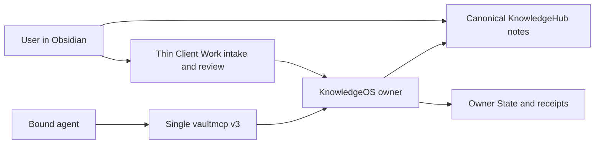

# KnowledgeOS Blueprint

> KnowledgeOS is development software in AgentFabric. This document defines the current product boundary, not deployment or historical acceptance. Current progress is in `PROJECT_STATE.md`; exact machine contracts are in `blueprint/blueprint.yaml`, owner policies, MCP schemas, and live source.

## Ownership

- AgentFabric Core supplies versioned static contracts. `ops/config/core-adoption.json` selects Core 0.18.1 and the current semantic bundle.
- `Operations/KnowledgeOS/` owns code, policy, methods, tests, and this Blueprint.
- `Vaults/KnowledgeHub/` is the independent Obsidian Vault and Git root. It owns canonical Markdown, Properties, attachments, and Pending review material.
- `States/Operations/knowledgeos/` owns the journal, Work and Graph bindings, human decisions, receipts, and unresolved effects.
- `Runtimes/KnowledgeOS-runtime/` holds reconstructable indexes, caches, logs, and host process artifacts.
- Private config v3 binds these five roots. A path, tool name, document, or plugin does not grant authority.

## Human and agent flows

```mermaid
flowchart LR
    U[User in Obsidian] --> V[Canonical KnowledgeHub notes]
    U --> W[Thin Client Work intake and review]
    W --> O[KnowledgeOS owner]
    A[Bound agent] --> M[Single vaultmcp v3]
    M --> O
    O --> S[Owner State and receipts]
    O --> V
```

- Users create, edit, search, link, and manage tasks in Obsidian. Core Search, Bases, Backlinks, Daily Notes, Templates, and the configured QuickAdd flow retain those interface jobs.
- The Thin Client submits a bounded Work request for Director admission and displays status, cited evidence, Pending content, and diff. It records an explicit human approval or rejection through the owner. Canonical apply is a separate human action through the owner; the plugin does not directly write canonical notes.
- Agents read and submit through one owner-gated `vaultmcp` v3. Work tools require an owner-issued session bound to Team or Officer, Profile, method, Graph, source, and effect scope. General tool listing is not authorization.
- `vaultctl` is the maintenance interface: operation checks and recovery, index build/verify/export, note validation, diagnostics, receipts, exact repair, contract checks, and exact storage transitions. It has no general note creation, search/answer, AI decision, model, provider, queue, worker, or embedding command.

## Vault contract

- Markdown body and flat YAML Properties are canonical. Keep note id, type, title, lifecycle, sensitivity, `ai_policy`, source references, timestamps, and typed relations internally consistent.
- The registered note types, templates, Base views, dashboards, relation predicates, property names, and generated artifacts are defined in the machine Blueprint and their owner sources. A generated view is a projection, never a second source of truth.
- `Home.md` and `Mobile.md` are navigation surfaces. The canonical Bases and Compass views provide filters and relationship orientation. Search results, backlinks, and unlinked mentions are evidence candidates; they do not create relations automatically.
- Obsidian manages user note creation. Agent suggestions become owner-journaled Pending proposals with exact source references and preimages. Approval alone does not apply a proposal.

## Retrieval and privacy

- Current agent retrieval is bounded, citation-bearing lexical and typed-link evidence. Read tools recheck owner reference, current digest, scope, sensitivity, and `ai_policy` before returning source bytes.
- Configured local MCP may read `ai_policy: ask` documents under the explicit owner policy. `deny` and confidential content remain excluded. `local_only` body text requires a trusted local execution binding.
- Embeddings, vector search, remote retrieval, and KOS-managed model execution are outside the current source contract.

## Work and review

- Six Teams each have a dedicated Manager. A bounded one-Profile task may use an Officer without a Team or Manager. WorkSpec admission, user pins, Manager Graph segments, independent EvalOfficer assessment, human decision, and canonical apply remain distinct.
- Curation, Research, Ontology, Project Review, Exchange, and Vault Maintenance methods are versioned in `ops/config/work-methods.json`. Agent proposals use action-specific schemas and the common owner intent/receipt/replay rules.
- Gateway evidence is limited to accepted exchange references. A foreign Operation's Vault or State is never a direct KnowledgeOS read target.
- The source has a synthetic stdio MCP and owner Web adapter. Native Hermes Runner identity, actual Web listener, profile installation, six Team execution, external Gateway exchange, and device use require separate adoption evidence.

## Validation

Run `make source-check`, `make verify`, `make blueprint-check`, `make schema-check`, `make test`, `make lint`, and `make state-check` in the project-owned container as applicable. Keep source, semantic, artifact, synthetic runtime, deployment, and device results distinct. `PROJECT_STATE.md` records only the current acceptance slice and its observed limits.
