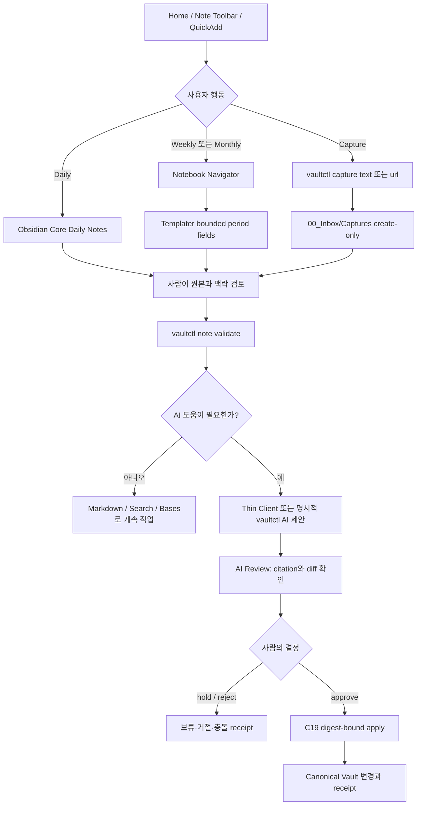
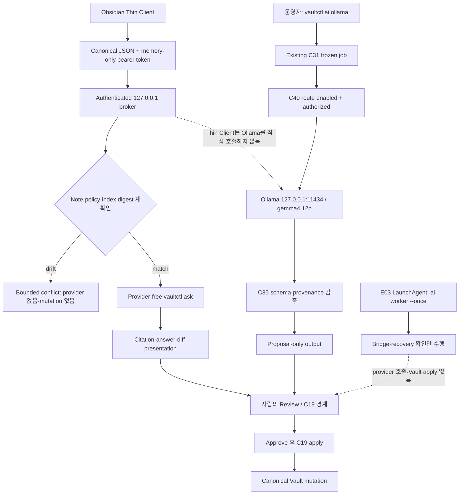

# KnowledgeOS

KnowledgeOS는 생각과 자료를 빠르게 담아 두고, 나중에 판단할 수 있는 지식과 실행할 수 있는 프로젝트로 바꾸는 개인용 Obsidian 작업공간입니다.

이 공간의 중심은 “무엇이든 자동으로 정리해 주는 AI”가 아닙니다. 먼저 원본을 안전하게 보존하고, 사람이 검토할 수 있는 형태로 만들고, 확정한 내용만 정식 노트와 프로젝트에 반영합니다. 그래서 짧은 메모는 부담 없이 남길 수 있고, 중요한 판단은 나중에 근거를 확인하면서 내릴 수 있습니다.

## KnowledgeOS에서 실제로 일어나는 흐름

정상적인 사용 흐름은 GUI-first입니다. Obsidian이 사람의 작성·검토 화면을 맡고, `vaultctl`은 캡처 검증, 검색, 제안, 승인, 적용과 증적을 담당합니다. AI 출력은 사람이 확인하기 전까지 정본이 아닙니다.

### 사용자 워크플로우



### `vaultctl` 파이프라인

```mermaid
flowchart LR
    A[Vault source 또는 capture] --> B[Capture finalize / note validate]
    B --> C[Path·schema·SHA-256 guard]
    C --> D[Privacy·ai_policy gate]
    D --> E[Index build/verify와 lexical·typed-link retrieval]
    E --> F[Frozen evidence와 context]
    F --> G{명시된 실행 경로}
    G -->|provider-free| H[ask / triage / proposal]
    G -->|explicit local| I[ai ollama: C31·C40·C35]
    H --> J[Schema·provenance·citation·digest 검증]
    I --> J
    J --> K[읽기 답변 또는 pending proposal]
    K --> L[사람의 Review]
    L --> M{결정}
    M -->|hold / reject| N[보류·거절·충돌 receipt]
    M -->|approve| O[Digest-bound C19 approval]
    O --> P[vaultctl ai apply]
    P --> Q[Canonical Vault mutation과 receipt]
```



이 경로에서 provider 결과는 Vault에 직접 쓰이지 않습니다. 기존 정본을 바꾸는 유일한 닫힌 경로는 최신 digest를 다시 확인하는 C19 승인·적용 단계입니다.

### Local AI 접점의 파이프라인

Thin Client의 presentation 경로와 명시적인 local provider 경로는 서로 다른 접점입니다. Thin Client는 Ollama를 직접 호출하지 않고 provider-free `vaultctl ask`를 표시하며, Ollama 경로는 별도의 운영자 실행과 proposal 경계를 요구합니다.



각 단계의 역할은 분명합니다.

1. **담기** — 생각, 질문, URL, 인용문, 음성에서 얻은 요점, 파일을 원본 그대로 남깁니다.
2. **확인하기** — 노트 유형, 원본, 민감도와 AI 사용 정책을 확인해 어떤 맥락까지 사용할지 정합니다.
3. **다시 보기** — Inbox에 쌓인 항목을 한 번에 처리하지 않고, 지금 결정할 수 있는 것만 고릅니다.
4. **분류하기** — task, idea, question, knowledge, source, project 중 적절한 맥락을 정합니다.
5. **확정하기** — 정식 Markdown 노트와 속성을 만들고, 관련 프로젝트나 지식 노트에 연결합니다.
6. **찾고 이해하기** — 본문 검색과 허용된 typed link로 관련 맥락을 넓히고, 필요하면 정확한 근거가 붙은 답을 확인합니다.
7. **검토하고 적용하기** — AI가 만든 분류·요약·링크·초안은 Review에서 원본과 diff를 확인한 뒤에만 정본에 반영합니다.
8. **보존하기** — 끝난 capture와 프로젝트를 Archive로 옮기되, 노트의 정체성과 링크는 유지합니다.

AI가 이 과정에 참여하더라도 제안은 제안으로 남습니다. 분류, 요약, 링크, 새 노트 작성은 사람이 확인하기 전까지 정본이 되지 않습니다.

### 이 흐름이 사용자에게 주는 변화

- **빠르게 남기고 나중에 판단할 수 있습니다.** Capture는 먼저 원문을 보존하고, 분류는 Inbox에서 이어서 합니다.
- **검색 결과를 다시 확인할 수 있습니다.** 답변은 어떤 노트의 어느 위치를 근거로 했는지 보여 주며, 원본이 바뀌면 이전 근거를 그대로 사용하지 않습니다.
- **AI의 역할이 단계별로 나뉩니다.** triage, 요약, 초안, 링크 제안, 정규화, cited answer는 각각 검토 가능한 제안으로 남고, 한 번의 모호한 명령이 정본을 바꾸지 않습니다.
- **민감한 내용이 조용히 섞이지 않습니다.** `confidential` 또는 `ai_policy: deny`인 내용은 AI 맥락에서 제외되고, local-only 자료는 허용된 로컬 경로에서만 다뤄집니다.
- **중복 작업이 정본을 흔들지 않습니다.** 한 작업은 private queue에서 한 번만 claim되고, 중단되면 lease가 만료된 뒤 다시 처리할 수 있으며, 같은 결과를 다시 받으면 중복 적용 없이 끝납니다.
- **문제가 생기면 조용히 덮어쓰지 않습니다.** 원본·정책·근거·결과의 digest가 달라지면 충돌 또는 격리 상태로 멈추고, 사람이 확인할 수 있는 다음 행동을 남깁니다.

## 처음 사용하는 방법

현재 KnowledgeOS의 가장 완성된 사용 방식은 MacBook에서 Obsidian을 여는 것입니다.

1. Obsidian에서 `KnowledgeHub/`를 Vault로 엽니다.
2. 시작 화면으로 `Home.md`를 엽니다.
3. 오늘의 방향을 Daily에 한 줄로 적습니다.
4. 생각이 떠오르면 Home의 빠른 캡처를 사용합니다.
5. 시간이 날 때 Inbox에서 하나씩 열어 triage hint, 프로젝트, 관련 노트를 정합니다.
6. 계속할 일이면 프로젝트의 `next_action`을 갱신하고, 보존할 지식이면 해당 Knowledge 노트로 확정합니다.

처음부터 모든 폴더를 정리할 필요는 없습니다. `Home → 빠른 캡처 → Inbox → 프로젝트 또는 Knowledge` 네 화면만으로도 기본 사용을 시작할 수 있습니다.

## Mac에서 플러그인으로 흐름을 줄이는 방법

플러그인은 노트와 Properties를 대신 보관하는 시스템이 아니라, 이미 있는 흐름에 더 짧은 진입점을 제공하는 도구입니다. 정식 노트의 내용과 속성은 언제나 Markdown과 YAML Properties에 남고, 플러그인을 끄더라도 기본 화면에서 읽고 이어서 작업할 수 있어야 합니다.

현재 Mac baseline에는 커뮤니티 플러그인 11개가 명시되어 있습니다. 이 목록은 사용자 경험을 줄이는 역할 목록이지, 노트·retrieval·provider·Vault write·Git·canonical apply의 권한 목록이 아닙니다.

| 플러그인 | 역할 | 경계 |
| --- | --- | --- |
| QuickAdd | 사람의 capture 진입점 | 원문을 먼저 남기고 분류는 사람이 결정 |
| Templater | bounded template field renderer | shell, network, AI, `vaultctl`, 자동 apply 없음 |
| Tasks | 다음 행동 query | 정본 Properties의 소유자가 아님 |
| Linter | bounded Markdown hygiene | 사람의 판단을 대신하지 않음 |
| Obsidian Git | Mac의 수동 Git 확인·작업 | 자동 commit/push 없음 |
| Homepage | `Home.md` 시작 화면 | 시작 시 다른 명령을 자동 실행하지 않음 |
| Note Toolbar | 현재 맥락의 command surface | 본문을 몰래 수정하지 않음 |
| Breadcrumbs | typed relation navigation | 새 관계를 자동 생성하지 않음 |
| Notebook Navigator | bounded note navigation | 일괄 이동·병합·삭제는 명시적 선택 필요 |
| Meta Bind | low-risk property view/edit | 추적용 id·hash·승인 필드는 이 경로로 변경하지 않음 |
| `knowledgeos-thin-client` | proposal-only presentation client | retrieval·provider·Vault write·Git·canonical apply 권한 없음 |

모바일 community-plugin baseline은 비어 있습니다. Mac 플러그인이 꺼져 있거나 unavailable이어도 Home, Markdown, YAML Properties, Core Search, File Explorer, Bases와 Command Palette fallback으로 같은 판단을 이어갈 수 있어야 합니다.

### 아침에 시작하기

1. Obsidian을 열면 Homepage가 `Home.md`를 보여 줍니다.
2. Home에서 오늘의 방향, active 또는 blocked 프로젝트, 아직 답하지 않은 질문을 확인합니다.
3. Note Toolbar의 `Today`, `Tasks`, `Review` 버튼으로 필요한 화면만 엽니다.
4. Daily에 오늘의 방향을 한 줄로 적고, Meta Bind가 보이는 `today_focus`나 `next_action` 같은 허용된 필드만 조정합니다.

Homepage가 없거나 꺼져 있어도 `Home.md`를 직접 열면 같은 작업을 계속할 수 있습니다. 시작 화면은 편의 기능이지 정본이 아닙니다.

### 생각이 떠오를 때

1. Note Toolbar의 `Capture`를 누르거나 기존 QuickAdd 단축키를 사용합니다.
2. 원문만 빠르게 적고, 지금 분류할 수 없다면 capture로 저장합니다.
3. Templater가 날짜와 기본 형식을 채워도 내용의 의미와 분류는 나중에 결정합니다.
4. 계속 작업해야 한다면 `NEW_PROJECT`, 답을 찾아야 한다면 `NEW_QUESTION`으로 시작합니다.

이때 Notebook Navigator로 새 capture가 실제 `00_Inbox/Captures/`에 들어갔는지 확인할 수 있습니다. 버튼을 눌렀다는 표시만 믿지 않고, 목록에서 파일을 열어 원문을 확인합니다.

### Inbox를 정리할 때

1. Notebook Navigator에서 최근 capture와 Inbox를 엽니다.
2. Note Toolbar의 `Open project`, `Related`, `Review` 같은 탐색 버튼으로 관련 맥락을 확인합니다.
3. Breadcrumbs에서 기존 Project·Question·Source 관계를 따라가며 이 capture가 어디에 기여하는지 판단합니다.
4. 필요하면 Meta Bind로 허용된 `status`, `priority`, `next_action`을 조정하고, 원문과 중요한 provenance 필드는 그대로 둡니다.
5. 사람이 판단한 뒤에만 capture를 idea, question, knowledge, source 또는 project로 발전시킵니다.

플러그인은 “어디에 연결할지”를 찾는 시간을 줄여 주지만, 분류 결정을 대신하지 않습니다. 애매하면 capture를 유지한 채 다음 검토로 넘겨도 됩니다.

### 프로젝트와 지식을 다시 사용할 때

1. Home의 Bases와 Tasks에서 오늘 처리할 Project와 다음 행동을 고릅니다.
2. Project에서 Breadcrumbs를 사용해 Working 메모, 관련 Question, 근거 Source로 이동합니다.
3. Note Toolbar의 `Back` 또는 `Home`으로 다시 판단 화면으로 돌아옵니다.
4. 노트 본문을 수정한 뒤 Linter로 서식을 정돈하고, 필요한 변경만 Git으로 확인합니다.

검색이 필요하면 먼저 Core Search와 Home의 Bases를 사용합니다. Breadcrumbs는 검색 결과를 관계의 맥락으로 넓혀 주고, Note Toolbar는 자주 쓰는 결과 화면을 다시 여는 시간을 줄입니다. 검색 플러그인이 없더라도 본문, 링크, Properties는 그대로 검색할 수 있어야 합니다.

### 하루를 닫고 다음 날 이어가기

1. Daily에서 완료한 일과 남은 `next_action`을 확인합니다.
2. Meta Bind로 허용된 상태 필드만 정리하고, 실제 판단이나 설명은 본문에 남깁니다.
3. 끝난 capture와 Project는 바로 삭제하지 말고 필요한 링크를 확인한 뒤 Archive로 보냅니다.
4. Mac에서 변경 diff와 Git 상태를 확인합니다.

플러그인이 일시적으로 작동하지 않아도 Home, Markdown, YAML Properties, Bases, Tasks로 같은 판단을 이어갈 수 있어야 합니다. 플러그인 화면과 버튼은 작업을 빠르게 하지만, 원본과 결정의 소유자는 사용자입니다.

## 기기별 역할

KnowledgeOS는 기기마다 잘 맞는 작업을 다르게 둡니다.

| 기기 | 주된 역할 | 잘 맞는 작업 |
| --- | --- | --- |
| Mac | 결정하고 연결하고 확정하기 | 분류, 승인, 프로젝트 구조 변경, 검색, Git 확인, Archive |
| iPhone | 놓치지 않고 담기 | 생각·음성·URL·짧은 메모 capture, 오늘 화면 확인 |
| iPad | 읽고 가볍게 보완하기 | 읽기, 주석, 짧은 본문 수정, 검토 대상 확인 |

모바일에서는 새로운 capture를 만들거나 읽는 작업을 우선합니다. 대량 이동, 대량 이름 변경, 삭제, plugin 설치, Git 충돌 해결, 정본에 대한 AI apply는 Mac에서 처리합니다.

모바일 화면과 Shortcut 사용 방식은 설계되어 있지만, Working Copy를 통한 실제 mobile round trip은 별도의 배치 단계입니다. 아직 그 배치를 하지 않았다면 모바일 경로를 이미 동기화되고 있다고 가정하지 말고, Mac에서 `Home.md`를 정본 화면으로 사용하세요.

## 매일 보는 화면

### Home — 판단을 위한 데스크톱 조종석

`Home.md`는 모든 파일을 보여주는 파일 브라우저가 아니라, 오늘 결정해야 할 것만 모아 보는 화면입니다.

- **오늘의 방향** — 오늘 Daily와 focus를 엽니다.
- **Now** — 현재 active 또는 blocked 상태인 프로젝트를 봅니다.
- **Needs a decision** — 아직 답하지 않은 질문과 결정을 봅니다.
- **Next actions** — 각 프로젝트에서 다음에 할 일을 봅니다.
- **Knowledge radar** — 최근 지식과 아이디어를 다시 봅니다.
- **Inbox** — 아직 처리하지 않은 capture를 봅니다.
- **AI review** — pending 또는 conflict 상태의 제안을 확인합니다.
- **빠른 이동** — Tasks, Weekly Review, Ideas, Sources로 바로 갑니다.

Home에 표시된 목록은 원본을 대신하지 않습니다. 목록에서 노트를 열어 본문과 속성을 확인하면 언제든 전체 맥락으로 돌아갈 수 있습니다.

### Mobile — 현장에서 담고 조회하는 화면

`Mobile.md`는 작은 화면에서 필요한 것만 남긴 단일 열 화면입니다.

- `KO · Capture` — 생각이나 짧은 텍스트를 새 capture로 만듭니다.
- `KO · Save Source` — URL, 선택한 문장, 짧은 주석을 자료 capture로 저장합니다.
- `KO · Defer to Mac` — Mac에서 처리할 작업을 요청 대상으로 보냅니다.
- `KO · Sync` — 동기화 전에 상태를 확인하고 안전한 경우에만 다음 단계로 갑니다.
- 오늘 Daily, Mobile 프로젝트 목록, Mac 검토 Inbox, AI 결과를 확인합니다.

Mobile 화면의 동기화 안내는 마지막으로 확인된 snapshot을 뜻합니다. 화면에 “성공”을 기록해 두는 방식이 아니므로, 실제 상태는 기기의 Git 상태와 마지막 응답을 함께 확인해야 합니다.

## 생각을 빠르게 담는 방법

Mac의 Home에는 QuickAdd를 이용한 다섯 가지 빠른 진입점이 있습니다.

| 단축키 | 진입점 | 만들어지는 맥락 |
| --- | --- | --- |
| `⌥⌘I` | `CAPTURE_THOUGHT` | 아직 판단하지 않은 생각을 `00_Inbox/Captures/`에 보관 |
| `⌥⌘J` | `NEW_IDEA` | 발전시킬 아이디어를 `40_Knowledge/Ideas/`에 생성 |
| `⌥⌘P` | `NEW_PROJECT` | 결과와 다음 행동을 가진 프로젝트 묶음을 생성 |
| `⌥⌘Q` | `NEW_QUESTION` | 답이 필요한 질문이나 결정을 `40_Knowledge/Questions/`에 생성 |
| `⌥⌘K` | `NEW_KNOWLEDGE` | 오래 보존할 지식 주장을 `40_Knowledge/Notes/`에 생성 |

단축키가 아직 연결되지 않았다면 Obsidian Command palette에서 같은 choice 이름을 찾을 수 있습니다. 빠른 capture는 기존 파일을 덮어쓰지 않고 항상 새로운 파일을 만듭니다.

### 어떤 방식으로 담을까?

- 지금 당장 판단할 수 없으면 **capture**로 담습니다.
- 나중에 발전시킬 가능성이 있으면 **idea**로 만듭니다.
- 답을 찾거나 결정을 내려야 하면 **question**으로 만듭니다.
- 반복해서 참고할 주장이나 설명이면 **knowledge**로 만듭니다.
- 다시 읽거나 인용할 자료면 **source**로 만듭니다.
- 끝내야 할 결과와 다음 행동이 있으면 **project**로 만듭니다.

무엇인지 잘 모르겠을 때는 capture로 시작하는 편이 좋습니다. Inbox에서 나중에 판단할 수 있도록 `triage_hint`만 남겨도 충분합니다.

## 노트는 맥락에 맞게 사용하기

KnowledgeOS의 노트 유형은 폴더 이름만 다르게 붙인 메모가 아닙니다. 각 유형은 “이 노트를 나중에 어떻게 사용할 것인가”를 표현합니다.

| 노트 유형 | 언제 사용하는가 | 기본 위치 |
| --- | --- | --- |
| Capture | 아직 분류하지 않은 원본을 보존할 때 | `00_Inbox/Captures/` |
| Daily / Weekly / Monthly | 일정 기간의 방향과 회고를 남길 때 | `10_Journal/` |
| Project | 끝내야 할 결과와 다음 행동이 있을 때 | `20_Projects/<project>/` |
| Project note | 특정 프로젝트 안의 작업 메모일 때 | `20_Projects/<project>/Working/` |
| Artifact | 프로젝트의 결과물이나 명세일 때 | `20_Projects/<project>/Artifacts/` |
| Area | 계속 관리해야 하는 생활·업무 영역일 때 | `30_Areas/` |
| Idea | 가능성을 발전시키고 싶을 때 | `40_Knowledge/Ideas/` |
| Question | 답, 결정, 조사 방향이 필요할 때 | `40_Knowledge/Questions/` |
| Knowledge | 오래 남길 설명이나 주장을 만들 때 | `40_Knowledge/Notes/` |
| Source | 읽고 인용할 자료를 관리할 때 | `40_Knowledge/Sources/` |
| Person | 사람과 관련된 맥락을 보관할 때 | `40_Knowledge/People/` |
| MOC | 관련 노트를 사람이 큐레이션한 길로 묶을 때 | `50_Maps/` 또는 프로젝트 Working |
| Meeting | 회의의 의제·결정·후속 작업을 남길 때 | `60_Meetings/` |

새 노트를 만들 때는 파일명과 노트 제목을 같게 유지하고, frontmatter의 `type`, `status`, `created`, `modified`를 임의의 표현으로 바꾸지 않는 것이 좋습니다. 링크는 단순한 장식이 아니라 노트 사이의 관계를 표현하는 방법입니다.

## Inbox를 처리하는 법

Inbox는 “반드시 오늘 비워야 하는 목록”이 아닙니다. 처리할 수 있는 것만 골라 다음 질문에 답합니다.

1. 이것은 버릴 것인가, 보류할 것인가?
2. 계속할 행동이 있는가?
3. 특정 프로젝트에 속하는가?
4. 오래 남길 아이디어·질문·지식·자료인가?
5. 이미 존재하는 노트와 어떤 관계가 있는가?

결과에 따라 다음처럼 처리합니다.

- **discarded** — 더 보존할 이유가 없을 때
- **triaged** — 적절한 프로젝트나 정식 노트와 연결했을 때
- **hold** — 지금 판단하지 않되 다시 볼 이유가 있을 때
- **task** — 구체적인 다음 행동이 있을 때
- **idea / question / knowledge / source** — 해당 정식 노트로 발전시킬 때

Capture의 원문은 먼저 보존하고, 정식 노트로 옮길 때도 원본 capture와 연결합니다. 그래서 나중에 “왜 이 노트를 만들었는가?”를 추적할 수 있습니다.

## 프로젝트를 운영하는 법

프로젝트는 단순한 폴더가 아니라 결과를 향해 움직이는 작은 작업 공간입니다.

프로젝트를 만들 때는 다음 세 가지를 먼저 적습니다.

- **Outcome** — 끝났을 때 무엇이 달라져 있어야 하는가
- **Status** — planned, active, blocked, completed 중 현재 상태
- **Next action** — 다음에 실제로 할 수 있는 한 가지 행동

프로젝트를 만들면 다음 구조가 함께 생깁니다.

```text
20_Projects/
└── 프로젝트 이름/
    ├── 프로젝트 이름.md
    ├── Working/
    └── Artifacts/
```

- 프로젝트 root note에는 목적, 상태, 우선순위, 다음 행동을 둡니다.
- `Working/`에는 진행 중인 생각, MOC, 조사 메모를 둡니다.
- `Artifacts/`에는 외부에 전달하거나 최종 결과로 남길 산출물을 둡니다.

프로젝트가 막히면 상태를 `blocked`로 바꾸고, 막힌 이유나 기다리는 결정을 next action 주변에 남깁니다. 그러면 Home의 Now와 Blocked 목록에서 다시 발견할 수 있습니다.

## 자료, 첨부파일, 출처

자료를 저장할 때는 URL만 복사하는 것보다 “왜 저장했는지”를 함께 남기는 것이 좋습니다.

1. `KO · Save Source`로 URL과 선택한 문장을 저장합니다.
2. 짧은 주석에 “이 자료가 왜 필요한가”를 적습니다.
3. 나중에 `Source` 노트에서 작성자, 날짜, citation key, 관련 프로젝트를 보완합니다.
4. 주장이나 결정으로 발전하면 `derived_from` 또는 적절한 relation으로 원자료와 연결합니다.

이미지, PDF 같은 파일은 `80_Assets/`에 보관하고 노트에서 링크합니다. 파일의 SHA-256과 provenance를 함께 관리하면 같은 자료가 바뀌었는지 확인할 수 있습니다. 지원하기 어려운 큰 파일이나 오디오·비디오는 무리해서 정본 Vault에 넣기보다 링크와 설명을 남기는 방식이 안전합니다.

## AI 제안은 이렇게 사용하기

AI Review는 정식 노트를 대신 쓰는 곳이 아니라, 사람이 판단하기 전의 제안을 보는 곳입니다.

1. capture, Daily, Source처럼 원본이 있는 항목을 선택합니다.
2. 분류, 요약, 링크, 정식 노트 초안, 질문에 대한 cited answer 중 필요한 작업을 요청합니다.
3. KnowledgeOS가 현재 원본·검색 결과·정책을 묶어 만든 검토 맥락을 기준으로 결과를 검사합니다.
4. 제안의 원본 경로, 관련 프로젝트, 인용 위치, 변경 내용을 확인합니다.
5. 맞으면 승인하고, 아니면 수정하거나 거절합니다. 판단을 미루려면 pending 상태로 남겨도 됩니다.
6. 승인된 변경만 최신 원본과 다시 대조한 뒤 정본 노트에 적용합니다.

모델이 만든 텍스트는 항상 신뢰하지 않은 입력으로 취급합니다. 예상하지 않은 도구 호출, reasoning payload, 잘못된 JSON, 근거가 바뀐 citation, 정책에 맞지 않는 내용은 Review에 도달하기 전에 거절됩니다. 이 검사는 결과를 더 그럴듯하게 만드는 장치가 아니라, 사람이 확인할 수 있는 범위 밖의 변경을 막는 장치입니다.

AI Review의 상태는 대략 다음 의미를 가집니다.

- **pending** — 아직 사람이 보지 않은 제안
- **conflict** — 원본이나 대상 노트가 바뀌어 다시 확인해야 하는 제안
- **approved** — 사람이 적용을 허용한 제안
- **applied** — 정본에 적용된 제안
- **rejected** — 적용하지 않기로 한 제안
- **expired** — 승인할 수 있는 시간이 지나 다시 만들어야 하는 제안

원본이 바뀐 상태에서 예전 제안을 억지로 적용하지 않습니다. 충돌이 나면 최신 원본을 기준으로 다시 검토합니다. 외부 AI provider를 사용하더라도 민감도와 `ai_policy`를 먼저 확인하며, 조용한 provider fallback이나 자동 정본 변경은 사용하지 않습니다.

### AI 작업이 처리되는 방식

사용자가 AI 작업을 요청하면 결과가 바로 정본 노트에 쓰이지 않습니다. 작업은 private runtime에 임시로 기록되고, 사용자가 명시적으로 실행한 `ai queue` one-shot이 다음 순서로 처리합니다. E03 LaunchAgent는 이 provider queue를 몰래 소비하는 장치가 아니라, 별도의 provider-free local worker를 깨워 bridge request와 recovery 상태를 확인하는 경로입니다.

```text
AI 작업 요청
    ↓
원본·검색 결과·정책·출력 schema를 고정
    ↓
`ai queue`가 private queue에서 작업 하나를 claim하고 lease를 발급
    ↓
허용된 local 또는 synthetic 경로 실행
    ↓
결과 schema·원본 digest·근거·정책을 다시 검증
    ├─ answer_ready  → 응답을 확인
    ├─ needs_review  → AI Review에서 제안과 diff를 확인
    ├─ deferred      → 조건이 맞을 때 다시 처리
    └─ conflict      → 변경된 파일이나 위조된 artifact를 격리
    ↓
사람이 승인한 경우에만 정본에 적용
```

worker가 처리 중 멈추면 만료된 lease를 회수해 같은 private artifact를 다시 검증합니다. 이미 완료한 작업은 동일한 digest를 다시 적용하지 않습니다. 이 때문에 사용자는 “실행 버튼을 여러 번 눌렀으니 노트가 여러 번 바뀌었을까?”를 걱정하기보다 Review와 terminal 상태를 확인하면 됩니다. queue가 live provider나 자동 실행을 허용하지 않는 경로를 만나면 작업은 `deferred`로 남고, 임의의 fallback을 선택하지 않습니다.

### 백그라운드로 처리될 때의 사용자 경험

E03가 닫힌 뒤에도 “백그라운드에서 모든 것을 자동으로 끝낸다”는 방식은 아닙니다. 사용자가 정확한 control root와 실행 파일을 확인한 뒤 LaunchAgent를 명시적으로 활성화했을 때만, 현재 사용자 세션의 `gui/<uid>` 영역에서 다음과 같은 짧은 wake가 시작됩니다.

```text
LaunchAgent가 300초 간격으로 wake
    ↓
vaultctl ai worker --once
    ↓
커밋된 local bridge request와 recovery 상태 확인
    ↓
필요한 private runtime queue·recovery artifact만 준비하고 상태 반환
    ↓
필요한 경우 사용자가 별도로 `ai queue`를 실행하고 AI Review에서 결과 확인
```

사용자가 체감하는 순서는 다음과 같습니다.

1. **미리보기** — `launchd install --dry-run`으로 어떤 root, `vaultctl` 실행 파일, label이 묶이는지 확인합니다. 미리보기는 LaunchAgent를 쓰거나 실행하지 않습니다.
2. **명시적 활성화** — 승인한 경우에만 현재 사용자 LaunchAgent를 로드합니다. `RunAtLoad=false`이므로 로그인 직후 갑자기 실행되지 않고, 300초 간격의 one-shot worker로 동작합니다.
3. **조용한 확인** — worker는 커밋된 local request와 recovery journal을 확인하고 필요한 private runtime 상태를 준비합니다. provider 호출, Ollama/Gemma 호출, 정본 Vault 수정, Git network 동작은 하지 않습니다.
4. **결과 확인** — `vaultctl launchd status`와 worker log에서 마지막 실행 상태를 확인합니다. worker log는 장기 증적 저장소가 아니라 최신 상태를 잠깐 확인하는 용도이므로 stdout/stderr 파일별 16KiB 상한, 다음 wake에 최대 8KiB 이월, 1시간 이상 갱신되지 않은 파일의 다음 wake 폐기 정책을 적용합니다. 문제가 있으면 조용히 덮어쓰지 않고 `CONFLICT`, `REPAIR_REQUIRED` 또는 Review 대상처럼 사람이 다음 행동을 선택할 수 있는 상태로 남깁니다.
5. **잠시 멈추기** — `launchd rollback --apply`는 E03가 소유하고 bytes가 변하지 않은 plist와 정확한 label만 되돌립니다. 백그라운드 호출만 멈추며 원본 capture와 private 결과를 임의로 지우지 않습니다.

이 경로와 `vaultctl ai queue`는 의도적으로 분리되어 있습니다. LaunchAgent가 켜져 있어도 provider queue가 자동으로 Gemma를 호출하거나, 승인되지 않은 제안이 정본에 적용되거나, remote/unattended lane이 열리지는 않습니다.

### 로컬 Ollama와 Gemma를 사용할 때

KnowledgeOS의 local AI에는 서로 다른 두 운영 경로가 있습니다. 둘 다 물리 컴퓨터의 loopback Ollama를 사용할 수 있지만, Thin Client와 E03 worker는 Ollama를 직접 호출하지 않습니다.

- **E02 host verification** — 내부 SSD, `127.0.0.1`, cloud-off 조건에서 모델 identity, digest, generation·embedding resource/latency를 측정한 host-native one-shot evidence입니다. 이 측정 결과만으로 provider를 자동 활성화하거나 정본을 수정하지 않습니다.
- **E05 explicit local route** — 운영자가 기존 C31 job과 명시적 authorization으로 `vaultctl ai ollama`를 실행합니다. 현재 허용된 generation identity는 `gemma4:12b`이며, live exercise는 `127.0.0.1:11434`와 600초 bound를 사용했습니다. 결과는 C35 schema·provenance 검증을 거친 proposal-only output입니다.

로컬 provider 결과는 신뢰하지 않은 입력으로 취급합니다. model identity, cloud-off·loopback 정책, source/policy/index provenance와 output digest를 다시 확인한 뒤에만 답변 또는 Review 제안으로 공개합니다. 모델 다운로드, alias 자동 변환, 자동 fallback, 지속적인 provider daemon은 이 경로에 포함되지 않습니다.

Thin Client는 이 local provider route를 호출하지 않습니다. Thin Client는 인증된 `127.0.0.1` broker를 통해 현재 note·selection과 digest를 전달하고 provider-free `vaultctl ask`의 citation·answer·diff를 표시합니다. E03 LaunchAgent 역시 `vaultctl ai worker --once`로 bridge·recovery 상태만 확인하며, provider queue를 소비하거나 Ollama/Gemma를 호출하지 않습니다.

E05에서 local Gemma route가 통과한 사실과 별도로, provider-free frozen proposal 하나가 C19 review → approve → apply → receipt 경로를 통과했습니다. 즉 local provider response가 곧바로 canonical Vault를 변경한 것은 아닙니다. 기본 경험은 계속 local-first, proposal-only, human-approved입니다.

## 검색하고 답을 확인하는 법

KnowledgeOS의 검색은 한 번에 “그럴듯한 답”을 만드는 것보다, 원본 노트와 근거를 다시 찾아가는 데 초점을 둡니다.

### 빠르게 찾기

- Obsidian Search로 정확한 단어나 파일을 찾습니다.
- Home의 Bases에서 Inbox, 프로젝트, 질문, 지식, Sources를 맥락별로 봅니다.
- `related`, `supports`, `contradicts`, `explains`, `implements` 같은 관계를 따라갑니다.
- `50_Maps/`의 MOC는 사람이 자주 탐색하는 길을 고정하는 데 사용합니다.

### 관련 맥락까지 넓히기

검색 결과 하나만으로 부족하면 관련 project, source, idea, question을 함께 봅니다. KnowledgeOS의 retrieval은 본문 단어뿐 아니라 허용된 typed link를 따라 관련 노트를 확장합니다. 그래서 “이 주장과 연결된 프로젝트는 무엇인가?”, “이 아이디어를 뒷받침하는 자료는 무엇인가?” 같은 질문에 더 적합합니다.

### 인용이 필요한 답

`ask` 흐름은 질문이나 capture를 기준으로 답을 만들고, 답과 함께 근거 노트, 정확한 위치, 표시된 excerpt, evidence digest, uncertainty를 돌려주는 방식입니다. 답을 읽은 뒤에는 citation을 열어 원문을 직접 확인할 수 있습니다. 근거가 부족하거나 원본이 바뀌었으면 억지로 채우지 않고 insufficient input, conflict 또는 refused 결과를 남깁니다.

기본 검색은 lexical-first이며, typed-link 확장은 허용된 관계와 제한된 범위 안에서만 일어납니다. vector/RRF와 learned retrieval은 기본 검색을 몰래 바꾸지 않는 선택 경로입니다. 따라서 검색 결과를 재현하고 싶을 때도 어떤 읽기용 generation, 원본 노트, 검색 경로를 기준으로 했는지 확인할 수 있습니다.

### 질문에서 정본으로 돌아오는 짧은 경로

```text
질문 또는 capture 선택
    ↓
검색 결과와 관련 노트 확인
    ↓
cited answer 읽기
    ↓
citation으로 원문 확인
    ↓
필요하면 Question·Knowledge·Project를 사람이 작성
    ↓
AI 제안은 Review → 승인 → 최신 원본 재검증 → 적용
```

답변 자체를 정본으로 복사하지 않아도 됩니다. 답변은 판단을 돕는 읽기 화면이고, 오래 남겨야 하는 결론은 사람이 근거와 함께 Question, Knowledge 또는 Project에 확정합니다.

## Daily와 Weekly Review

### 아침

1. Home의 Today Focus를 확인합니다.
2. Daily에 오늘의 방향을 적습니다.
3. Now에서 active 또는 blocked 프로젝트를 확인합니다.
4. Next Actions에서 오늘 실제로 할 한두 가지를 고릅니다.

### 하루 중

- 생각은 capture로 담고, 흐름을 끊어 정리하지 않습니다.
- URL은 Save Source로 저장하고, 나중에 읽을 이유를 한 줄 적습니다.
- 결정이 필요한 것은 Question으로 만들어 기억에 의존하지 않습니다.

### 주간 회고

1. Weekly Review에서 이번 주에 만든 capture와 Daily를 돌아봅니다.
2. 계속할 프로젝트의 next action을 갱신합니다.
3. 오래된 Inbox는 삭제하지 말고 triage, hold, archive 중 하나를 선택합니다.
4. 반복해서 등장한 주장은 Knowledge로 승격하고, 근거 Source를 연결합니다.
5. 끝난 프로젝트는 결과물을 확인한 뒤 Archive합니다.

## 동기화와 변경을 안전하게 다루기

KnowledgeOS에는 한 번에 한 명의 writer만 정본 Vault를 변경한다는 원칙이 있습니다.

- Mac에서는 Obsidian Git 또는 `vaultctl` 중 한 가지 경로만 사용합니다.
- 두 경로를 동시에 열어 같은 파일을 수정하지 않습니다.
- 모바일에서 기존 파일을 대량 수정하기 전에 Obsidian을 닫고 상태를 확인합니다.
- dirty, diverged, detached, unknown 상태라면 자동 merge나 push를 시도하지 않고 Mac으로 넘깁니다.
- 새로운 capture는 offline에서도 만들 수 있지만, 동기화 실패가 capture를 잃게 만들지 않도록 device recovery outbox에 남깁니다.
- force push, reset, stash, rebase, “모든 변경사항 포함” 방식은 기본 흐름에 포함하지 않습니다.

정본을 바꾸는 작업은 사람이 결과를 확인할 수 있어야 합니다. 단순한 capture 생성은 빠르게 허용하지만, 기존 note 수정·이동·archive·AI apply는 source와 target을 확인한 뒤 진행합니다.

## 파일과 폴더를 이해하는 법

| 위치 | 사용자의 관점에서 의미 |
| --- | --- |
| `00_Inbox/Captures/` | 아직 판단하지 않은 원본이 머무는 곳 |
| `01_AI_Review/` | 사람이 승인하거나 거절할 제안을 보는 곳 |
| `10_Journal/` | Daily, Weekly, Monthly의 시간 흐름 |
| `20_Projects/` | 결과와 다음 행동을 가진 프로젝트 |
| `30_Areas/` | 계속 관리해야 하는 삶·업무 영역 |
| `40_Knowledge/` | Idea, Question, Knowledge, Source, Person |
| `50_Maps/` | 사람이 만든 탐색 경로와 MOC |
| `60_Meetings/` | 회의의 의제, 결정, 후속 작업 |
| `80_Assets/` | 검증된 이미지, PDF, 원자료 |
| `90_Archive/` | 끝난 capture와 프로젝트의 보존 장소 |
| `99_System/` | Template, Base, Dashboard, schema 같은 시스템 파일 |

`99_System/`의 파일은 화면과 노트 생성 규칙을 지탱합니다. 사용자가 직접 정리하거나 삭제하기보다, 해당 기능을 통해 변경하는 편이 안전합니다.

## 이런 상황에서는 이렇게 사용하세요

### “방금 떠오른 생각을 잊고 싶지 않다”

Home에서 `⌥⌘I`를 누르고 원문만 적습니다. 지금 분류하지 않아도 됩니다. 나중에 Inbox에서 idea, question, project 중 하나를 고릅니다.

### “읽은 글을 나중에 프로젝트에 쓰고 싶다”

`KO · Save Source`로 URL, 중요한 문장, 저장 이유를 함께 남깁니다. Source 노트를 프로젝트와 연결하면, 나중에 project summary나 cited answer에서 근거로 다시 찾을 수 있습니다.

### “아이디어를 실제 결과로 만들고 싶다”

`NEW_PROJECT`로 프로젝트를 만들고 outcome과 next action을 적습니다. 관련 아이디어와 질문은 프로젝트 root에 복사하기보다 링크로 연결하고, 실제 작업 메모는 `Working/`, 결과물은 `Artifacts/`에 둡니다.

### “결정해야 할 일이 자꾸 사라진다”

`NEW_QUESTION`으로 질문을 만듭니다. Home의 Needs a decision에 모인 질문을 주간 회고 때 확인하고, 답을 찾으면 decision과 근거를 함께 남긴 뒤 상태를 닫습니다.

### “AI가 정리해 준 내용을 믿어도 될까?”

AI Review에서 제안의 source, target, 변경 diff를 먼저 봅니다. 원본이 바뀌었거나 근거가 부족하면 적용하지 않습니다. AI는 정본의 소유자가 아니며, 승인하지 않은 제안은 지식으로 취급하지 않습니다.

### “끝난 프로젝트를 치우고 싶다”

결과물과 링크를 먼저 확인하고 프로젝트를 Archive합니다. Archive는 삭제가 아니라 보존입니다. 나중에 왜 그런 결정을 했는지 다시 찾아볼 수 있도록 root note와 related link를 유지합니다.

## 안전 원칙

- 원본 Markdown과 YAML 속성이 정본입니다.
- 새 capture는 기존 파일을 덮어쓰지 않습니다.
- AI·plugin·외부 서비스는 정본의 대체자가 아닙니다.
- 기존 파일의 수정과 이동은 원본 hash와 대상 맥락을 확인한 뒤 수행합니다.
- `confidential` 자료는 remote provider로 보내지 않는 것을 기본으로 합니다.
- 사람·회의 자료는 기본적으로 더 보수적인 privacy 정책을 적용합니다.
- 모바일은 capture·조회·보류를 우선하고, canonical apply는 Mac에서 합니다.
- private queue는 bounded one-shot 처리와 lease recovery를 사용하며, 위조되거나 digest가 달라진 artifact는 격리합니다.
- 자동 pull, 자동 commit, 자동 push, force push는 기본값이 아닙니다.
- provider queue와 remote/unattended lane은 기본 비활성입니다. E03 LaunchAgent는 사용자가 명시적으로 설치한 경우에만 provider-free `ai worker --once`를 300초 간격으로 깨우며, `RunAtLoad=false`이고 Vault 정본 변경·Git network·provider 호출을 수행하지 않습니다. `ai queue` 실행과 정본 apply는 여전히 사용자가 별도로 시작하고 승인해야 합니다.

이 원칙 때문에 KnowledgeOS는 조금 느리게 느껴질 수 있습니다. 대신 빠르게 담는 단계와 신중하게 확정하는 단계를 분리해, 나중에 원본과 판단의 경계를 다시 확인할 수 있게 합니다.

## 현재 사용 범위

현재 가장 안정적인 사용 범위는 MacBook 중심의 Obsidian workflow입니다.

- Home, Mobile, Bases, Dashboard, Templates를 사용할 수 있습니다.
- Mac baseline에는 QuickAdd, Templater, Tasks, Linter, Obsidian Git, Homepage, Note Toolbar, Breadcrumbs, Notebook Navigator, Meta Bind, `knowledgeos-thin-client`가 포함됩니다. 모바일 community-plugin baseline은 비어 있습니다.
- capture, typed note, Daily/Weekly/Monthly, project bundle, asset provenance, archive를 사용할 수 있습니다.
- AI 제안은 preview·review·approval을 거치는 구조입니다.
- lexical search, typed-link retrieval, 근거가 붙은 cited answer를 사용할 수 있습니다.
- vector/RRF는 기본 검색을 바꾸지 않는 선택 기능입니다.
- action별 AI 제안과 schema 검사는 원본·정책·citation에 묶여 있으며, provider 결과가 곧바로 정본을 바꾸지 않습니다.
- background worker는 필요할 때 명시적으로 실행하거나, E03에서 설치된 LaunchAgent를 통해 provider-free 방식으로 깨울 수 있습니다. 현재 E03 label은 `gui/501/com.knowledgeos.vaultops`에 로드되어 있으며 `ai worker --once`를 300초 간격으로 호출하지만, provider queue를 소비하거나 Ollama/Gemma를 호출하지 않고 remote/unattended lane도 활성화하지 않습니다.
- private provider queue는 `vaultctl ai queue`로 한 번만 명시적으로 처리할 수 있으며, bounded local/synthetic 작업을 claim하고 lease를 회수하며, 결과를 재검증한 뒤 응답 또는 Review 제안으로만 공개합니다. 이 명령은 live provider, LaunchAgent, 자동 실행 또는 정본 apply를 활성화하지 않습니다.
- E02 host-native Ollama verification은 내부 SSD·loopback·cloud-off 조건에서 generation과 embedding profile을 확인하는 별도 one-shot 경로로 완료되었습니다. 모델 identity와 resource evidence는 기록되지만, 모델 다운로드·자동 fallback·지속적인 provider daemon은 기본 사용 범위에 포함되지 않습니다.
- E05의 explicit local `gemma4:12b` route는 bounded one-shot evidence와 proposal 경계 안에서만 사용할 수 있습니다. Thin Client의 일상적인 경로로 provider를 승격하거나 remote/unattended lane을 활성화하는 결정은 별도로 deferred 상태입니다. E03 LaunchAgent의 상태는 프로젝트 루트에서 `vaultctl launchd status`로 확인하고, rollback은 E03가 소유한 동일 bytes를 검증한 뒤 `vaultctl launchd rollback --apply`로 수행합니다. 기본 경험은 계속 명시적 실행, Review, 사람의 승인으로 닫힙니다.

모바일의 실제 Working Copy 동기화, live mobile bridge round trip, remote provider 연결은 이 기본 사용 범위와 별도의 배치·승인 단계입니다. 그 경계를 넘기 전에는 Mac 중심의 안전한 흐름과 E03의 provider-free worker 경계를 그대로 사용하면 됩니다.

## 관련 화면

- [`KnowledgeHub/Home.md`](KnowledgeHub/Home.md) — Mac에서 매일 사용하는 시작 화면
- [`KnowledgeHub/Mobile.md`](KnowledgeHub/Mobile.md) — 모바일에서 capture·조회·보류에 사용하는 화면
- [`KnowledgeHub/99_System/Bases/Inbox.base`](KnowledgeHub/99_System/Bases/Inbox.base) — 처리하지 않은 capture와 mobile review
- [`KnowledgeHub/99_System/Bases/Projects.base`](KnowledgeHub/99_System/Bases/Projects.base) — 프로젝트, Now, Next Actions
- [`KnowledgeHub/99_System/Bases/Review.base`](KnowledgeHub/99_System/Bases/Review.base) — pending·conflict 제안
- [`KnowledgeHub/99_System/Dashboards/Weekly_Review.md`](KnowledgeHub/99_System/Dashboards/Weekly_Review.md) — 주간 회고 화면

KnowledgeOS를 처음 사용할 때는 이 README를 모두 외우기보다 `Home.md`를 열고, 생각 하나를 capture한 뒤 Inbox에서 그 생각의 다음 맥락을 정하는 것부터 시작하면 됩니다.
