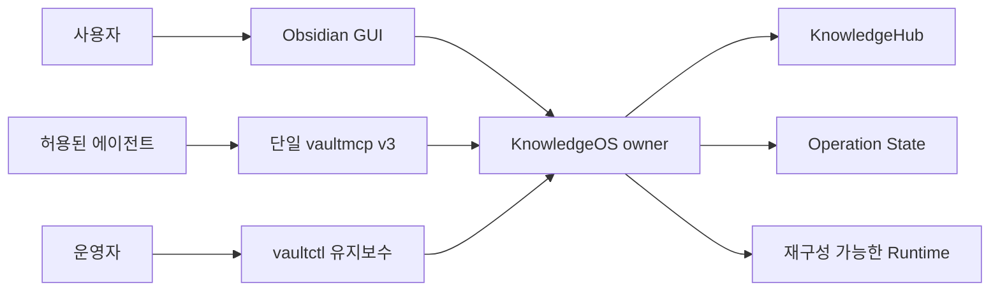

# KnowledgeOS

KnowledgeOS는 AgentFabric 안에서 KnowledgeHub를 관리하는 Operation입니다. 현재 개발 단계의 소스이며, 실제 사용자 문서나 설치된 Hermes Runner의 운영 결과를 이 문서에서 주장하지 않습니다.

## 사용 흐름

사용자는 [KnowledgeHub](../../Vaults/KnowledgeHub/)를 Obsidian에서 열어 작성, 편집, 검색, 링크 탐색, 할 일 관리, Pending 제안 검토와 결정을 합니다. QuickAdd와 템플릿은 일반 문서 생성 진입점입니다. AI 요청 화면인 Thin Client는 owner에 Work를 접수하고 상태·출처·diff를 보여주는 어댑터입니다. 사람의 승인 또는 거절과 정본 적용은 각각 별도 owner 호출입니다.

에이전트는 단일 `vaultmcp` v3에서 근거를 읽고 산출물 또는 Pending 제안을 제출합니다. 보이는 도구 목록은 권한이 아닙니다. Work 전용 호출은 owner가 발급한 실행 문맥, 선택된 Team/Officer, Profile, Graph, 자료 범위와 효과 정책을 매번 확인합니다. `ai_policy: ask`는 구성된 로컬 MCP 정책에서 허용되며 `deny`와 confidential 자료는 제외됩니다. `local_only` 본문은 신뢰된 로컬 실행 문맥에서만 반환합니다.

`vaultctl`은 상태·무결성 검사, 인덱스 구축·검증, 노트 계약 검사, receipt·repair, 초기 설정과 정확한 storage 유지보수에 사용합니다. 사용자 문서 작성, 일반 검색·답변, AI 제안·승인 facade, 모델 실행과 임베딩은 CLI의 역할이 아닙니다.


```mermaid
flowchart LR
    U[사용자] --> O[Obsidian GUI]
    O --> W[KnowledgeOS owner]
    A[허용된 에이전트] --> M[단일 vaultmcp v3]
    M --> W
    C[운영자] --> V[vaultctl 유지보수]
    V --> W
    W --> K[KnowledgeHub]
    W --> S[Operation State]
    W --> R[재구성 가능한 Runtime]
```

## 소유 경계

- [Core](../../Core/)는 공통 계약과 정적 환경을 제공합니다. 선택 버전은 [core-adoption.json](ops/config/core-adoption.json)이 고정합니다.
- 이 저장소는 Operation 소스, 메서드, 정책, 테스트 및 문서를 소유합니다.
- [KnowledgeHub](../../Vaults/KnowledgeHub/)는 독립 Git Vault이며 정본 문서와 GUI 자료를 보관합니다.
- `States/Operations/knowledgeos/`는 owner journal, 결정, receipt와 정확한 효과 상태를 소유합니다.
- `Runtimes/KnowledgeOS-runtime/`는 재구성 가능한 인덱스와 호스트 실행 자료를 보관합니다.

여섯 Team은 각자 전담 Manager를 두며, 한 Profile이 처리할 작업은 독립 Officer로 접수할 수 있습니다. 방법과 도구 범위는 [Team 카탈로그](ops/config/team-catalog.json), [메서드 카탈로그](ops/config/work-methods.json), [MCP capability manifest](ops/schemas/mcp/capabilities.json)와 owner 정책에 있습니다. 산출물의 독립 평가, 사용자 결정, 정본 적용은 서로 구분됩니다.

## 개발과 검증

사람이 읽을 현재 계약은 [Blueprint](OBSIDIAN_VAULT_BLUEPRINT.md), [Whitepaper](OBSIDIAN_VAULT_WHITEPAPER.md), [사용자 기능 명세](USER_FEATURE_SPEC.md)입니다. 정확한 구조는 [machine Blueprint](blueprint/blueprint.yaml), owner 정책, 메서드와 MCP 스키마를 확인합니다. [현재 상태](PROJECT_STATE.md)는 완료·미완료 검증과 다음 작업을 기록합니다.

```sh
make source-check
make blueprint-check
make schema-check
make test
make lint
make state-check
```

검증은 프로젝트가 소유한 컨테이너에서 수행합니다. 소스와 격리 fixture 결과는 실제 Obsidian 프로필 설치, GUI 사용, Hermes 네이티브 실행, 외부 Gateway 연결 또는 배포의 증거가 아닙니다.
