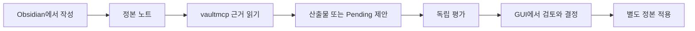

# KnowledgeOS 사용자 기능 명세

KnowledgeOS는 AgentFabric 안에서 개발 중인 Operation입니다. 현재 소스의 기능과 실제 설치·기기에서 확인한 기능은 구분합니다. 진행 상태와 수행한 검사는 [현재 상태](PROJECT_STATE.md)를 확인하세요.

## 사용자가 하는 일

사용자는 KnowledgeHub를 Obsidian에서 엽니다. 일반 노트와 포착은 구성된 QuickAdd 또는 Obsidian의 새 노트 흐름으로 작성하고, Daily Notes·Templates·Notebook Navigator로 기간별 기록을 만듭니다. Search, Bases, Backlinks, Properties, Tasks로 자료를 찾고 연결과 할 일을 확인합니다. 플러그인을 쓰지 않아도 Markdown 본문과 YAML Properties가 정본입니다.

Home과 Mobile은 탐색 화면이고, Base와 Compass 뷰는 원문을 바꾸지 않는 투영입니다. 제목·alias의 미연결 언급은 연결 후보로만 봅니다. 관계를 정본에 추가할지, 할 일을 완료할지, 제안을 승인할지는 사용자가 결정합니다.

## 에이전트가 하는 일

에이전트는 단일 `vaultmcp` v3로 허용된 자료를 읽고 결과를 제출합니다. 현재 도구는 검색·근거 조회와 구간 읽기, Base·링크·할 일 조회, Work·method 조회, Graph 제안, 산출물 제출, 독립 평가, 인용 확인, 관계·정렬·프로젝트 검토·교환 적응·복구 계획 제안을 포함합니다. 정확한 이름과 입력 스키마는 [MCP capability manifest](ops/schemas/mcp/capabilities.json)에 있습니다.

일반 연결에 도구 이름이 보여도 모든 호출이 허용되지는 않습니다. Work 도구는 owner가 발급한 Team 또는 Officer, Profile, method, Graph, 원문 범위, 효과 권한에 묶입니다. 모델이 actor, root, 실행 binding을 선택할 수 없습니다. 원문을 반환하기 직전에 현재 digest와 문서 정책을 다시 확인합니다.

기본 `ai_policy: ask` 문서는 구성된 로컬 MCP 정책에서 읽을 수 있습니다. `deny`와 confidential 문서는 제외하며, `local_only` 본문은 신뢰된 로컬 실행 문맥에서만 반환합니다. 인용 검증은 참조·구간·해시를 확인하고 주장 자체의 진실성은 판정하지 않습니다.

## 제안과 사람의 결정

에이전트의 변경안은 출처와 대상 preimage에 묶인 Pending 제안입니다. Obsidian Thin Client의 소스 계약은 owner Work 접수, 진행 상태, 인용된 결과, Pending 원문·출처·diff 표시를 제공합니다. 사용자가 승인 또는 거절을 누르면 owner가 그 결정을 기록합니다. 정본 적용은 별도 버튼과 owner의 재검증을 거칩니다. 승인만으로 파일이 바뀌지 않습니다.

이 Thin Client는 현재 소스 계약입니다. 실제 프로필 설치, Web listener, Hermes Runner, 여섯 Team의 실동작, 외부 Gateway 교환과 기기 UI 검증은 별도 채택 증거가 필요합니다.

## 운영자가 하는 일

`vaultctl`은 운영·유지보수 전용입니다. `operation check/status/recover`, `index build/verify/export`, `note validate`, `doctor`, `receipts verify`, `repair plan/apply`, `work validate`, `foundation`, `blueprint validate`, `schema export`, 초기 설정과 정확한 storage 전환을 제공합니다. 전체 명령은 [CLI 소스](ops/src/vaultops/interfaces/cli.py)의 parser를 기준으로 확인합니다.

문서·프로젝트 생성, 일반 검색·답변, AI 제안 결정, 모델·provider·queue·worker·embedding 명령은 현재 CLI에 없습니다. 사용자의 문서 작업은 Obsidian, 에이전트의 지식 작업은 MCP에 둡니다.

## 작업 순서

여섯 Team의 역할과 Officer 경로는 [Team 계약](docs/TEAMS_AND_ROADMAP.md), 정확한 현재 상태는 [PROJECT_STATE.md](PROJECT_STATE.md)를 확인하세요. 임베딩·벡터 검색·KOS 모델 실행은 이번 소스 범위 밖입니다.
