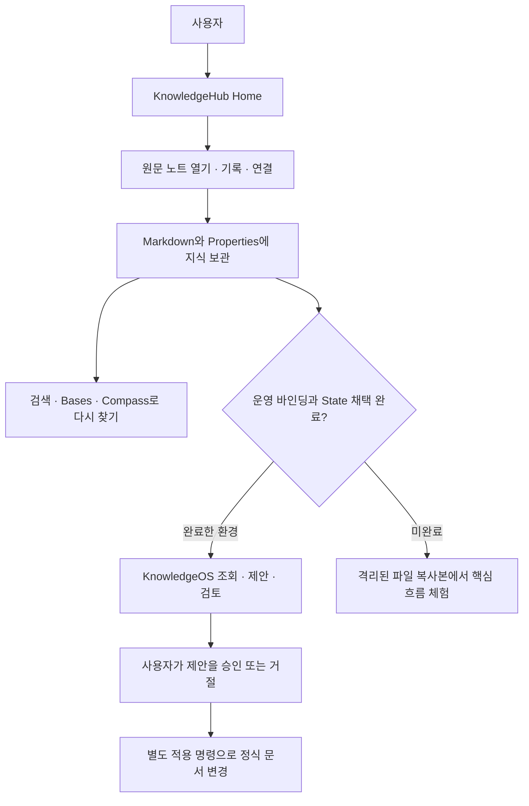
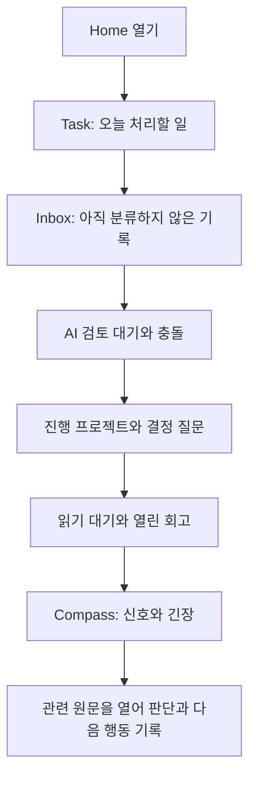
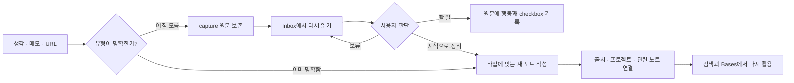
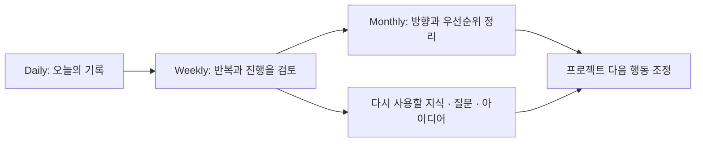
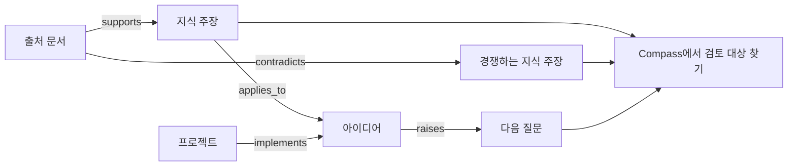
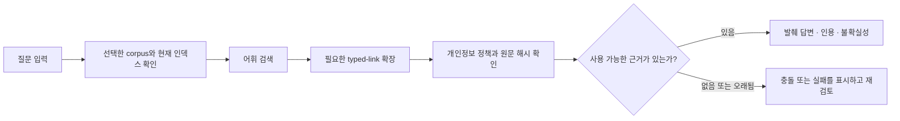
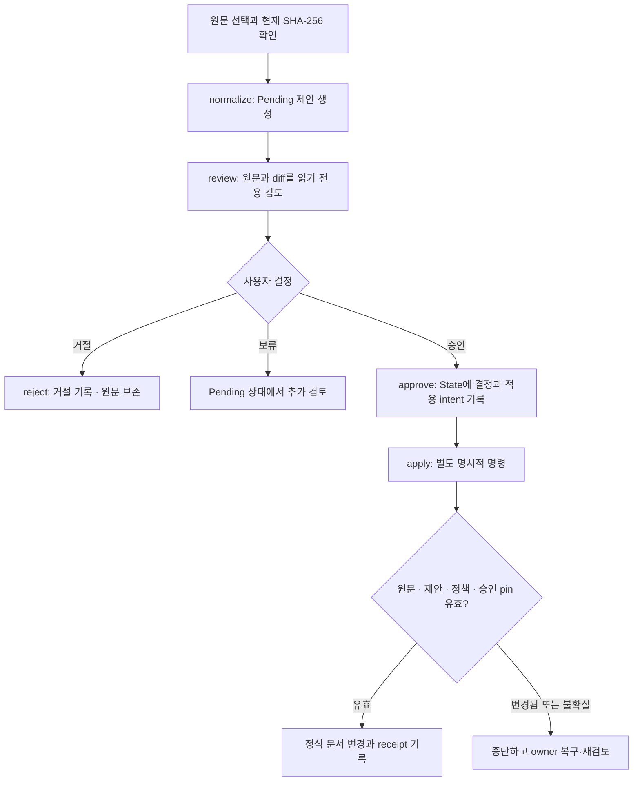
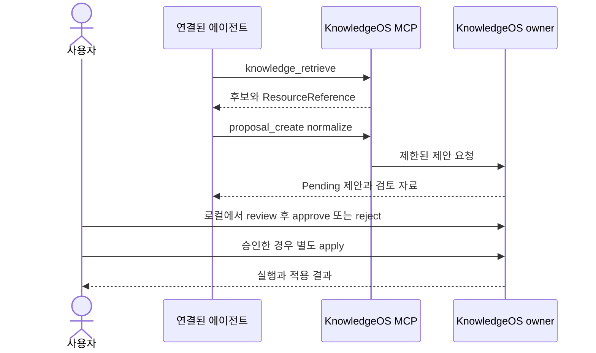
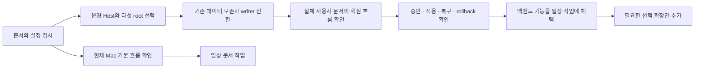

# KnowledgeOS 사용자 기능 명세서

이 문서는 사용자가 어떤 기능을 어디에서 시작하고, 어떤 결과를 확인하며, 어느 지점에서 직접 결정해야 하는지를 설명한다. 평가 기준일은 **2026-10-04, Asia/Seoul**이다. 변경 가능한 진행 상태와 운영 채택 여부의 유일한 기준은 [PROJECT_STATE.md](PROJECT_STATE.md)이며, 이번 검증의 관찰 결과는 [사용 준비도 보고서](../../Tmp/knowledgeos-user-readiness-2026-10-04/REPORT.md)에 기록한다.

## 1. 사용 준비도와 적용 범위

KnowledgeOS는 Markdown 문서를 직접 관리하는 KnowledgeHub와, 조회·검증·제안·승인·복구를 담당하는 KnowledgeOS 프로그램으로 구성된다. **문서 작업을 시작할 기본 구조는 갖추었고, 백엔드의 핵심 기능은 격리된 환경에서 검증할 수 있다. 현재 실사용 State 전환과 운영 바인딩이 끝나지 않아 전체 기능을 바로 사용하는 운영 제품으로 판정하지 않는다.**

| 구분 | 제공하는 경험 | 이번 평가에서 인정하는 범위 |
| --- | --- | --- |
| 문서와 화면 | Home, 노트, 템플릿, Bases, 검색, 링크 | 실제 Vault 파일·설정·연결의 정합성. 현재 Obsidian 화면 동작은 별도 확인 필요 |
| 로컬 핵심 프로그램 | 포착, 문서 생성, 검색, 근거 답변, 정규화 제안, 검토, 승인·적용, 복구 | 오프라인 테스트와 실제 생성 seed의 격리 복사본에서 실행한 범위 |
| 실제 운영 연결 | 실제 사용자 문서, 새 State, 운영 writer, Host 바인딩 | 다음 운영 채택 작업에서 선택·검증할 범위 |
| 선택 확장 | 로컬 모델, Thin Client, 자동 실행, 외부 전송, 모바일 동기화 | 구현 자료나 테스트가 있어도 현재 활성화된 사용자 기능으로 안내하지 않음 |

검증에 사용한 Vault는 아직 실제 사용자 지식이 쌓인 운영 말뭉치가 아니다. 생성된 예시가 검색되고 제안이 적용되는 결과는 사용자의 자료에서 답변 품질·분류 정확도·복구 능력을 확보했다는 증거가 아니다.



### 사용 환경의 구분

일반 Obsidian 기본 프로필과 KnowledgeOS가 준비한 `.obsidian-mac` 프로필은 다르다. Mac 전용 단축키·QuickAdd·Notebook Navigator·Note Toolbar·Home CSS는 해당 프로필이 실제로 선택되고 활성화되어야 작동한다. 파일이 있다는 사실만으로 현재 앱에서 켜져 있다고 판단하지 않는다.

기본 문서 열기, 원문 수정, Markdown checkbox, wikilink, Core Search는 기본 Obsidian 기능으로 사용할 수 있다. 플러그인이 없거나 화면이 표시되지 않으면 해당 원문과 Core Search로 돌아간다. 현재 앱 프로필 전환과 플러그인 실행은 이번 검증에서 수행하지 않았다.

## 2. 기능 목록

아래의 “격리 실행”은 실제 운영 데이터 대신 일회용 파일·State·Runtime에서 확인한 프로그램 동작이다. “파일 준비”는 문서·설정·컴파일된 화면의 근거이며 실제 앱 실행 증거와 구분한다.

| ID | 사용자가 하는 일 | 기본 진입점 | 결과와 확인 방법 | 근거·선행 조건 |
| --- | --- | --- | --- | --- |
| F01 | 지금 할 일과 검토 항목 확인 | `Home.md` | Task, Inbox, AI 검토, 프로젝트, 결정, 읽기·회고, Compass | 실제 생성 파일과 정합성 검사; 앱 표시 확인 필요 |
| F02 | 생각·텍스트·URL 포착 | QuickAdd `CAPTURE_THOUGHT`; CLI `capture text/url` | `00_Inbox/Captures/YYYY/MM/`에 새 capture | CLI 격리 실행; QuickAdd는 Mac 프로필과 실제 렌더 확인 필요 |
| F03 | 하루 기록과 주·월 회고 작성 | Core Daily Notes; Notebook Navigator | Daily, Weekly, Monthly 문서 | 템플릿·설정·계약 검사; 현재 앱 생성 흐름 재확인 필요 |
| F04 | 할 일을 정리하고 완료 표시 | 원문 checkbox; Home Task | `#task`와 기한이 있는 미완료 항목을 최대 4개 조망 | Tasks 설정·조회 계약; 실제 변경은 원문에서 수행 |
| F05 | 프로젝트와 작업 문서 관리 | QuickAdd `NEW_PROJECT`; `project create` | 프로젝트 문서와 Working·Artifacts 등 묶음 | 생성·검증·transaction 테스트; 기본 생성은 CLI 격리 실행 |
| F06 | 아이디어·질문·지식·출처 등 작성 | QuickAdd; 타입별 템플릿; `note create` | 타입과 Properties가 있는 Markdown | 16개 템플릿·18개 note type; idea 생성·검증은 CLI 격리 실행 |
| F07 | 읽기와 회고를 이어가기 | `Sources.base`, `Journal.base` | Reading queue, Processed, Open Reviews | 조회 정의·생성 파일 검증; 실제 내용은 사용자가 작성 |
| F08 | 모순·낮은 신뢰·연결 공백 발견 | `Compass.base` | Signals, Tensions 등 6개 보기 | 속성 기반 필터·관계 계약; 자동 진실 판단 기능은 아님 |
| F09 | 문서와 관계를 검색 | Core Search; `search`, `retrieve` | 후보 문서·출처·해시·관계 확장 | 실제 seed 조회와 CLI 격리 실행; CLI 인덱스·바인딩 필요 |
| F10 | 근거가 붙은 로컬 답변 받기 | `ask --question-stdin` | 선택 문서의 발췌 답변·citations·불확실성 | provider 없이 CLI 격리 실행; 모델 추론 답변과 구분 |
| F11 | 정규화 변경안을 만들고 검토 | `ai normalize`, `ai review` | Pending 제안과 diff, 출처, 검토 결과 | owner 제어·CLI·MCP 격리 검증; 원문·정책의 현재 digest 필요 |
| F12 | 변경안을 승인·거절하고 적용 | trusted local CLI `approve/reject/apply` | State decision, 별도 canonical apply | 승인과 적용을 분리한 격리 검증; 실제 Vault 적용은 운영 채택 이후 |
| F13 | 에이전트에 제한된 지식 도구 제공 | 로컬 stdio `vaultmcp` | 조회·검색·정규화 제안·검토 4개 도구 | SDK protocol 테스트; 클라이언트 연결·운영 바인딩 필요 |
| F14 | 상태·무결성·복구 확인 | `operation check/status/recover`, 검사 명령 | 실행·평가·승인·적용·freshness를 구분 | 격리 실행·계약 검사; 성공 표시는 실운영 채택 완료를 뜻하지 않음 |
| F15 | 파일 첨부·포착 정리·프로젝트 보관 | `asset import`, `capture finalize`, `project archive` | 해시 검증된 transaction과 receipt | 회귀 테스트 범위; 사용자 자료의 실제 transaction은 이번에 실행하지 않음 |
| F16 | 로컬 모델·벡터·Thin Client 사용 | 선택적인 `ai ollama`, embedding, broker | 모델 제안 또는 검색 보조 | 이전 구현·테스트 있음; 현재 활성화·품질·운영 실행은 미검증 |
| F17 | 모바일·동기화·자동 실행 사용 | `Mobile.md`, bridge, scheduler 자료 | 모바일 조회 및 향후 capture·전송·worker | 현재 Mobile은 조회 화면; shortcut·원격 전송·주기 실행은 미구성 |

## 3. Home에서 하루를 시작하는 흐름

Home은 할 일과 검토 대상을 조망하는 화면이다. Home 항목을 열어 원문에서 기록·분류·결정한다. 현재 Home에 capture 버튼이나 AI·Git·서비스 시작 버튼은 없다. capture는 Mac 프로필의 단축키와 QuickAdd가 담당하며, Note Toolbar는 이동을 돕는다.

1. Task에서 기한이 가까운 할 일을 확인하고 원문에서 처리한다.
2. Inbox에서 미처리 capture를 열어 보류·작업 전환·정식 노트 작성 방향을 정한다.
3. AI 검토 대기·충돌에서 변경안을 읽고, 필요한 경우 로컬 승인 흐름으로 이동한다.
4. 진행 프로젝트와 결정 질문을 살펴 다음 행동을 정한다.
5. Reading queue·Open Reviews로 읽기와 회고를 이어간다.
6. Compass의 Signals·Tensions를 읽고 관련 원문과 근거를 연결한다.



`Today_Focus.md`는 사이드바에서 여는 별도 시스템 문서다. Home에 포함된 것으로 찾지 않는다. Home의 제안 status와 문서의 Properties는 승인 기록을 대신하지 않는다.

## 4. 포착한 내용을 지식으로 만드는 흐름

### 빠른 포착과 바로 작성

기록할 내용의 유형이 불명확하면 capture로 남긴다. capture는 원문을 보존하는 입력이며, 정식 지식·프로젝트와 구분한다. 유형이 이미 명확하면 `NEW_IDEA`, `NEW_QUESTION`, `NEW_PROJECT`, `NEW_KNOWLEDGE`로 바로 작성할 수 있다.

| Mac 프로필 동작 | 설정된 단축키 | 생성 위치 |
| --- | --- | --- |
| `CAPTURE_THOUGHT` | `⌥⌘C` | `00_Inbox/Captures/YYYY/MM/` |
| `NEW_IDEA` | `⌥⌘J` | `40_Knowledge/Ideas/` |
| `NEW_PROJECT` | `⌥⌘P` | `20_Projects/<이름>/` |
| `NEW_QUESTION` | `⌥⌘Q` | `40_Knowledge/Questions/` |
| `NEW_KNOWLEDGE` | `⌥⌘K` | `40_Knowledge/Notes/` |

단축키는 선언된 Mac 설정이다. 현재 실행 중인 앱에서 충돌 없이 동작하는지는 별도 확인한다. URL 포착은 주소와 메모를 저장하며 페이지를 다운로드하거나 본문을 자동 수집하지 않는다. 음성·모바일 share sheet는 설계 입력 유형이지만 이번에 바로 사용할 수 있다고 검증한 기능에 포함하지 않는다.



포착 정리 transaction은 `capture finalize`가 별도로 담당한다. 위의 사용자 판단 자체가 자동 분류·원본 이동·Git commit을 발생시키지는 않는다. 같은 목표 파일을 다시 만들 때 기존 원문을 덮어쓰지 않고 충돌을 반환한다.

## 5. 일지·프로젝트·지식 문서

### 기간별 기록

Daily는 Core Daily Notes로, Weekly와 Monthly는 Notebook Navigator로 만들거나 연다. Templater는 날짜와 문서 필드를 채운다. 기간 문서를 terminal `note create`로 만드는 경로는 거부한다.

| 문서 | 파일 경로 계약 | 주 사용 목적 |
| --- | --- | --- |
| Daily | `10_Journal/Daily/YYYY-MM-DD.md` | 하루 기록, 할 일, 관찰 |
| Weekly | `10_Journal/Weekly/YYYY/YYYY-Www.md` | 한 주의 회고와 다음 행동 |
| Monthly | `10_Journal/Monthly/YYYY/YYYY-MM.md` | 월간 흐름과 정리 |

Weekly의 연도는 ISO week-year를 사용한다. 연말·연초에는 달력 연도와 다를 수 있다. 기존 문서를 다시 열 때 새 템플릿으로 원문을 덮어쓰는 동작은 허용하지 않는다.



### 프로젝트와 재사용 지식

프로젝트는 대표 문서, 작업 문서, 산출물을 함께 관리한다. `planned`로 시작할 수 있고, CLI에서 `active`·`blocked`로 만들 때는 `focus_rank`와 `next_action`도 제공해야 한다. 이번 직접 실행에서 `active` 프로젝트의 `focus_rank`를 생략하면 파일을 만들지 않고 검증 실패가 반환되는 것을 확인했다. 아이디어는 탐색할 가능성, 질문은 풀어야 할 문제 또는 결정, 지식은 재사용할 주장, 출처는 근거 자료다. MOC는 여러 문서를 연결하는 탐색 지도이며, Area는 계속 관리할 책임 영역이다.

할 일은 원문에 Markdown checkbox로 기록한다. Home의 Task는 `#task`가 있고 기한이 내일까지인 미완료 항목을 기한·우선순위로 정렬한다. 기한이 없거나 태그가 없는 checkbox까지 모두 Home에 표시되는 것은 아니다.

참고 예시:

```markdown
- [ ] 포착한 근거를 프로젝트 문서와 연결한다 #task 📅 2026-10-04
```

## 6. 관계와 Compass로 판단을 돕기

폴더는 문서의 종류·수명·업무 맥락을 정리한다. 의미 관계는 wikilink와 Properties로 표현한다. 사용자는 출처, 프로젝트, 관련 문서와 함께 `supports`, `contradicts`, `explains`, `applies_to`, `derived_from`, `implements`, `raises` 등의 관계를 기록할 수 있다. 각 관계의 허용 subject·object 타입은 Blueprint registry를 따른다.

Compass는 이미 기록된 속성에서 살펴볼 대상을 찾는다. 지지와 모순을 스스로 판정하거나 문서의 신뢰도를 자동 인증하지 않는다.

| 보기 | 찾는 대상 | 다음 사용자 행동 |
| --- | --- | --- |
| Signals | 모순 관계, 낮은 신뢰도, 연결이 부족한 아이디어 | 우선 검토할 문서 선택 |
| Tensions | `contradicts`가 있는 지식·출처 | 양쪽 원문과 근거를 비교 |
| Research Gaps | 프로젝트에 연결되지 않은 열린 연구·문제 질문 | 조사·연결·보류 결정 |
| Unconnected Ideas | 프로젝트·관련 노트·확장 질문이 없는 아이디어 | 관련 프로젝트나 질문 연결 |
| Low Confidence | 신뢰도가 low·unknown인 지식 | 출처와 지지 근거 보강 |
| Project Bridges | 아이디어를 `implements`로 연결한 active·blocked 프로젝트 | 실행과 아이디어의 연결 점검 |



## 7. 검색과 근거 답변

Core Search는 현재 문서를 바로 찾는 기본 경로다. KnowledgeOS CLI는 선택한 문서 corpus의 projection과 인덱스를 사용한다. 검색 인덱스가 없거나 원문·정책과 맞지 않으면 먼저 인덱스를 생성·검증해야 한다.

`search`는 어휘 검색 후보를 반환한다. `retrieve`는 제한된 typed-link 확장을 결합하며 `--hops 0/1/2`로 범위를 정한다. `ask`는 검색된 원문에서 근거를 발췌해 citations와 함께 답변한다. 이번에 검증한 `ask`는 LLM 추론을 수행하지 않는다. 근거가 없거나 해시가 오래되었으면 성공 답변을 만들어내지 않는다.



원문과 검색 결과를 읽는 기능과, 원문을 모델에 제공하는 동의는 다르다. 기본 `ai_policy: ask`, 사람·회의 등의 제한 문서는 자동으로 AI 처리에 동의한 것으로 해석하지 않는다. 로컬 모델과 vector/RRF는 선택 확장이며 기본 검색을 위해 켤 필요가 없다.

## 8. 제안·검토·승인·적용

현재 핵심 owner 흐름은 **전체 타입 문서 하나를 provider 없이 정규화하는 제안**이다. 원문과 정책을 고정하고 Pending artifact와 diff를 만든 뒤 검토한다. 정규화는 Properties와 본문 의미를 유지하는 형식 정리이며, 새 지식 생성이나 정확한 자동 분류를 보장하는 기능이 아니다. 이미 정규화된 문서는 `NO_CHANGE`를 반환할 수 있다.

`organize`, `summarize`, `relate`, `extract`, `draft-note` 등의 기존 route도 코드에 있지만, 이들이 모두 모델 추론으로 작동하거나 현재 실사용 corpus에서 채택된 기능이라고 볼 수는 없다. 이번에 직접 확인한 owner 기준 흐름은 정규화 제안이다.



승인만으로 원문이 바뀌지 않는다. Review Base의 `pending`, `conflict` 등은 문서 분류다. 프로그램이 실제로 실행됐는지, domain 검사를 통과했는지, 사용자가 승인했는지, canonical apply가 끝났는지는 별개로 확인한다. source·proposal·policy·schema·semantic pin이 바뀌면 기존 승인을 그대로 재사용할 수 없다.

### 운영 바인딩 이후의 CLI 예시

다음은 **이미 채택한 로컬 KnowledgeOS 컨테이너와 v3 바인딩이 있는 환경**에서 사용하는 CLI 문법이다. 현재 물리 호스트에 도구나 의존성을 설치하라는 안내가 아니며, 실행 환경·다섯 root·사용 권한을 먼저 선택해야 한다. 실제 canonical apply는 사용자가 선택한 정확한 문서와 변경 범위에서만 실행한다.

```sh
vaultctl operation check
vaultctl operation status
vaultctl capture text --stdin --device mac --title '생각 기록'
vaultctl capture url --url-stdin --title '나중에 읽을 출처'
vaultctl project create --title '연구 프로젝트' --status active --focus-rank 1 --next-action '근거를 검토한다'
vaultctl note create --type idea --title '검증할 아이디어' --body-stdin
vaultctl note validate '40_Knowledge/Ideas/검증할 아이디어.md'
vaultctl index build
vaultctl search --query-stdin
vaultctl retrieve --query-stdin --hops 1
vaultctl ask --question-stdin
```

`--stdin`, `--query-stdin`, `--question-stdin`에는 명령행 인자 대신 표준 입력으로 내용을 전달한다. 쿼리는 한 줄이다. 자동화에서는 UTF-8 파일을 사용하는 대응 `--*-file` 인자도 선택할 수 있다. 출력은 Markdown 편집 화면이 아닌 구조화된 JSON이다.

제안 출력의 `proposal_path`, `proposal_sha256`와 선택한 원문의 현재 digest를 사용한다. `<...>`는 실제 값으로 교체한다.

```sh
vaultctl ai normalize --source '<Vault-relative note>' --expected-sha256 '<source sha256>'
vaultctl ai review --proposal '<proposal_path>'
vaultctl ai approve --proposal '<proposal_path>' --expected-sha256 '<proposal_sha256>'
vaultctl ai apply --proposal '<proposal_path>'
vaultctl operation recover
vaultctl operation status
```

거절할 때는 `vaultctl ai reject --proposal '<proposal_path>' --expected-sha256 '<proposal_sha256>' --reason '거절 이유'`를 사용한다. 제안은 승인하기 전에 원문·diff·출처를 읽는다.

## 9. 에이전트 연결과 복구

### MCP 사용 범위

`vaultmcp`는 서버가 선택한 하나의 Vault·State 문맥에서 stdio로 실행한다. 에이전트는 검색과 조회에서 받은 owner-scoped `ResourceReference`를 사용한다. 임의 host 경로나 actor를 입력해 권한을 얻을 수 없다.

| 도구 | 입력·결과 | 사용자 제어 |
| --- | --- | --- |
| `knowledge_search` | 쿼리 → 후보와 resource reference | 조회 |
| `knowledge_retrieve` | `query`, 제한된 필터, `hops=0/1` → 관련 문서와 reference | 조회; 결과 limit 최대 20 |
| `proposal_create` | `source_reference` → 정규화 Pending 제안 또는 NO_CHANGE | 정규화 전용; 별도 action 인자를 받지 않음 |
| `proposal_inspect` | `proposal_reference` → 출처·diff·검토 결과 | 읽기 전용 검토 |

승인·적용·provider 활성화는 MCP 도구에 없다. 연결된 에이전트가 제안을 만들더라도 로컬 사용자가 정확한 제안을 검토하고 최종 결정한다. 이번 검증은 SDK stdio protocol 범위이며 현재 사용하는 에이전트 앱에 실제로 등록한 상태를 확인하지 않았다.



### 상태 확인과 복구

`operation check`는 현재 Core pin과 manifest를 검사한다. `PASS`여도 `runtime_adoption=unconfigured`일 수 있다. `operation status`의 `health.ready`도 선택된 journal에 미해결 intent가 없는지에 대한 현재 관찰이며 실운영 전체 완료를 보증하지 않는다.

`operation recover`는 저장된 intent와 관찰 가능한 파일·receipt를 조정한다. 불확실한 외부 효과를 자동으로 다시 실행하거나 승인 없이 원문을 되돌리지 않는다. `unknown`이 남으면 사용자가 해당 결과와 바인딩을 확인한 뒤 다음 조치를 결정한다.

## 10. 모바일·AI·자동화의 사용 조건

현재 `Mobile.md`는 기기에 존재하는 문서의 조회·탐색 화면이다. Mobile을 열었다고 최신 동기화·원격 응답·승인·Mac 실행이 가능한 상태가 되지 않는다. shortcut, Working Copy, 자격 증명, 전송 receipt와 기기 왕복 검증이 필요하다. iPhone의 포착·조회·보류, iPad의 읽기·가벼운 보완, Mac의 최종 적용이라는 역할은 채택할 때 지킬 경계다.

Thin Client는 설치 가능한 파일이 있으나 현재 Mac 활성 플러그인 목록에서 빠져 있다. broker·provider·Git 자동화·scheduled worker도 운영 활성화의 증거가 없다. 기존 로컬 모델·embedding·bridge·LaunchAgent 구현과 역사적 검증을 현재 활성화 상태로 간주하지 않는다.

## 11. 실사용을 시작하기 위한 순서

문서 중심 작업은 Home과 노트를 직접 열어 읽는 것부터 시작할 수 있다. capture·템플릿 생성·일지·toolbar에 의존할 계획이면 현재 Mac 프로필에서 생성, 다시 열기, 기존 내용 보존, 화면 이동을 먼저 확인한다. 이 단계는 앱·device 동작을 확인하는 별도 범위다.

백엔드 쓰기 기능을 실제 사용자 자료에 연결하려면 다음을 순서대로 완료한다.

1. 정확한 Host·local principal과 Core/control/Vault/State/Runtime 다섯 root를 선택한다.
2. 기존 private 데이터·미해결 작업·writer를 조사하고 보존·이관·보관 범위를 결정한다.
3. 기존 writer를 멈추고 새 owner generation 하나로 전환한다. 새 State와 Runtime은 서로 다르게 둔다.
4. 작고 실제적인 사용자 corpus에서 포착→조회→정규화 제안→읽기 전용 검토를 확인한다.
5. 사용자가 검토한 한 건에 대해 승인→별도 적용→중단·재시작→복구·rollback을 확인한다.
6. 그 뒤 필요한 MCP 클라이언트·로컬 AI·모바일·자동화를 각각 선택하고 확인한다.



## 12. 기능 정의의 근거

- [Blueprint 기능·경험 계약](OBSIDIAN_VAULT_BLUEPRINT.md), [기계 registry](blueprint/blueprint.yaml): 문서 종류·템플릿·Bases·관계·명령 정의.
- [Mac 설정의 유지 소스](ops/config/vault-profile.json), [Vault 생성 소스](ops/src/vaultops/vault_projection.py): 현재 파일·profile 경계.
- [CLI 문법](ops/src/vaultops/interfaces/cli.py), [owner 애플리케이션](ops/src/vaultops/application/knowledge.py), [MCP 구현](ops/src/vaultops/interfaces/mcp_server.py): 실제 제어 경로.
- [현재 Home](../../Vaults/KnowledgeHub/Home.md), [Mobile](../../Vaults/KnowledgeHub/Mobile.md), [Vault 사용자 안내](../../Vaults/KnowledgeHub/99_System/Guides/KnowledgeOS.md): 생성된 사용자 표면.
- [C12 운영 채택 handoff](planning/c12-preparation/C12_HANDOFF.md): 실제 바인딩, 데이터 전환, writer, rollback의 미완료 범위.
- [검증 보고서와 실행 증거](../../Tmp/knowledgeos-user-readiness-2026-10-04/REPORT.md): 이번 준비도 판단과 실행 범위.

도식은 사용자 흐름을 설명한다. 화면 배치나 자동 실행을 새로 구현한 근거로 사용하지 않는다.
