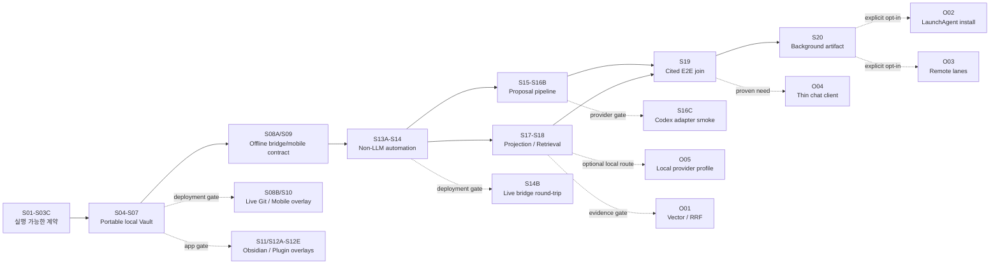

# KnowledgeOS 실제 구현 다중 세션 계획

기준일: 2026-09-09

계획 상태: active

현재 기술 단계: `foundation_scaffold`, `S01 runtime_harness`, `S02 blueprint_json_schema`, `S03A semantic_gate1`, `S03B semantic_gate2`, `S03C generated_artifact_zero_diff` 완료

다음 기본 세션: `S04 — Operational policy, strict schema, note engine`

## 1. 이 문서의 역할

이 문서는 KnowledgeOS를 한 번의 큰 구현으로 끝내지 않고, 여러 후속 개발 세션이 앞 단계의 검증 증거를 이어받아 순차적으로 완성하기 위한 실행 계획이다.

- `docs/IMPLEMENTATION_STATUS.md`는 **지금 실제로 구현된 것**을 기록한다.
- 이 문서는 **앞으로 구현할 순서와 각 세션의 종료 조건**을 기록한다.
- Blueprint와 YAML은 제품 계약의 정본이며, 이 문서의 세션 번호와 세션 크기는 구현 편의를 위한 계획이다.
- 이 문서는 plugin 설치, remote 추가, Git commit/push, 장치 credential 설정, LaunchAgent 등록, remote LLM 사용, migration을 승인하지 않는다.
- 한 세션은 하나의 검증 가능한 capability slice만 닫는다. 다음 세션 파일을 빈 placeholder로 미리 만들지 않는다.

설계 충돌은 `OBSIDIAN_VAULT_BLUEPRINT.md` → `blueprint/blueprint.yaml` → `OBSIDIAN_VAULT_WHITEPAPER.md` 순서로 해석한다.

## 2. 계획 작성 시점의 기준선

현재 확인된 사실은 다음과 같다.

| 영역 | 현재 상태 |
|---|---|
| 설계 원본 | `knowledgeos-blueprint-v2` checksum 고정 및 `make source-check` 통과 |
| foundation 검증 | `make verify` 통과 |
| control repository | 독립 Git root, local `main`, HEAD `ef014b09f215`, remote 없음; 현재 S00/S01/S02/S03A/S03B 변경은 미커밋 |
| Vault repository | `vault/`의 독립 Git root, local `main`, HEAD `9a217884f735`, clean, remote 없음 |
| root sentinel | remote fingerprint, expected branch, Vault UUID 미확정으로 미생성 |
| host toolchain | Python `3.9.6`; `uv`는 PATH에 없음; `mise` `2026.9.1` 설치됨 |
| Colima/Docker | Colima `0.10.3` 설치됐지만 현재 VM은 실행 중이 아님; Docker `29.5.3`/Compose `5.1.4`는 있으나 현재 `default` context의 daemon에 연결되지 않음 |
| executable contract | S02 JSON Schema, S03A/S03B semantic gate, S03C generated ownership/zero-diff 완료 |
| portable Vault | 고정 directory만 존재; schema, template, Base, dashboard, 실제 note는 미구현 |
| runtime/mobile/AI/retrieval | 계약 문서와 빈 namespace만 있고 기능은 미구현 |

두 repository의 현재 local branch 이름이 `main`이라는 사실은 notes remote의 canonical `expected_branch`가 확정되었다는 뜻이 아니다. remote identity와 expected branch는 `S08B`의 사용자 입력 gate까지 열린 결정으로 남긴다.

## 3. 실행 전략

### 3.1 Contract-first

어떤 Vault artifact mutation보다 먼저 다음 검증을 executable gate로 만든다.

1. Blueprint YAML의 JSON Schema 검증
2. path/type/template, action/command/schema, bridge state/runtime path, Base query, registry exactness, projection 및 transaction 계약의 semantic cross-validation
3. 생성된 schema/policy/Property Dictionary/protocol 사본의 zero-diff 검사
4. 각 invariant를 하나씩 깨는 negative mutation fixture

현재 `make blueprint-check`가 JSON Schema와 S03A/S03B semantic gate를, `make schema-check`가 S03C generated ownership/zero-diff를, `make verify`가 bootstrap 무결성을 담당한다. S03C는 production Vault 파일을 생성하지 않으며, 그 배포는 S04부터 시작한다.

### 3.2 순환 의존성 해소

Blueprint Phase 1은 project bundle create command를 요구하지만 전체 `vaultctl without LLM`은 Phase 4에 있다. 다음처럼 나눈다.

- `S01`–`S03C`: production Vault를 수정하지 않는 contract/compiler kernel
- `S04`–`S07`: 이 kernel 위의 note engine과 좁은 create-only command
- `S13A`–`S14`: queue, bridge, journal, receipt, Git adapter까지 포함한 non-LLM `vaultctl` 완성

이는 canonical Phase 순서를 바꾸는 것이 아니라, Phase 1 mutation의 안전한 선행조건을 별도 세션으로 만드는 것이다.

### 3.3 Capability profile과 deployment overlay 분리

최종 required file 집합을 모든 초기 단계에 무조건 요구하면 sentinel 값을 추측하거나 빈 파일을 만들게 된다. 코드의 구현 성숙도와 실제 장치·remote 활성 상태를 서로 다른 축으로 검증한다.

누적 capability profile:

| Profile | 의미 | sentinel 필요 여부 |
|---|---|---|
| `foundation` | source lock, namespace, 두 Git root 경계 | 없음이 정상 |
| `blueprint_json_schema` | safe YAML parse와 Draft 2020-12 Blueprint JSON Schema 검증 | 불필요 |
| `blueprint_semantic_gate1` | S03A registry/path/action/bridge semantic 검증 | 불필요 |
| `blueprint_semantic_gate2` | S03B Base/dashboard/projection/transaction semantic 검증 | 불필요 |
| `contract_validated` | JSON Schema, semantic validator, generator ownership | 불필요 |
| `portable_core` | schema, template, Base, dashboard, local fixture | 불필요 |
| `offline_non_llm_automation` | deterministic CLI, runtime, synthetic bridge/Git adapter | 불필요 |
| `proposal_pipeline` | deterministic fake adapter와 approval-bound proposal | 불필요 |
| `local_retrieval_core` | deterministic projection, lexical/typed-link cited retrieval | 불필요 |
| `background_artifacts` | 비활성 plist와 synthetic recovery | 불필요 |

독립 deployment overlay:

| Overlay | 활성 조건 | 추가로 주장할 수 있는 범위 |
|---|---|---|
| `git_identity_configured` | remote fingerprint, expected branch, Vault UUID와 sentinel 검증 | 실제 notes topology를 대상으로 한 bridge/configure |
| `mobile_transport_verified` | Working Copy와 iPhone/iPad의 capture/sync 및 device-local result renderer 검증 | R2 Mobile |
| `obsidian_mobile_profiles_verified` | 실제 phone/tablet 앱이 생성한 config와 장치별 smoke | mobile Core profile |
| `obsidian_mac_core_verified` | Mac 앱이 생성한 config와 smoke | Mac Core profile |
| `community_plugins_verified` | plugin별 승인·감사·smoke | 설치한 plugin의 보조 UX |
| `codex_provider_verified` | synthetic payload만 사용한 실제 Codex adapter smoke | 검증된 provider/CLI 조합 |
| `local_provider_verified` | 승인된 `local:<profile>` adapter/model의 structured-output·resource smoke | 외부 전송 없는 실제 local synthesis |
| `live_bridge_roundtrip_verified` | `S14` 구현 뒤 실제 mobile→Mac ingest/publish→mobile 왕복 | 검증된 notes topology의 live bridge |
| `launchd_active` | 별도 install 승인과 recovery drill | background 실행 활성 |
| `remote_lane_active` | 별도 provider/route 승인과 smoke | 승인된 remote lane만 활성 |

capability profile은 순차 누적하지만 deployment overlay는 독립적으로 `inactive`, `deferred`, `verified`를 기록한다. offline code는 remote/device가 없어도 구현할 수 있으나, 해당 overlay가 없으면 live mobile·bridge·background 완료를 주장하지 않는다. 아직 소유하지 않은 profile/overlay 파일을 placeholder로 만들지 않는다.

### 3.4 Colima/Docker-first 개발·실행 경계

이 프로젝트의 기본 재현 개발·실행 환경은 **Colima VM 위의 Docker container**다. 호스트 Python/`uv` 설치와 직접 실행은 허용하지만, 기본값은 프로젝트 dependency를 host 전용 `.venv`나 별도 lock으로 복제하지 않는 것이다. 사용자가 host 직접 실행을 명시적으로 선택할 때만 동일 lockfile에서 분리된 non-canonical 환경을 만들 수 있으며, 호스트는 container를 시작하고 macOS/device 경계를 연결하는 orchestrator로 사용한다.

호스트에 남는 최소 표면(필요한 것만 설치):

- Colima와 Docker CLI/Compose만 사용하며 Docker Desktop daemon이나 별도 호스트 Docker runtime은 요구하지 않음
- 선택적 host `mise` + Python/`uv`: 편의용 직접 실행과 빠른 read-only 확인에 사용 가능하지만 canonical test/release evidence의 기본 경로는 아님
- 이미 macOS에 있는 `make`, POSIX shell, `shasum`, Ruby/Psych를 사용하는 현재 foundation check
- Obsidian GUI, `plutil`, `launchctl`, iPhone/iPad 및 Working Copy처럼 Linux container로 대체할 수 없는 실제 앱/device lane
- 사용자가 이미 보유한 Codex CLI를 쓰는 선택적 provider overlay; baseline container를 위해 새 CLI를 설치하지 않음

프로젝트 runtime을 소유하는 container:

- Python `>=3.12`, `uv`, 모든 Python dependency, `vaultctl`, test/lint, worker, projection, retrieval, synthetic Git fixture
- control root와 독립 `vault/` Git root를 각각 bind mount로 연결하고 두 `.git` 경계를 보존
- `runtime/`은 durable receipt·queue·journal이므로 workspace bind mount로 보존하며 image layer나 ephemeral container에 두지 않음
- uv/build cache는 Colima 내부 named volume으로 분리하고 runtime evidence와 섞지 않음
- 기본 network, Docker socket, host secret/keychain, SSH agent mount는 비활성; provider/remote lane에서만 명시적으로 연다
- non-root container user와 configurable UID/GID로 host bind mount에 root-owned 파일을 만들지 않음

표준 실행 경로는 다음처럼 고정한다.

```text
macOS host: colima/docker/make orchestration
        │
        ▼
Colima VM: knowledgeos-dev / worker container
        ├── /workspace/control  ← control root bind mount
        ├── /workspace/vault    ← 독립 Vault root bind mount
        └── /workspace/runtime  ← durable runtime bind mount
```

`make test`, `make vaultctl`, `make worker`, `make blueprint-check`는 Docker Compose wrapper를 canonical 경로로 둔다. 문서에 등장하는 `uv run`, `pytest`, `vaultctl`은 기본적으로 container 내부 명령으로 해석하지만, 사용자가 호환 host Python/`uv` 환경에서 직접 실행하는 것은 허용한다. 단 host 실행은 동일한 `pyproject.toml`/`uv.lock`을 사용하고 release evidence에는 실행 환경을 기록한다. 현재 `make source-check`와 `make verify`는 추가 설치 없이 macOS built-in만 사용하는 foundation 경량 예외이고, `S01`에서 `make container-source-check`/`make container-verify`로 동일한 검사를 container-backed target에서도 재현한다.

이미지 재빌드는 Dockerfile, `pyproject.toml`, `uv.lock`이 바뀔 때만 한다. 일상적인 테스트·CLI 실행은 현재 workspace를 bind mount한 일회성 container로 수행하고, dependency/build cache는 Colima 내부에서만 누적되도록 별도 정리 절차를 둔다.

물리적 예외도 실행 주체를 혼동하지 않는다. Obsidian과 device smoke는 macOS/iOS 앱에서 수행하고, LaunchAgent는 호스트의 `docker compose run` wrapper를 호출해 기본 worker를 container에서 실행한다. 사용자가 host Python으로 경량 command를 직접 실행하는 것은 허용하지만, LaunchAgent의 canonical 경로는 container worker이며 host `.venv/bin/vaultctl`을 유일한 실행 환경으로 고정하지 않는다.

### 3.5 mise와 Docker의 역할 분리

`mise`를 사용할 수는 있지만, host dependency를 늘리는 또 하나의 package manager로 쓰지 않는다. `mise`는 Python/`uv`/필요 시 Node의 **버전과 실행 shim을 관리하는 선택적 host toolchain manager**이고, application dependency와 KnowledgeOS runtime은 Docker image가 소유한다.

- S01에서 concrete version을 정한 `mise.toml`을 control root에 추가한다. 호스트에 `mise`가 없더라도 Docker canonical 경로는 동작해야 한다.
- 호스트 직접 실행이 필요하면 `mise exec` 또는 동일 `mise.toml`을 사용한다. global `pip install`, global `npm install`, 별도 host lockfile은 만들지 않는다. 사용자가 명시적으로 선택한 host `.venv`는 동일 `uv.lock`에서만 만들고 canonical evidence와 구분한다.
- Dockerfile은 같은 Python/`uv` version을 image label과 parity report에 기록한다. `mise.toml`과 image toolchain drift는 acceptance failure로 처리한다.
- Node는 현재 세션에서 실제 Node 기반 도구가 필요하지 않으면 설치하지 않는다. UI/build 또는 특정 plugin tooling이 처음 필요해지는 세션에서만 `mise.toml`과 image를 함께 확장한다.
- `mise install`이나 runtime download는 host cache를 바꾸는 동작이므로 G1에서 범위와 cache 위치를 기록한다. 이미 설치된 runtime은 재사용하고 중복 다운로드하지 않는다.

실행 경로의 우선순위는 다음과 같다.

1. canonical test/release evidence: Colima/Docker container
2. 빠른 host read-only 진단: `mise exec`로 관리한 Python/`uv`
3. macOS GUI/device 경계: Obsidian, Working Copy, Shortcuts, `plutil`, `launchctl`

어느 경로에서 실행했는지와 Python/`uv`/Node/mise/container image digest를 세션 evidence에 남긴다. host convenience path가 container path와 다른 dependency를 조용히 설치하거나 결과를 대체해서는 안 된다.

### 3.6 Useful release first

첫 사용 가능 지점을 remote나 AI보다 앞에 둔다.



| Release gate | 종료 세션 | 사용할 수 있다고 말할 수 있는 범위 | 아직 주장하지 않는 범위 |
|---|---|---|---|
| R1 Portable | `S07` | plugin 없이 읽고 수동 사용 가능한 local Vault | mobile, bridge, automation, AI, retrieval |
| R2 Mobile | `S10` | 검증된 device에서 create-only capture, 수동 sync, fixture 기반 result renderer | canonical response publish/visibility는 `S14B`, 무인 Git, canonical mobile apply |
| R3 Deterministic automation | `S14` | provider 없이 local CLI, runtime, synthetic Git에서 검증된 bridge/exact commit | live bridge round-trip은 `S14B`와 deployment overlays, LLM 판단과 actual cited synthesis |
| R4 Proposal pipeline | `S16B` | fake adapter 기반 isolated proposal action과 사람 승인 적용 | 검증된 실제 provider는 `codex_provider_verified`, direct AI write, unattended remote |
| R5 Local retrieval core | `S19` | deterministic projection, lexical/typed-link search/retrieve, fake-adapter cited-answer pipeline | 검증된 provider가 없는 실제 자연어 cited answer, vector 우위, always-on worker, thin client |
| R6 Background-ready | `S20` | 설치 전 검증된 launchd artifact와 synthetic recovery | 실제 LaunchAgent 등록 및 remote 활성화 |

## 4. 모든 개발 세션의 공통 계약

### 4.1 시작 순서

1. `AGENTS.md`, `README.md`, `docs/IMPLEMENTATION_STATUS.md`, 이 계획에서 현재 세션을 읽는다.
2. `make source-check`와 현재 단계의 `make verify`를 실행한다.
3. `S01` 이후에는 동일한 검사를 `make container-source-check`, `make container-verify`로 canonical container surface에서도 실행한다.
4. control과 Vault에서 각각 `git status --short --branch`를 확인한다.
5. 세션과 직접 관련된 Blueprint/YAML/Whitepaper 및 `docs/` 부분만 다시 읽는다.
6. 이전 세션의 acceptance evidence와 unresolved gate를 확인한다.
7. 실제 앱·CLI·plugin·provider 동작이 관련되면 구현 당일 현재 설치본과 공식 근거를 재검증한다.

기준선이 깨졌거나 예상 밖 사용자 파일·dirty state·symlink·remote가 발견되면 구현을 시작하지 않고 먼저 차이를 보고한다.

### 4.2 범위 규칙

- 세션 ID 하나의 산출물과 acceptance만 구현한다.
- canonical 47개 CLI command를 빈 stub로 한꺼번에 만들지 않는다.
- production `vault/`에 테스트 설명문, `.gitkeep`, 빈 template, 추측한 `.obsidian` JSON을 넣지 않는다.
- fixture는 기본적으로 `ops/tests/fixtures/` 안의 synthetic data를 사용한다.
- 실제 note content, credential, secret, provider payload는 test fixture나 Git에 넣지 않는다.
- 구현 중 다음 단계가 쉬워 보여도 그 단계의 외부 효과나 opt-in을 함께 활성화하지 않는다.
- project command와 test는 Docker Compose를 기본 실행 surface로 사용한다. host `mise exec` 직접 실행을 선택한 경우에도 동일 lockfile과 version parity를 확인하고 evidence에 surface를 기록한다.

### 4.3 종료 순서

1. 변경 범위의 unit, negative, transaction/fault fixture를 실행한다.
2. 구현된 시점부터 `vaultctl blueprint validate`와 `vaultctl schema export --check`를 실행한다.
3. `make source-check`, `make verify`를 실행하고, `S01` 이후에는 `make container-source-check`, `make container-verify`도 실행한다.
4. `git diff --check`를 실행한다.
5. control과 Vault 각각 `git status --short --branch`를 남긴다.
6. 필요한 단계에서만 실제 Obsidian/device/provider smoke를 수행하고 synthetic 증거와 구분한다.
7. `docs/IMPLEMENTATION_STATUS.md`에서 실제 완료·미완료·차단 항목을 갱신한다.
8. 새 구조 결정은 `docs/DECISIONS.md`에 기록한다.
9. 완료 보고를 생성 파일, 검증 증거, 남은 사용자 행동, 비활성 opt-in으로 나눈다.
10. 실행 surface(`container`, `mise-host`, `macOS app/device`)와 image/runtime version을 기록한다.

commit과 push는 세션의 자동 종료 조건이 아니다. 요청받은 경우에도 두 repository의 exact staged set을 각각 확인하고 별도로 수행한다.

### 4.4 세션 상태

`docs/IMPLEMENTATION_STATUS.md`에서 다음 값만 사용한다.

- `not_started`: 진입 조건을 아직 확인하지 않음
- `ready`: 모든 선행 세션이 완료되어 read-only preflight부터 시작 가능; 세션 중 외부 효과 직전의 별도 승인은 여전히 필요
- `in_progress`: 현재 세션에서 작업 중
- `blocked`: 필수 입력이나 실패한 acceptance 때문에 진행 불가
- `deferred`: 사용자가 opt-in을 보류했으며 기능도 비활성
- `complete`: 모든 필수 acceptance와 문서 갱신이 끝남

파일이 존재한다는 이유만으로 `complete`로 바꾸지 않는다.

## 5. 상세 세션 계획

### S00 — 계획과 기준선 정합화

Canonical mapping: foundation handoff, Phase 0 local baseline

상태: 이 계획을 작성하는 현재 세션에서 완료

산출물:

- 실제 Git 초기화 상태와 remote 부재를 README/운영/상태 문서에 반영
- 이 다중 세션 계획과 capability/overlay verification 결정 기록
- 현재 local toolchain 및 아직 미확인인 device/remote 영역 구분

Acceptance:

- `make source-check`, `make verify` 통과
- 두 Git root의 branch/HEAD/remote/dirty 상태가 정확히 기록되고, 예상된 control 문서 변경과 clean Vault가 구분됨
- sentinel, Vault content, plugin, runtime state에 변화 없음

### S01 — Colima/Docker 개발 runtime과 검증 harness

Canonical mapping: Phase 1 진입 기반, Whitepaper development runtime

상태: `complete` (2026-09-08)

선행조건: `S00`

목표:

- Colima VM 위 Docker image 안에 Python `>=3.12`, `uv`, locked dependency, test/CLI package의 재현 가능한 기반을 만든다.
- 호스트 Python `3.9.6` 또는 호스트 `uv` 설치를 canonical runtime의 전제조건으로 사용하지 않는다. 호환 host runtime은 선택적 convenience path로 허용한다.

주요 산출물:

- 호스트 convenience와 container parity를 위한 concrete `mise.toml` toolchain 선언(Python/uv, Node는 필요 시에만)
- 실제 동작하는 `ops/pyproject.toml`, `ops/uv.lock`
- pinned base image와 container 내부에서만 동작하는 `ops/Dockerfile`, Compose/service 정의, `.dockerignore`
- workspace/control, workspace/vault, workspace/runtime bind mount와 non-root UID/GID 계약
- `ops/src/vaultops/` package entry point와 최소 CLI/test layout
- `make test`, `make vaultctl`, `make blueprint-check`의 Docker Compose wrapper
- safe YAML loader의 duplicate-key/implicit timestamp 방어 시험 기반

Acceptance:

- fresh Colima/Docker environment에서 image build 중 `uv sync --locked` 통과
- `docker compose run --rm dev uv run --frozen --no-sync pytest`와 lint target 통과
- CLI help만 존재하는 빈 command 집합이 아니라 다음 `S02`가 사용할 실제 package entry point가 존재
- lockfile과 metadata drift가 실패로 보고됨
- bind mount에 생성된 파일이 root 소유가 아니고, container 종료 뒤 `runtime` durable evidence가 보존됨
- host에 Python/uv/node 또는 project-specific package를 새로 설치하지 않아도 canonical container 경로가 재현됨
- `mise.toml`이 있으면 `mise exec` host 실행과 image label의 Python/uv version이 일치하며, mise가 없어도 container acceptance는 통과함

Gate / non-goal:

- Colima/Docker 설치 또는 image dependency download가 필요하면 그 외부 변경을 먼저 알리고 승인받는다. host `mise`/Python/uv 설치가 필요해도 선택적 convenience로만 기록하고 project dependency는 image/lockfile을 정본으로 둔다.
- 이 세션에서는 Vault artifact, sentinel, remote, plugin을 만들거나 변경하지 않는다.

완료 evidence:

- `uv sync --locked`가 Python 3.12.8 image에서 통과하고 `ops/uv.lock`에 31개 package resolution이 기록됨
- `make test`: 10 passed; `make lint`: All checks passed
- `make container-source-check`: Source checksum checks: PASS; `make container-verify`: Foundation checks: PASS
- `make vaultctl`: 실제 argparse entry point help 출력; S01 당시 `make blueprint-check`는 S02/S03A-S03C deferred 상태를 명시
- non-root UID/GID로 `/workspace/runtime/runs/`에 mode 0600 probe를 만들고 container 종료 뒤 재기동한 container에서 재독해한 뒤 probe를 정리함
- host Python/uv/node 또는 project-specific package를 설치하지 않음; Colima VM과 Docker image download는 G1 승인 후 수행함

### S02 — Blueprint JSON Schema validator

Canonical mapping: Phase 1 mutation 전 validation gate

상태: `complete` (2026-09-08)

선행조건: `S01`

목표:

- `blueprint.yaml`을 `blueprint.schema.json`으로 실제 검증하는 read-only `vaultctl blueprint validate`를 구현한다.

주요 산출물:

- safe YAML parse, Draft 2020-12 JSON Schema validation
- checksum/contract ID/schema provenance를 포함한 deterministic 진단
- missing/extra key, const, cardinality, type 변조 fixture

Acceptance:

- canonical Blueprint 통과
- schema 구조를 하나씩 깨는 fixture가 안정된 reason code와 locator로 실패
- invalid Blueprint에서도 `vault/`와 `runtime/` bytes 변화 0개
- JSON Schema pass를 semantic pass로 잘못 보고하지 않음

### S03A — Registry, path, action, bridge semantic validator

Canonical mapping: Phase 1 mutation 전 semantic gate 1

상태: `complete` (2026-09-08)

선행조건: `S02`

목표:

- JSON Schema가 표현하지 못하는 registry와 state-machine exactness를 검사한다.

필수 검사:

- path ↔ type ↔ template
- 64개 property, 18개 note type, relation predicate와 방향의 exact set
- action ↔ command ↔ prompt/output-schema declaration
- 47개 command, 9개 phase, 50개 acceptance의 exact set
- bridge state ↔ runtime path ↔ transition closure

Acceptance:

- registry item의 rename/delete/add, relation reverse, path/type/template mismatch가 각각 고유 reason code로 실패
- action 전체 집합과 bridge가 의도적으로 허용한 action 부분집합을 혼동하지 않음
- canonical command 이름을 인식하는 것과 executable command 구현 여부를 별도 결과로 보고
- invalid semantic contract에서도 production `vault/` bytes 변화 0개

### S03B — Base, dashboard, projection, transaction semantic validator

Canonical mapping: Phase 1 mutation 전 semantic gate 2

상태: `complete` (2026-09-09)

선행조건: `S03A`

목표:

- query 소비자와 atomic lifecycle 계약의 cross-document drift를 검사한다.

필수 검사:

- 8개 Base/14개 view의 filter/sort/limit/column
- Home/Mobile/dashboard의 source/view/limit 연결
- projection required field, nullability, hash domain, serialization, ordering
- project bundle과 capture-finalize transaction 단계

Acceptance:

- Base limit/sort/status, dashboard source/view, projection hash/order를 하나씩 변조한 fixture가 실패
- project bundle cardinality와 capture-finalize step을 삭제·재배열한 fixture가 실패
- JSON Schema는 통과하지만 `S03A`/`S03B` semantic rule 하나가 틀린 fixture가 해당 규칙으로 실패
- YAML의 `contract_validation.cross_document_checks` 중 generated artifact가 필요 없는 항목이 모두 executable
- generated schema에 의존하는 Markdown example 검사는 owner가 활성화되는 `S04`, `S08A`, `S15`/`S16B`, `S17`에서 점진적으로 닫는다고 보고

완료 evidence:

- 8개 Base와 14개 view의 canonical filter/sort/limit/column을 exact 비교하고, Home/Mobile의 10개 source/view/limit 소비자 연결을 검사함
- projection path/schema, note·edge required field, wikilink/edge nullability, UTF-8 LF hash domain, compact JSON serialization, NFC/order, publish protocol을 검사함
- project bundle의 `Working`/`Artifacts` sibling과 단일 parent project cardinality, capture-finalize 8단계의 순서·완전성을 검사함
- Base limit·sort·status, dashboard source/view, projection hash/order, bundle cardinality, transaction reorder를 JSON Schema PASS + semantic FAIL fixture로 검증함
- `make test`: 33 passed; `make lint`: All checks passed
- S03B도 `vault/`, `runtime/`과 generated/production artifact를 생성·수정하지 않음

### S03C — Generated artifact ownership과 zero-diff

Canonical mapping: Phase 1 mutation 전 generation gate

상태: `complete` (2026-09-09)

선행조건: `S03B`

목표:

- 각 artifact의 authoritative input과 generated/deployed copy를 명시하고 현재 profile이 소유한 출력만 byte-for-byte 검사한다.

주요 산출물:

- artifact별 `authoritative_inputs`, generator, deployed-copy 여부, 최초 활성 capability를 기록한 version-controlled ownership 계약
- `vaultctl schema export`와 `--check`
- Blueprint에서 완전히 결정 가능한 property/path/relation/privacy/retrieval registry와 trusted schema의 첫 control 산출물
- Whitepaper 세부 계약이 정본인 redaction/generated-section/prompt/action 항목을 blueprint-derived 출력과 구분한 ownership test
- `Property_Dictionary.md`의 temporary expected rendering; production Vault 배포는 `S04`

점진적 확장:

- `S04`: note schema와 Property Dictionary
- `S08A`: bridge request/response와 protocol deployed copy
- `S15`/`S16B`: job/proposal/action/output schema와 action registry
- `S17`: note/edge/retrieval/answer projection schema

Acceptance:

- 현재 `contract_validated` profile이 소유한 generated artifact 한 바이트 변조가 `--check`에서 실패
- 아직 뒤 profile이 소유한 artifact는 PASS가 아니라 명시적 `NOT_APPLICABLE_FOR_PROFILE`로 보고
- 새 artifact owner를 추가하지 않고 wildcard `ops/policies/*.yaml` 전체를 생성 완료로 주장하지 않음
- `make verify`가 기존 세 validator를 더 이상 `NOT IMPLEMENTED`로 보고하지 않음

완료 evidence:

- `ops/config/generated-artifacts.yaml`가 각 owned/N/A artifact의 authoritative input, generator, deployed-copy 여부와 최초 capability를 명시하고, executable allowlist와 exact match를 검사함
- `vaultctl schema export`가 Blueprint-derived `properties.yaml`, `paths.yaml`, `relations.yaml`, `privacy.yaml`, `retrieval.yaml`, trusted Blueprint schema copy, 임시 `Property_Dictionary.md`를 atomic write함
- `vaultctl schema export --check`가 owned artifact의 SHA-256/byte zero-diff를 검사하고 뒤 세션 산출물을 `NOT_APPLICABLE_FOR_PROFILE`로 보고함
- ownership wildcard/drift, owned artifact one-byte mutation, deterministic re-run, Vault/runtime 비생성 negative fixture가 통과함
- `make test`: 38 passed; `make lint`: All checks passed; `make schema-check`: PASS; `make verify`의 generated validator 상태가 AVAILABLE로 갱신됨

### S03C 이후 인수인계

상태: `S04 ready`

- S03C generated policy와 trusted Blueprint schema copy를 S04 note/path/property/relation engine의 read-only 입력으로 사용한다.
- `ops/expected/Property_Dictionary.md`는 expected rendering이며 production `vault/99_System/Schemas/Property_Dictionary.md`가 아니다.
- `ops/actions`, `ops/prompts`, 뒤 세션 schema와 bridge/projection artifact는 여전히 ownership report의 `NOT_APPLICABLE_FOR_PROFILE` 상태다.

### S04 — Operational policy, strict schema, note engine

Canonical mapping: Phase 1 portable Vault data contract

선행조건: `S03C`

목표:

- 한 registry를 frontmatter, proposal, projection이 함께 사용하도록 note/path/property/relation engine을 만든다.

주요 산출물:

- `S03C`가 생성한 policy/schema를 사용하는 duplicate-key-safe frontmatter parser와 schema-aware writer
- type/status/conditional property, path capability, relation 방향을 강제하는 runtime validator
- filename/title, UUID/datetime, wikilink, Unicode/path collision 검증 API
- 같은 registry를 이후 proposal validator와 projection에 재사용하는 typed model boundary
- 검증된 generator가 배포한 `vault/99_System/Schemas/Property_Dictionary.md`
- 18개 note type의 positive/negative fixture

Acceptance:

- dictionary와 machine schema의 key/type/enum exact match
- duplicate YAML key, title/basename, timezone, UUID, status, conditional property 오류 거부
- NFC/NFD와 case-fold collision, absolute/traversal/NUL/hidden protected path, symlink escape 거부
- 7개 semantic 및 6개 context relation의 허용 방향과 provenance 검증
- proposal relation이 승인 없이 canonical relation으로 들어가는 fixture 실패
- common note/type/property Markdown example이 현재 note schema로 유효하고, 각 example 변조 fixture가 실패

### S05 — 16개 template, bootstrap, project create

Canonical mapping: Blueprint Phase 1

선행조건: `S04`

목표:

- canonical tree에 실제 사용 가능한 16개 template과 좁은 create-only workflow를 추가한다.

주요 산출물:

- 정확한 파일명의 16개 note template
- concrete UUID/date/title/path로 template을 렌더하는 fixture
- `bootstrap --dry-run`과 additive/idempotent bootstrap
- project root note + `Working/` + `Artifacts/`를 함께 만드는 project create command
- Daily/Weekly/Monthly deterministic renderer

Acceptance:

- 모든 rendered template sample이 note schema 통과
- `YYYY`, `MM`, `GGGG`, `PROJECT_NAME`, `JOB_ID` literal directory 0개
- 두 번째 bootstrap이 기존 파일을 덮지 않음
- project bundle이 완전 생성되거나 아무것도 생성되지 않으며 부분 상태 없음
- project-local Project Note와 Artifact가 parent Project 정확히 하나로 resolve

Gate / non-goal:

- live `vault/` mutation 전 dry-run exact path 목록을 검토한다.
- remote/branch/UUID가 없으므로 sentinel은 만들지 않는다.

### S06 — 8개 Base와 Home/Mobile dashboard

Canonical mapping: Blueprint Phase 1

선행조건: `S05`

목표:

- plugin-free manual 사용을 위한 query와 navigation surface를 구현한다.

주요 산출물:

- 8개 Base와 canonical 14개 view
- `Home.md`, `Mobile.md`
- `99_System/Dashboards/Tasks.md`, `Weekly_Review.md`
- `dashboard.css`와 plain Markdown/wikilink fallback
- frozen fixture를 사용하는 Base/dashboard query evaluator

Acceptance:

- Home의 Now 3, Needs a decision 5, Next actions 3, Knowledge radar 6, Inbox 10, AI Review 10 exact limit/ordering
- freshness는 frontmatter `modified`가 아니라 file mtime 사용
- Mobile은 single-column, Core-only, stale sync snapshot 안내 포함
- Base를 열 수 없어도 핵심 navigation과 capture/defer 링크가 보임
- CSS나 community plugin에만 존재하는 필수 정보가 없음

### S07 — Portable Vault 통합 fixture와 restricted-mode smoke

Canonical mapping: Blueprint Phase 1 exit gate

선행조건: `S06`

목표:

- R1 Portable을 실제 fixture와 Obsidian에서 증명한다.

주요 산출물:

- `guestbook-horror`의 Phase 1 input/expected Vault와 hash/mtime manifest
- Idea, Question, Knowledge, Source, Project, Project Note/MOC, Artifact fixture
- archive, capture-finalize, asset provenance의 golden expected bytes
- 실제 Obsidian desktop과 narrow/mobile-width restricted-mode smoke evidence

Acceptance:

- fixed input hash/mtime에서 path/property/link/Home query가 exact 재현
- invalid relation, duplicate ID, missing locator fixture 실패
- Home, Bases, Daily가 실제 앱에서 오류 없이 열림
- community plugin 0개 상태에서 Markdown, Properties, fallback link가 읽힘
- 이 단계의 완료 명칭은 `portable local Vault`; mobile/automation 완료로 표현하지 않음

Gate:

- 실제 Obsidian을 열거나 test Vault를 선택하는 동작이 필요할 수 있다.
- production `.obsidian-*` 설정을 추측해 작성하지 않는다.

### S08A — Offline bridge와 sentinel schema

Canonical mapping: Blueprint Phase 2 control-side

선행조건: `S07`

목표:

- 사용자 remote 값 없이 bridge wire format, state machine, sentinel shape를 구현한다.

주요 산출물:

- trusted control-side bridge request/response schema
- digest가 고정된 Vault protocol deployed copy와 zero-diff profile 확장
- 17개 bridge state, allowed transition, runtime/public status mapping
- root sentinel schema와 remote identity canonicalization/hash library
- Git/network/write 없이 `ops/tests/fixtures/` 안에서만 canonical response sample bytes를 만드는 fixture renderer와 validator
- synthetic wrong root/remote/branch/sentinel fixture

Acceptance:

- protocol 사본과 trusted schema digest 일치
- malformed transition과 unknown state/runtime mapping 실패
- request/response create-only와 update/delete/re-add quarantine fixture
- 같은 synthetic response input이 byte-identical fixture output을 만들고 trusted schema/digest 검증을 통과
- fixture renderer가 production `.vault-bridge/responses/`에 쓰거나 publish 권한을 갖지 않음
- credential/token/query/fragment가 remote identity나 protocol artifact에 들어가지 않음
- production sentinel, remote, credential, push 변화 0개

### S08B — Configure, remote identity, production sentinel

Canonical mapping: Blueprint Phase 2 deployment overlay

선행조건: `S08A`

목표:

- 확인된 실제 topology로 `git_identity_configured` overlay를 만든다.

필수 사용자 입력:

- notes repository remote와 canonical fingerprint
- expected branch
- canonical Vault name
- 새 Vault UUID
- 이 Vault에 넣지 않을 민감 자료 경계

주요 산출물:

- `configure --interactive`
- 확정값으로만 생성한 `.knowledgeos-root.json`
- wrong root/remote/branch/sentinel 진단

Acceptance:

- sentinel 허용 필드 외 거부, credential/token/query/fragment 미포함
- actual remote identity hash, expected branch, canonical Vault name, UUID가 사용자 확인값과 일치
- wrong repository/remote/branch/sentinel에서 configure/live bridge preflight 실패
- `git_identity_configured: verified` evidence와 rollback 절차 기록

Gate / non-goal:

- remote 등록은 사용자 선택 후에만 한다.
- commit과 push는 configure 승인과 별개다.
- 입력값이 없으면 `S08B`만 `deferred`로 기록하고 sentinel을 추측하지 않는다. 완료된 `S08A`를 되돌리거나 `S09` offline 구현을 막지 않는다.

### S09 — 다섯 Shortcut과 durable outbox의 offline 구현

Canonical mapping: Blueprint Phase 2

선행조건: `S08A`; 실제 remote 활성은 불필요

목표:

- 장치 설치 전에 mobile capture/sync가 실패해도 원문을 잃지 않는 계약을 synthetic 환경에서 닫는다.

주요 산출물:

- `KO · Capture`, `Save Source`, `Today`, `Defer to Mac`, `Sync`의 export 가능한 정의와 설치 문서
- device-local create-only recovery outbox와 append-only event model
- size/MIME/HEIC/privacy/secret gate
- same-ID/same-digest no-op, different-digest conflict
- offline/auth/push rejection/Shortcut 취소/reboot recovery fixture

Acceptance:

- durable payload를 재읽어 hash 확인한 이후의 실패에서도 복구 가능
- pre-existing staged path, dirty/detached/diverged/conflict에서 자동 pull/commit 없음
- exact staged set을 확인할 수 없으면 자동 commit 기능 비활성
- `Defer`가 committed blob bytes를 확인하지 못하면 request를 게시하지 않음
- `remote_observed` 또는 local-only 이관 receipt와 7일 조건 없이는 outbox cleanup 금지

Gate:

- 이 세션은 실제 장치 설치, credential 발급, push를 하지 않는다.

### S10 — iPhone/iPad Working Copy 실제 transport와 local result renderer

Canonical mapping: Blueprint Phase 2 exit gate

선행조건: `S08B`, `S09`, 실제 장치와 사용자 참여

목표:

- R2 Mobile을 실제 iPhone/iPad에서 증명한다.

주요 증거:

- Working Copy Pro/Push/linked external repository capability
- external worktree root = Obsidian Vault root
- remote/branch/sentinel/config override 일치
- iPhone unique capture와 iPad `triage_hint`/short edit
- mobile commit/push → Mac의 수동 fetch/read visibility
- `S08A` fixture response를 repository에 넣지 않고 device-local file/Shortcut input으로 전달해 schema와 Quick Look result renderer를 확인
- 앱이 실제 생성한 `.obsidian-phone`, `.obsidian-tablet`의 좁은 allowlist와 서로 분리된 device 설정
- offline, auth failure, conflict, relink, sacrificial credential revoke drill

Acceptance:

- iPhone capture 30초 이내, Mobile 핵심 상태 10초 이내
- 기존 파일 overwrite 0개, device ID tracked file 유출 0개
- 같은 Vault에 두 번째 live sync transport 없음
- iPad edit는 safe sync 후 exact-file commit만 사용
- phone/tablet profile 변경이 서로 또는 tracked Mac profile에 영향을 주지 않음
- lost-device drill 뒤 해당 repository-scoped identity의 push가 실제 거부
- `mobile_transport_verified`와 `obsidian_mobile_profiles_verified` evidence가 장치별로 분리 기록됨
- production `.vault-bridge/responses/` bytes 변화 0개; canonical response commit/visibility는 `S14B`만 소유

Gate:

- Working Copy 연결, device credential, sync topology 변경, exact commit, 각 push와 revoke drill은 각각 사용자 참여·승인이 필요하다.
- 앱이 생성한 mobile config의 exact diff와 tracked allowlist를 phone/tablet별로 검토·승인한다.
- 실제 device가 준비되지 않으면 Phase 2는 `deferred`이며 mobile 완료를 주장하지 않는다.
- 실제 mobile request를 Mac worker가 ingest하고 response를 publish하는 왕복은 `S14B` 전에는 주장하지 않는다.

### S11 — Obsidian Mac Core profile과 device config

Canonical mapping: Blueprint Phase 3 core profile

선행조건: `S07`; mobile overlay와 독립적으로 진행 가능

목표:

- 앱이 실제 생성한 형식을 바탕으로 Mac profile의 재현 가능한 최소 설정만 추적한다.

주요 산출물:

- `.obsidian-mac`의 좁은 allowlist 설정; phone/tablet profile은 실제 장치를 쓰는 `S10`이 소유
- Properties, Bases, Daily Notes, Templates, Search, Links, Bookmarks, File Recovery의 Core profile
- workspace/cache/local state/secret/absolute home path ignore 검증
- allowlisted command ID만 받는 `vaultctl obsidian`과 `vaultctl ui home|mobile|review`

Acceptance:

- 앱 재시작 후 지정 profile 유지
- Daily/Bases/Home/Mobile smoke
- mobile overlay가 비활성이어도 Mac profile만으로 동일 smoke가 재현됨
- 기본 `.obsidian/` 및 local workspace/cache가 Git status에 나타나지 않음
- community plugin 없이 핵심 사용 가능
- `obsidian_mac_core_verified` evidence가 mobile overlay 상태와 분리 기록됨

Gate:

- `.obsidian-mac` mutation은 실제 범위를 먼저 보여 주고 진행한다.
- 공개 안정 API가 아닌 JSON 구조를 추측해 광범위하게 작성하지 않는다.

### S12A–S12E — Community plugin을 하나씩 설치·감사

Canonical mapping: Blueprint Phase 3 plugin profile

선행조건: `S11`

각 plugin은 독립 세션과 독립 승인으로 진행한다.

| 세션 | plugin | 핵심 검증 |
|---|---|---|
| `S12A` | QuickAdd | 12개 canonical choice, target/template/path, AI·shell 비활성 |
| `S12B` | Templater | UUID/title quoting, raw token 0개, system command/global trigger 비활성 |
| `S12C` | Tasks | Tasks dashboard query, JavaScript query 비활성 |
| `S12D` | Linter | marker 밖 수동 text와 template placeholder 보존 |
| `S12E` | Obsidian Git | one-writer, 수동 sync, auto pull/commit/push 비활성 |

공통 Acceptance:

- 구현일의 registry/repository/release/version을 다시 확인
- 설치 → app restart → 기능 smoke → version/config digest snapshot → disable fallback 순서
- plugin binary/cache/token이 Git에 없음
- 현재 plugin을 꺼도 canonical Markdown과 fallback이 읽힘
- 한 plugin 검증이 실패하면 다음 plugin으로 넘어가지 않음

Gate:

- download, install, enable, update는 plugin별 사용자 승인 대상이다.
- plugin을 보류해도 이후 CLI 개발은 Core-only 상태로 진행할 수 있지만 Phase 3 plugin profile은 `deferred`로 남는다.
- `S12E` Obsidian Git은 `git_identity_configured` overlay와 one-writer topology가 검증됐거나 mobile writer가 명시적으로 inactive일 때만 진행한다.

### S13A — Non-LLM CLI read-only shell

Canonical mapping: Blueprint Phase 4 slice 1

선행조건: `S07`; `S11`/`S12*`는 app/plugin 진단에만 필요

목표:

- provider나 Vault mutation 없이 운영 상태와 입력을 진단하는 canonical CLI surface를 완성한다.

주요 산출물:

- strict config loader와 project/Vault/runtime root discovery
- `doctor`, `note validate`, `git status --repo`, `plugins audit`
- stable exit-code taxonomy와 structured/redacted diagnostic output
- `S01`–`S04` validator/compiler를 정식 CLI namespace로 통합

Acceptance:

- provider call 및 Vault/runtime/Git mutation 0개
- wrong root, config drift, missing sentinel overlay, plugin 미설치를 오류/비활성 상태로 구분
- duplicate YAML, path/symlink/Unicode/schema negative fixture가 canonical exit class로 실패
- doctor가 control/Vault Git 및 capability/overlay 상태를 별도로 보고

### S13B — Create-only local commands

Canonical mapping: Blueprint Phase 4 slice 2

선행조건: `S13A`

목표:

- 기존 canonical file을 바꾸지 않는 L0/create-only 명령을 완성한다.

주요 산출물:

- `bootstrap --dry-run`과 additive bootstrap
- `capture text`, `capture url`, `note create`, `period create`
- `fmt --check` 및 명시 path에 대한 guarded write mode
- `S05` project create renderer와 같은 note engine을 사용하는 command integration

Acceptance:

- content는 argv가 아니라 stdin 또는 validated file로만 전달
- create-existing, 예상 밖 path, invalid UTF-8/NUL, size limit에서 fail closed
- same deterministic period/project target을 다시 만들 때 overwrite하지 않음
- dry-run과 check mode의 filesystem/Git 변화 0개

### S13C — Asset, finalize, archive transaction

Canonical mapping: Blueprint Phase 4 slice 3

선행조건: `S13B`

목표:

- 기존 note 상태나 경로를 바꾸는 bounded transaction을 hash-bound maintenance로 구현한다.

주요 산출물:

- asset import/quarantine와 Source/Capture/Asset provenance
- capture finalize
- project archive
- single-writer lock, journaled atomic create/replace/move primitive
- 단계별 fault injection과 reconcile input

Acceptance:

- malformed/archive/executable/MIME mismatch/symlink asset이 canonical Assets에 들어가지 않음
- create-existing, replace-missing, ID 변경, marker 밖 manual text 변경 실패
- capture finalize와 project archive가 원본 보존/완전 적용/명시 conflict 중 하나로만 수렴
- archive 후 bundle ID/type/link cardinality 보존
- binary provenance가 path/hash/locator로 왕복 추적됨

Gate:

- existing note mutation/move/archive는 hash-bound interactive maintenance gate를 요구한다.
- delete는 이 세션 범위가 아니다.

### S13D — Runtime state, receipt, reconcile, repair

Canonical mapping: Blueprint Phase 4 slice 4

선행조건: `S13C`

목표:

- queue와 crash recovery의 내구 상태를 provider 없이 완성한다.

주요 산출물:

- staging→queue atomic publish, claim/state transition, poison quarantine
- immutable manifest, journal, typed receipt와 companion digest
- redacted bounded log, retention classification
- `reconcile`, `repair plan`, plan-bound interactive `repair apply`, `receipts verify`

Acceptance:

- same ID/same digest no-op, same ID/different digest quarantine
- partial/fault state가 원본 보존/완료/명시 conflict 중 하나로 수렴
- reconcile이 canonical Markdown을 자동 수정하지 않음
- repair apply가 승인된 plan/digest/path를 벗어나면 실패
- worker가 network Git command를 호출하지 않음
- runtime 전체 reset은 제공하지 않거나 durable evidence backup gate를 강제

### S14 — Bridge ingest/publish, Git adapter, Phase 4 gate

Canonical mapping: Blueprint Phase 4 exit gate

선행조건: `S13D`, `S08A`; live topology 검증에는 `S08B`

목표:

- model 없이 committed request를 local job으로 ingest하고 immutable response를 exact commit하는 전체 bridge를 닫는다.

주요 산출물:

- `bridge ingest/status/publish`
- committed tree/blob reader와 request/source hash binding
- 17개 bridge state/transition, terminal outcome response fixture
- receipt-bound exact-path Git stage/commit adapter
- publish intent journal, crash resume/quarantine, receipts verify
- local bare repository를 이용한 network 없는 Git fixture

Acceptance:

- request와 source가 같은 expected commit tree이고 hash가 맞을 때만 ingest
- replay no-op, tamper/re-add/malformed/traversal/unknown action quarantine
- publish crash 뒤 same digest 재개, different digest/path quarantine
- existing staged user path가 있으면 fail closed
- wildcard/bracket path에서도 receipt exact set만 stage
- receipt에 control/Vault HEAD가 분리 기록되고 push는 발생하지 않음

Gate:

- production notes repository의 exact commit 생성은 staged set을 보여 준 뒤 별도 승인한다. 격리된 임시 test repository의 fixture commit은 검증 산출물이다.
- push는 항상 별도 인간 동작이며 worker가 수행하지 않는다.

### S14B — 실제 mobile bridge round-trip overlay

Canonical mapping: Blueprint Phase 4 live deployment overlay

선행조건: `S14`, `S10`, `git_identity_configured: verified`; 실제 장치와 사용자 참여

목표:

- offline에서 검증한 bridge를 확인된 notes topology에 연결해 mobile → Mac ingest/publish → mobile 전체 왕복을 한 건만 검증한다.

주요 증거:

- 실제 mobile에서 생성·commit·push한 unique request와 committed source blob
- Mac의 동일 expected branch/tree ingest와 provider 없는 deterministic response 생성
- exact-path response publish commit과 사용자가 수행한 push
- mobile pull 뒤 immutable response/result visibility
- request/job/response/commit/device visibility를 잇는 receipt와 digest

Acceptance:

- request/source/response가 같은 검증된 remote identity와 허용된 branch history에 결속됨
- Mac worker가 pull, rebase, push를 암묵적으로 실행하지 않음
- replay는 no-op이고 re-add/tamper/diverged/staged-user-file 상태는 fail closed
- mobile에서 보이는 result bytes와 published commit blob hash가 일치
- `live_bridge_roundtrip_verified: verified` evidence와 credential revoke/relink 복구 절차 기록

Gate:

- fetch/pull/push, exact commit, device credential 사용은 각각 사용자 참여·승인 범위 안에서만 수행한다.
- `S14B`가 deferred여도 offline capability인 `S14`와 이후 provider-free 세션은 진행할 수 있다.

### S15 — Offline/fake triage proposal contract

Canonical mapping: Blueprint Phase 5 first slice

선행조건: `S14`

목표:

- provider 호출 없이 첫 action인 `triage`의 전체 proposal contract를 검증한다.

주요 산출물:

- immutable job/action/prompt/output schema와 deterministic fake adapter
- isolated read-only bundle과 candidate set binding
- canonical `model_output_outcomes`: `proposed`, `decision`, `no_change`, `insufficient_input`, `refused`
- adapter/schema 실패와 approval drift를 model output이 아닌 runtime `failed`/`conflict` terminal state로 매핑
- AI Review renderer와 review/approve/reject/apply state machine
- malicious note, attachment, fake `AGENTS.md`, shell text fixture

Acceptance:

- source text가 지시로 실행되지 않고 network/protected-path 변화 0개
- schema 밖 field, unauthorized path, candidate 밖 link 거부
- `no_change`/insufficient/refusal가 operation 없이 표현됨
- `deny`, `local_only`, `confidential`이 remote candidate에 들어가지 않음
- fake adapter만으로 review 직전까지 reproducible

Gate:

- provider call과 실제 note content 전송 없음.
- canonical apply는 아직 synthetic fixture 안에서만 검증한다.

### S16A — Provider-free review/approve/apply closure

Canonical mapping: Blueprint Phase 5 approval/apply slice

선행조건: `S15`

목표:

- 실제 provider 없이 digest-bound review/approve/reject/apply를 닫는다.

주요 산출물:

- deterministic fake output을 사용하는 AI Review note/diff와 approve/reject/apply receipt
- 전송을 수행하지 않는 `ai authorize-remote`의 job/source/route/model/policy/expiry-bound receipt 생성·검증
- source/target/policy/schema/config/model drift conflict test
- historical receipt와 당시 Git tree/blob 검증

Acceptance:

- adapter가 live Vault를 직접 수정하지 않음
- 승인 전 canonical bytes 변화 0개
- 승인 후 bound digest 하나라도 바뀌면 apply 실패
- output의 모든 link가 고정 candidate set 안
- 과거 receipt가 이후 정상 note 변경 때문에 손상으로 오판되지 않음
- provider/network 없이 queue → review → approve/reject → synthetic apply가 재현됨
- remote authorization receipt의 source/config/prompt/schema/provider/index/Git baseline 또는 expiry drift가 검증 실패

Gate:

- L1/L2 apply, exact commit, push는 서로 별도 승인이다.
- 이 세션은 provider 호출, source 전송, remote route 활성화를 하지 않는다.

### S16B — 나머지 action, façade, PRD contract

Canonical mapping: Blueprint Phase 5 command/action closure

선행조건: `S16A`; provider 없이 fake adapter로 진행 가능

목표:

- triage 외 canonical action과 사용자 중심 AI façade를 빈 stub 없이 end-to-end로 구현한다.

주요 산출물:

- `draft_note`, `summarize`, `link_suggestions`, `normalize`, `answer` action config/prompt/output-schema ownership
- `ai organize`, `ai summarize`, `ai relate`, `ai extract`, `ai inbox`, `ai project-summary`
- source cardinality, target type, candidate set, privacy, outcome cross-validator
- Project summary/PRD의 evidence locator/hash → REQ-ID → acceptance traceability
- review/final Artifact 보호와 no-source-duplication 검사

Acceptance:

- 여섯 action registry와 여섯 façade route가 canonical command coverage report에서 executable로 표시
- 각 façade가 deterministic fake adapter로 queue → validate → review outcome까지 재현
- `link_suggestions`와 project-summary가 고정 candidate set 밖 link/evidence를 거부
- duplicate/empty REQ-ID, missing evidence, conflicting sources, final PRD overwrite가 실패
- `answer` action schema와 route는 등록되지만 cited retrieval 실행 acceptance는 `S19`에서 닫는다고 명시
- 실제 provider 없이 fake adapter만으로 이 세션의 모든 acceptance를 닫을 수 있음

Gate:

- 실제 provider smoke는 이 세션의 완료 조건이 아니며 `S16C`가 소유한다.
- 실제 Vault source를 자동으로 provider에 보내지 않는다.

### S16C — Synthetic Codex provider adapter overlay

Canonical mapping: Blueprint Phase 5 provider deployment overlay

선행조건: `S16A`; 모든 action을 함께 검증하려면 `S16B`

목표:

- 실제 Vault content가 아닌 synthetic payload 한 건으로 현재 Codex CLI/provider adapter 조합만 검증한다.

주요 산출물:

- 구현일의 공식 Codex CLI flag/model/structured-output 지원 재검증
- 실제 Vault 밖 synthetic `remote_ok` isolated smoke와 receipt
- provider/model/CLI/schema/config/prompt/policy digest
- timeout/refusal/malformed output/비용 한도/kill-switch fixture

Acceptance:

- provider에 실제 note, attachment, secret가 전송되지 않음
- structured output이 strict schema와 candidate set을 통과한 뒤에만 proposal pipeline으로 진입
- smoke 성공만으로 remote route, background worker, canonical apply가 활성화되지 않음
- `codex_provider_verified: verified` 또는 승인 보류 시 `deferred`가 capability 상태와 분리 기록됨

Gate:

- network/route/model/비용 범위를 smoke 직전에 승인받는다.
- 실제 `ask` source를 provider가 받는 것은 이후 job별 authorization이 필요하다.
- `S16C`가 deferred여도 `S16B`, `S17`–`S20`의 provider-free 구현은 진행할 수 있다.

### S17 — Deterministic JSONL projection

Canonical mapping: Blueprint Phase 6 foundation

선행조건: `S14`; proposal provenance를 포함하려면 `S16A`, 모든 action fixture에는 `S16B`

목표:

- Markdown 정본에서 byte-stable notes/edges generation을 만든다.

주요 산출물:

- `notes.jsonl`, `edges.jsonl`, generation manifest, atomic `current.json`
- canonical link resolver와 edge builder
- `export jsonl`, `graph validate`, `index verify`
- duplicate/ambiguous/unresolved/invalid relation report

Acceptance:

- 동일 input/policy/exporter에서 byte-identical output
- UTF-8/LF/NFC/key order/record order/terminal newline/hash domain exact
- BOM/CRLF/invalid UTF-8를 조용히 정상화하지 않고 실패
- source snapshot 변경, mixed generation, digest mismatch, stale pointer에서 fail closed
- proposal edge가 canonical `edges.jsonl`에 섞이지 않음
- index 삭제 뒤 Markdown에서 재생성 가능

### S18 — Lexical + typed-link retrieval와 평가

Canonical mapping: Blueprint Phase 6 R0/R1

선행조건: `S17`

목표:

- local exact/lexical/typed-link 검색을 먼저 활성화하고 vector 도입 판단의 baseline을 남긴다.

주요 산출물:

- exact title/alias/property/tag/heading search와 lexical FTS
- 기본 1-hop, 최대 2-hop의 allowlisted graph expansion
- frozen candidate set, policy decision, retrieval receipt
- 사전 고정된 질문/expected path/locator/policy exclusion 평가셋

Acceptance:

- expected note/path/locator retrieval
- hop/node/edge/candidate cap과 허용 sequence exact
- unknown predicate/direction/sequence를 조용히 연결하지 않음
- privacy filter가 indexing/fusion/context 직전에 각각 적용됨
- stale index fail closed
- lexical과 typed-link 결과를 독립 측정하고 source/config/generation을 receipt에서 추적

Gate / non-goal:

- remote embedding 없음.
- vector/RRF는 이 평가를 이긴다는 사전 기준이 정해질 때까지 비활성이다.

### S19 — Cited-answer pipeline과 full `guestbook-horror` E2E

Canonical mapping: Blueprint Phase 6 exit gate

선행조건: `S18`, `S16B`

목표:

- R5 Local retrieval core와 provider-independent 핵심 흐름을 fresh run에서 증명한다.

주요 산출물:

- path/note ID/heading·block locator/evidence hash를 가진 `vaultctl ask`
- provider가 없어도 검사 가능한 `ask --dry-run` context bundle과 deterministic fake-adapter answer fixture
- answer를 runtime artifact 또는 proposal로만 저장하는 경계
- `guestbook-horror` 전체 job/proposal/expected Vault/JSONL/Home/candidate/answer fixture
- project-summary가 근거·REQ-ID·acceptance·Question link를 가진 PRD proposal을 만들고 승인 뒤 `artifact_kind: specification` Artifact로 승격되는 fixture
- provider-free `doctor --deep`, fresh clone, durable runtime backup/restore drill

Acceptance:

- 답의 모든 핵심 주장에 path와 locator 존재
- citation 없는 answer는 Knowledge로 승격 불가
- answer save가 새 proposal만 만들고 기존 Knowledge bytes는 불변
- unknown/inactive route는 fail closed이고 fake route는 test fixture에서만 허용됨
- changed source hash, missing locator, stale generation fixture 실패
- expected bounded 2-hop으로 Source locator 도달
- PRD의 evidence path/locator/hash와 REQ-ID가 fresh run에서 재검증되고 review/final Artifact를 덮지 않음
- fresh run의 expected bytes와 전체 test가 재현됨
- repository/log/receipt/plugin data에 fixture secret 0개

Gate:

- `codex_provider_verified` 또는 `local_provider_verified`가 없으면 실제 Vault 질문의 자연어 synthesis를 사용 가능하다고 주장하지 않는다.
- Codex/remote provider가 실제 source를 받는 경우 G7의 job별 authorization이 필요하다. local provider는 승인된 profile과 privacy/resource gate를 요구한다.

### S20 — Background artifact와 synthetic recovery

Canonical mapping: Blueprint Phase 7 repository-side

선행조건: `S19`

목표:

- 실제 사용자 Library에 설치하지 않은 상태로 background operation artifact를 검증한다.

주요 산출물:

- absolute host Docker/Compose wrapper를 호출해 container worker를 실행하는 LaunchAgent plist renderer
- repository artifact만 생성하는 `vaultctl launchd install --dry-run`
- `plutil` lint, owner/mode/absolute path validator
- LLM 없는 synthetic queue first-run fixture
- poison quarantine, dedupe, bounded lock wait, sleep/wake/reconcile
- log redaction/rotation과 bootout rollback 문서

Acceptance:

- plist render와 lint 통과, secret/relative executable path 없음; host Python 또는 `.venv/bin/vaultctl` 직접 실행 없음
- synthetic job만으로 wake/reconcile/recovery 재현
- durable evidence backup/restore 통과
- repository artifact 생성만으로 LaunchAgent가 등록되거나 remote route가 켜지지 않음

Gate:

- `~/Library/LaunchAgents` 복사와 `launchctl bootstrap`은 `O02`의 별도 승인 대상이다.

## 6. 선택적 후속 세션

선택 기능은 R5/R6 완료와 분리한다. 필요성이나 승인이 없으면 `deferred`가 정상 상태다.

### O01 — Local vector/RRF 실험

진입 조건:

- `S18`의 frozen lexical/typed-link baseline
- 사전에 정한 품질·latency·resource·policy acceptance
- O-006 결정

동일 평가셋에서 baseline을 이기고 citation/policy/staleness를 악화시키지 않을 때만 활성화한다. 실패하면 default는 lexical로 유지한다. GraphRAG는 이 세션 범위가 아니다.

### O02 — LaunchAgent 실제 설치

진입 조건:

- `S20` 완료
- O-003 상시 실행 Mac 결정
- render diff와 bootout rollback을 본 사용자 승인

설치 뒤 `launchctl print`, last exit status, sleep/wake, queue recovery를 확인한다. 설치 승인은 remote LLM 또는 Git push 승인이 아니다.

### O03 — Remote/unattended lane

다음은 서로 독립된 opt-in으로 각각 별도 ADR과 세션을 사용한다.

- unattended remote LLM
- mobile immediate API relay
- always-on Mac service clone/automatic round-trip

각 lane은 synthetic `remote_ok` smoke, route/model/schema/policy digest, budget/kill switch, credential scope, no-log 검증이 필요하다. Codex 실패 시 API silent fallback을 만들지 않는다. baseline main branch의 무인 push는 계속 금지한다.

### O04 — Thin Obsidian chat client

`vaultctl ask`를 실제로 사용한 뒤 반복되는 UX 불편이 확인될 때만 구현한다.

- current note ID와 question만 전달
- owner-only Unix socket 우선
- citation click-through
- Save as Capture 또는 Save as Proposal
- 자체 provider key/index/direct canonical write 없음

plugin을 제거해도 CLI, JSONL, index, ask가 그대로 동작해야 한다.

### O05 — Local provider profile

진입 조건:

- `S16B`의 strict answer/action schema와 `S18`의 frozen retrieval context
- 명시적으로 선택한 `local:<profile>` runtime, model artifact, resource budget

실제 Vault 밖 synthetic payload로 structured output, timeout, refusal, resource cap, model/config digest를 먼저 검증한다. 통과하면 `local_provider_verified` overlay만 활성화하며, live note source에는 privacy gate와 per-job receipt를 적용한다. local provider 도입은 Codex/API silent fallback을 만들거나 remote lane을 승인하지 않는다.

### 장기 보류

다음은 초기 구현 계획에 포함하지 않는다.

- GraphRAG community summary
- Vault 전체 자동 재분류와 자동 tag 증식
- mobile에서 기존 note AI overwrite
- AppleScript UI scripting을 핵심 engine으로 사용
- 평문 API key를 Shortcut에 배포
- Obsidian Git과 Working Copy의 동시 background writer
- main branch 무인 push
- 범용 AI platform 또는 plugin 내부 중복 provider/index

## 7. 승인 및 중단 gate

| Gate | 가장 이른 세션 | 중지 조건 | 필요한 사용자 결정/승인 |
|---|---|---|---|
| G1 Toolchain | `S01` | Colima start/config, image dependency download, 또는 host `mise` runtime download 필요 | 설치·VM·cache 범위와 방식 |
| G2 Migration | 모든 세션 | 기존 사용자 파일 이동·병합·재작성 필요 | 대상, backup, rollback을 포함한 migration plan |
| G3 Git history | 변경 후 | user-owned control/Vault commit 또는 push 직전 | repository별 exact staged set; push는 별도; 임시 test repository 제외 |
| G4 Remote identity | `S08B` | sentinel/Working Copy 연결 전 | remote, expected branch, Vault name, UUID |
| G5 Device/sync | `S10` | Working Copy, credential, sync transport 변경 | 장치별 범위와 각 push/revoke drill |
| G6 Settings/plugin | `S10`/`S11`/`S12*` | `.obsidian-*` 변경 또는 plugin download/enable/update | 장치별 exact 설정 diff 또는 plugin별 승인 |
| G7 Remote LLM transmission | `S16C` 이후 | remote provider가 source bytes를 받기 전 | job/source/route/model/policy/expiry-bound authorization |
| G8 Canonical apply | `S16A` 이후 | proposal을 정본으로 승격 | L1 승인; 기존 note/move/relation은 L2 maintenance |
| G9 Background | `O02` | LaunchAgent 등록 전 | install diff와 bootout rollback |
| G10 Repair apply | `S13D` 이후 | 승인된 repair plan을 적용하기 전 | exact plan/digest/path, backup/rollback, interactive confirmation |
| G11 Destructive recovery | 모든 세션 | delete, runtime reset, credential revoke | exact target, backup, 복구 방법 |
| G12 Local provider | `O05` | model/runtime 설치·실행 또는 live source 전달 전 | exact profile/model/artifact, resource·privacy 범위, stop/cleanup 방법 |

하나의 gate 승인은 다른 gate를 포함하지 않는다. 예를 들어 remote를 추가하도록 승인한 것은 push, plugin install, LLM 전송을 승인한 것이 아니다.

## 8. Canonical command와 action 구현 소유권

`S03A`는 47개 command와 action 이름의 canonical registry를 인식하는 단계이지, 빈 executable stub 47개를 만드는 단계가 아니다. 실제 command coverage는 아래 owner 세션이 end-to-end 동작과 test를 제공할 때만 완료로 바뀐다.

| Command/action 묶음 | 구현 owner | 완료 증거 |
|---|---|---|
| `blueprint validate` | `S02`, `S03A`–`S03B` | JSON Schema + semantic negative fixture |
| `schema export` | `S03C`, 이후 owner 세션의 profile 확장 | artifact ownership + zero-diff |
| `configure --interactive` | `S08B` | user-confirmed identity + sentinel + overlay evidence |
| `bootstrap`, capture/note/period/fmt | `S05`, `S13A`–`S13B` | create-only/dry-run/overwrite-off |
| asset import, capture finalize, project archive | `S13C` | provenance + fault-injected transaction |
| doctor, note validate, Git status, plugins audit | `S13A` | provider-free read-only diagnostic |
| reconcile, repair plan/apply, receipts verify | `S13D` | plan-bound recovery와 durable receipt |
| bridge ingest/status/publish, commit | `S14` | committed-tree binding + exact staged set |
| triage queue/worker/review/authorize/approve/reject/apply | `S15`–`S16A` | fake provider와 digest-bound authorization/apply |
| draft/summarize/link/normalize 및 여섯 AI façade | `S16B` | action별 schema와 fake end-to-end |
| Codex provider adapter 실행 | `S16C` | synthetic-only smoke와 provider-bound receipt |
| export/graph/index/search/retrieve | `S17`–`S18` | deterministic generation과 frozen retrieval set |
| answer/ask | `S16B`, execution closure `S19` | fake-adapter cited-answer pipeline과 proposal-only save; 실제 synthesis는 provider overlay |
| Obsidian command allowlist와 `ui` | `S11` | 실제 앱 smoke와 arbitrary command 거부 |
| LaunchAgent command | `S20` dry-run, 실제 install은 `O02` | plist lint/synthetic recovery, 별도 activation receipt |

각 세션 종료 시 coverage report는 command를 `declared`, `implemented`, `tested`, `active_overlay`로 분리한다. 이름이 registry에 있다는 사실이나 inactive overlay 때문에 test가 skip됐다는 사실을 `implemented` 또는 `active`로 세지 않는다.

## 9. Canonical Phase 추적

| Blueprint Phase | 구현 세션 | Phase 종료 증거 |
|---|---|---|
| Phase 0 inventory | `S00`, 관련 gate에서 just-in-time 갱신 | current Git/environment와 확인·미확인 topology 구분, migration 0 또는 승인된 plan |
| Phase 1 portable Vault | `S01`–`S03C`, `S04`–`S07` | executable contract, schema/template/Base/dashboard, R1 smoke |
| Phase 2 Git/mobile baseline | `S08A`–`S10` | sentinel/fingerprint, outbox, 실제 device transport와 local result renderer |
| Phase 3 Mac plugin profile | `S11`, `S12A`–`S12E` | Core profile 및 승인된 plugin별 smoke/fallback |
| Phase 4 vaultctl without LLM | kernel `S01`–`S05`, 완성 `S13A`–`S14`, live overlay `S14B` | transaction/crash/bridge/Git/receipt non-LLM gate; 실제 왕복은 별도 overlay |
| Phase 5 read-only LLM proposal | capability `S15`–`S16B`, provider overlay `S16C` | isolated proposal actions, review/approval/apply binding, no direct write; 실제 provider는 별도 상태 |
| Phase 6 retrieval | `S17`–`S19`, 선택 `O01` | deterministic projection, lexical/typed-link, fake-adapter cited-answer pipeline, full fixture; 실제 synthesis는 provider overlay |
| Phase 7 background/optional remote | `S20`, 선택 `O02`/`O03` | synthetic background artifact; 활성화한 lane만 별도 evidence |
| Phase 8 thin chat client | 선택 `O04` | plugin 제거 뒤 CLI 기능 보존 |

## 10. 통합 fixture 성장 순서

`guestbook-horror`를 마지막 세션에 한 번에 쓰지 않는다.

| 시점 | 추가할 fixture evidence |
|---|---|
| `S04` | note type/property/relation positive·negative samples |
| `S05` | rendered templates, project bundle, periodic note |
| `S06` | Base query와 Home/Mobile expected result |
| `S07` | fixed input Vault, hash/mtime manifest, portable expected Vault |
| `S13C`–`S13D` | capture finalize, archive, asset provenance, crash journal |
| `S14` | bridge request/job/response/receipt and publish recovery |
| `S14B` | 실제 mobile request와 Mac publish commit의 end-to-end digest chain |
| `S15`–`S16B` | triage/other actions/proposal/review/apply outcomes |
| `S16C` | synthetic-only Codex adapter receipt; 실제 content 0개 |
| `S17` | exact notes/edges/generation bytes |
| `S18` | retrieval candidates와 graph path |
| `S19` | fake-adapter cited answer와 full fresh-run E2E |

작고 고립된 negative fixture 묶음도 별도로 유지한다: blueprint mutation, path/unicode/case-fold, note schema, project bundle, capture-finalize crash, asset provenance, Base query, Git topology, bridge history, projection stability, retrieval policy/staleness.

## 11. 후속 세션 인수인계 형식

각 세션 종료 시 `docs/IMPLEMENTATION_STATUS.md`와 완료 보고에 다음을 남긴다.

```text
session: Sxx
status: complete | blocked | deferred
created_or_changed:
acceptance_passed:
acceptance_failed_or_skipped:
commands_and_evidence:
external_effects_performed:
approvals_received:
remaining_user_actions:
inactive_opt_ins:
next_session:
next_entry_conditions:
```

다음 세션은 이 기록에 적힌 `next_entry_conditions`가 충족된 경우에만 시작한다. 실패한 acceptance를 문서상 완료로 바꾸거나, 다음 세션에서 우회하기 위해 정책을 약화하지 않는다.
