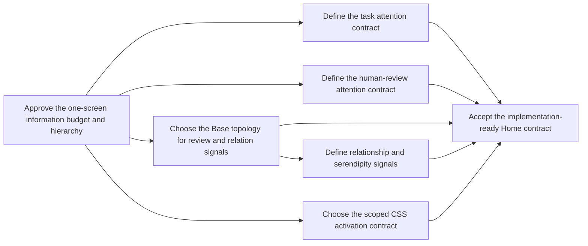

# KnowledgeHub Home Command Center Decision Map

> [!warning] Planning artifact
> This map is not project machine state and does not authorize Vault, Obsidian profile, plugin, or device changes. `PROJECT_STATE.md` remains the sole machine-state authority.

## Destination

Produce an implementation-ready, source-aware contract for a MacBook-only `Home.md` that:

- acts as KnowledgeHub's command center rather than a command tutorial;
- puts overdue/today tasks, AI review, blocked work, and pending decisions first;
- shows active projects once, with their next action in the same projection;
- exposes questions, ideas, typed relationships, review cadence, and knowledge gaps as prompts for thought;
  - keeps Daily and capture affordances out of prime space while preserving source-note navigation;
- uses a dense, wide, multi-column layout with graceful single-column fallback;
- keeps actual writing and editing in source notes;
- remains deterministic, review-gated, and generated from the KnowledgeOS contract chain.

The implementation contract is [Home Command Center Implementation Specification](IMPLEMENTATION_SPEC.md).

## Notes

- Planning methods: Wayfinder decision mapping plus Obsidian Flavored Markdown design.
- Local Markdown is used as the tracker fallback because this repository has no configured issue tracker.
- Design authority is `OBSIDIAN_VAULT_BLUEPRINT.md` followed by `blueprint/blueprint.yaml`; current outputs, generators, and tests were inspected as implementation evidence.
- The user explicitly superseded G-labelled GUI planning and D-labelled mobile planning for this redesign. Those lanes are out of scope and are not used as design authority here.
- The current `Home.md` is generator-owned and exact-byte tested. A manual Vault-only edit is therefore not an acceptable implementation.
- The separately authorized G03 slice applied the recommended static defaults through the canonical generator and preserved both roots' pre-existing user changes.
- G03 provides static, semantic, artifact, and container evidence only; profile activation, Obsidian rendering, and device acceptance remain a separate G07 slice.
- The current Vault is sparse, so empty-state behavior is part of the design rather than an edge case.
- Public research supports using bounded native Bases, a compact Tasks query, and scoped CSS before adding another plugin.

## Decisions so far

- [Choose the minimum plugin surface](tickets/choose-the-minimum-plugin-surface.md) — **resolved**: use core Bases, the installed Tasks and Homepage plugins, and project-owned scoped CSS. Breadcrumbs remains a source-note drill-down. Do not add Dataview, a multi-column plugin, TaskNotes, or an embedding/connection plugin in the baseline.
- Home is a projection, not a source of truth. Task checkboxes, proposal state, project state, and relations remain canonical in their source notes.
- QuickAdd choices and hotkeys remain available in the profile but disappear from visible Home content.
- Runtime, provider, sync, Git, index, broker, and deployment health do not belong on Home. A stale success statement is worse than no status.
- Relationship signals must be derived from explicit canonical properties such as `contradicts`, `raises`, `projects`, `related`, and `confidence`; AI-inferred edges remain proposals until human review and apply.
- The Compass implementation resolved the topology question: `Compass.base` is the eighth canonical Base, and Home embeds only its `Signals` view while the remaining signal views remain drill-down destinations.

## Decision frontier

The Compass static slice resolved the Base topology and relationship-signal
frontier. The remaining open items govern later task interaction, proposal
metadata, CSS/profile choices, and visual acceptance; they do not authorize
additional Compass scope.

| Decision | Status | Labels | Blocks |
|---|---|---|---|
| [Approve the one-screen information budget and hierarchy](tickets/approve-the-one-screen-information-budget-and-hierarchy.md) | Open | `wayfinder:prototype`, `wayfinder:grilling` | Task, review, Base topology, CSS, final acceptance |
| [Define the task attention contract](tickets/define-the-task-attention-contract.md) | Open | `wayfinder:prototype`, `wayfinder:grilling` | Final acceptance |
| [Define the human-review attention contract](tickets/define-the-human-review-attention-contract.md) | Open | `wayfinder:grilling` | Final acceptance |
| [Choose the Base topology for review and relation signals](tickets/choose-the-base-topology-for-review-and-relation-signals.md) | Resolved | `wayfinder:resolved` | Resolved by `Compass.base` implementation |
| [Define relationship and serendipity signals](tickets/define-relationship-and-serendipity-signals.md) | Resolved | `wayfinder:resolved` | Resolved by deterministic Compass filters |
| [Choose the scoped CSS activation contract](tickets/choose-the-scoped-css-activation-contract.md) | Open | `wayfinder:prototype`, `wayfinder:grilling` | Final acceptance |
| [Accept the implementation-ready Home contract](tickets/accept-the-implementation-ready-home-contract.md) | Open | `wayfinder:grilling` | Implementation authorization |

## Not yet specified

- The final row limits after visual testing at the user's actual Obsidian zoom and sidebar configuration.
- Whether Home task checkboxes must be technically non-interactive or direct completion is an acceptable explicit exception to source-note editing.
- Whether AI proposal notes need new human-oriented metadata beyond link, status, and creation time.
- Whether `cssclasses` should become an allowed Home-only schema field, or custom callout selectors alone are sufficient.
- Whether the Home-specific Note Toolbar mapping should be removed or reduced to one neutral navigation action.

## Out of scope

- For the original planning slice, editing `Home.md`, generated Bases, templates, CSS, Obsidian profile files, plugin settings, or `PROJECT_STATE.md` was out of scope. G03 is the separately authorized static implementation slice recorded in `PROJECT_STATE.md`.
- G-labelled GUI work and D-labelled mobile work, including their existing plans and acceptance claims.
- iPhone/iPad layout, synchronization, mobile capture, or thin-client behavior.
- Installing or configuring community plugins.
- Provider/model controls, runtime queues, broker or index status, Git status, deployment status, and service receipts on Home.
- Auto-applying AI proposals or materializing AI-inferred relations as canonical links.
- Moving canonical content into Home or making Home a second editing surface.

## Completion condition for this map

The map is complete when all open child decisions have an accepted answer, the specification reflects those answers, and a separately authorized implementation slice can name exact source files, generated outputs, tests, static checks, and Mac visual checks without inventing another product decision.
