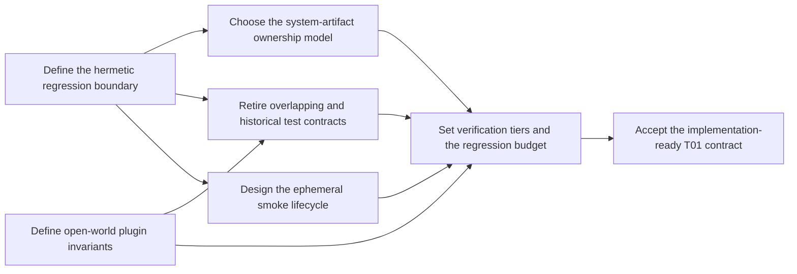

# KnowledgeOS Hermetic Test Architecture Decision Map

> [!warning] Planning artifact
> This map does not authorize test deletion, source refactoring, Vault mutation,
> Obsidian profile mutation, or live/device checks. `PROJECT_STATE.md` remains the
> sole machine-state authority.

## Destination

Produce an implementation-ready `T01` contract that makes KnowledgeOS tests
hermetic with respect to the mutable KnowledgeHub while retaining the smallest
set of high-value safety, schema, transaction, and generated-system-artifact
checks.

At the destination, an implementation session can name the exact tests to keep,
rewrite, merge, or delete; the exact source contracts to change; the isolated
fixture and smoke lifecycle; and the canonical acceptance commands without
making another product or ownership decision.

## Notes

- Planning method: Wayfinder decision mapping.
- Local Markdown is the tracker fallback because this repository has no
  configured issue tracker.
- The factual starting point is [T01 Test Architecture Baseline](BASELINE.md).
- The user owns ordinary KnowledgeHub notes and profile customization. Installing
  an unrelated community plugin, creating or deleting a note, or changing an
  unrelated setting must not fail the KnowledgeOS regression suite.
- Canonical regression tests must not read or write the real mutable
  KnowledgeHub. Test-created `tmp_path/KnowledgeHub` trees are isolated fixtures,
  not live-Vault coupling.
- Document-structure contract assertions are limited to system-owned documents
  under `99_System`; root `Home.md`, `Mobile.md`, and ordinary-document structure
  are not regression targets. Generic parser/schema tests may use synthetic
  fixture text without reading mutable Vault documents.
- Exact deployed-copy checks are limited to named `99_System` artifacts and the
  explicit read-only `make vault-artifact-check` command. Default regression
  tests document structure only for system-owned `99_System` outputs.
- Plugin inspection is open-world: required capabilities and safety-critical
  values may be enforced, while unrelated additional plugins and unrelated keys
  remain user-owned.
- Any separately authorized live, runtime, or device smoke creates a uniquely
  named temporary note, records its preconditions, and removes it on every
  success or failure path. A normal regression test never performs this smoke.
- Test and lint execution remain sequential in the canonical container.
- Keep every pytest implementation, fixture, and test-only helper under
  `ops/tests`; apply `ops/tests/AGENTS.md` and execute tests only through
  repository-root `make` targets.
- Existing KnowledgeHub changes are evidence of the required independence
  boundary and must be preserved, not normalized into passing fixtures.
- Charting resolves no ticket. Ticket answers, not this map, own future
  decisions.

## Decisions so far

- [Define the hermetic regression boundary](tickets/define-the-hermetic-regression-boundary.md): mask both real Vault aliases and both real runtime aliases, permit writes only in disposable fixtures, and keep artifact, serialized deployment, and live/device evidence in separate explicit tiers.
- [Define open-world plugin invariants](tickets/define-open-world-plugin-invariants.md): validate only stable KnowledgeOS-owned capability subsets and fail-closed global safety fields; treat additional plugins, future Core flags, unrelated records, presentation settings, and versions as non-failing user-owned or advisory state.
- [Design the ephemeral smoke lifecycle](tickets/design-the-ephemeral-smoke-lifecycle.md): create one UUID-bound note under `99_System/Smoke`, require action and cleanup success, and auto-clean stale residue only when identity, journal, marker, and sealed digest all match.
- [Choose the system-artifact ownership model](tickets/choose-the-system-artifact-ownership-model.md): keep exact default checks inside the control root, reserve deployed byte comparison for an explicit read-only `99_System` artifact command, and treat root notes, profiles, topology, identity, and bridge state as non-regression deployment surfaces.
- [Retire overlapping and historical test contracts](tickets/retire-overlapping-and-historical-test-contracts.md): preserve unique fail-closed responsibilities, replace broad snapshots and current-workspace checks, consolidate P01-P12, and delete only after a named surviving owner passes.
- [Set verification tiers and the regression budget](tickets/set-verification-tiers-and-the-regression-budget.md): use command-separated control, hermetic, container, deployment, and live tiers with zero live-path inputs and responsibility-based test scope; treat test counts, source lines, and durations as informational measurements.
- [Accept the implementation-ready T01 contract](tickets/accept-the-implementation-ready-t01-contract.md): implement the eight-stage migration and exact acceptance gates in [IMPLEMENTATION_CONTRACT.md](IMPLEMENTATION_CONTRACT.md).

## Decision graph

Every decision ticket is resolved. `status: complete` on this map means the
decision chart is complete; implementation-stage progress and current
verification evidence are recorded in
[HANDOFF_20260927.md](HANDOFF_20260927.md) and `PROJECT_STATE.md`. The accepted
eight-stage implementation has now been exercised through closure.

| Decision | Status | Type | Blocked by |
|---|---|---|---|
| [Define the hermetic regression boundary](tickets/define-the-hermetic-regression-boundary.md) | Resolved | `wayfinder:resolved` | — |
| [Define open-world plugin invariants](tickets/define-open-world-plugin-invariants.md) | Resolved | `wayfinder:resolved` | — |
| [Design the ephemeral smoke lifecycle](tickets/design-the-ephemeral-smoke-lifecycle.md) | Resolved | `wayfinder:resolved` | — |
| [Choose the system-artifact ownership model](tickets/choose-the-system-artifact-ownership-model.md) | Resolved | `wayfinder:resolved` | — |
| [Retire overlapping and historical test contracts](tickets/retire-overlapping-and-historical-test-contracts.md) | Resolved | `wayfinder:resolved` | — |
| [Set verification tiers and the regression budget](tickets/set-verification-tiers-and-the-regression-budget.md) | Resolved | `wayfinder:resolved` | System-artifact model; plugin invariants; retirement model; smoke lifecycle |
| [Accept the implementation-ready T01 contract](tickets/accept-the-implementation-ready-t01-contract.md) | Resolved | `wayfinder:resolved` | Set verification tiers and the regression budget |

## Implementation handoff

- Exact changes, order, rollback points, and checks:
  [IMPLEMENTATION_CONTRACT.md](IMPLEMENTATION_CONTRACT.md).
- Exact keep/rewrite/consolidate/delete actions:
  [RESPONSIBILITY_MATRIX.md](RESPONSIBILITY_MATRIX.md).
- Stage-by-stage implementation evidence and the latest verification result:
  [HANDOFF_20260927.md](HANDOFF_20260927.md).
- All eight migration stages have been implemented and passed their latest
  canonical acceptance run. Deployment artifact inspection, profile checks, and
  live smoke remain separate and unrun unless separately authorized.

## Out of scope

- Modify, normalize, regenerate, move, or delete existing KnowledgeHub content
  or profile data while planning.
- Install, uninstall, enable, disable, or reconfigure Obsidian plugins.
- Operate Obsidian, its UI, devices, app connectors, or host services while
  charting the map.
- Weaken proposal review, digest binding, path safety, schema validation,
  transaction atomicity, rollback, privacy, or provider authorization solely to
  reduce test count.
- Redesign KnowledgeHub information architecture, Home layout, templates, Base
  behavior, retrieval policy, or provider behavior except where a test-only
  ownership seam must be exposed.
- Commit, push, deploy, migrate, download, or perform Git remote effects.

## Completion condition for this map

The map is complete when every child decision has a recorded resolution, the
fog has either graduated into named tickets or been ruled out of scope, and the
accepted implementation contract identifies:

1. allowed and forbidden regression inputs;
2. retained system-owned artifact surfaces;
3. required plugin and setting invariants;
4. exact keep/rewrite/merge/delete actions;
5. the isolated fixture and live-smoke cleanup model;
6. verification tiers, informational performance measurements, and acceptance
   commands; and
7. state, documentation, and handoff updates required for closure.
