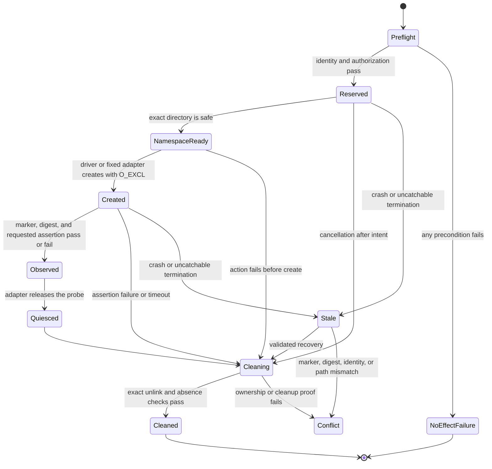

# Ephemeral live smoke lifecycle prototype v1

## Accepted decision

The user accepted this cleanup boundary on 2026-09-26:

> A stale smoke note may be deleted automatically only when a valid private
> runtime journal proves the exact Vault identity and relative path, the note is
> a non-symlink regular file inside `99_System/Smoke`, its embedded run marker
> matches, and its current SHA-256 is one of the digests sealed by that run.
> Every mismatch preserves the note and requires exact human confirmation.

This boundary gives normal crashes automatic cleanup without turning a filename
prefix into delete authority.

## Intended guarantee

A separately authorized live, runtime, or device smoke may create one temporary
Markdown note, exercise one fixed capability, and leave no persistent Vault
file or Git-status entry owned by that run. Cleanup is part of the smoke result,
not best-effort teardown.

The protocol does not promise that Obsidian or an operating-system index never
observes the temporary bytes. It proves only the named behavior and the absence
of the run-owned Vault artifact after bounded cleanup. Device, runtime, and
filesystem observations remain separate evidence classes.

## Non-negotiable boundaries

- Never invoke this lifecycle from `make test`, pytest collection, lint,
  artifact reconciliation, plugin audit, source checks, or schema checks.
- Require a separate authorization for the exact Vault, evidence class,
  capability adapter, temporary write, and cleanup effect on every live run.
- Accept a fixed adapter identifier only. Do not accept raw shell text, arbitrary
  argv, arbitrary Obsidian commands, absolute paths, globs, or caller-selected
  deletion paths.
- Create at most one note per run and permit at most one active smoke per Vault.
- Put every probe note beneath `KnowledgeHub/99_System/Smoke`; never create a
  probe in `Home.md`, `Mobile.md`, Inbox, Journal, Projects, Knowledge, a user
  folder, or the profile.
- Keep journals and receipts in private ignored `runtime/`, never in the Vault,
  profile, Git index, or synchronized bridge paths.
- Never commit, push, pull, sync, install, enable, disable, or reconfigure a
  plugin as part of a smoke.
- Never recursively delete. Cleanup may unlink one validated file and `rmdir`
  the exact smoke directory only when that run created it and it is empty.
- A smoke cannot report `PASS` until the action assertion and cleanup assertion
  both pass.

## Fixed surfaces

### Vault probe

```text
99_System/Smoke/KnowledgeOS-Smoke-<kind>-<UTC basic timestamp>-<lowercase UUIDv4>.md
```

`kind` is a bounded adapter class such as `filesystem`, `runtime`, or `device`.
The timestamp is diagnostic only; the UUIDv4 is the collision boundary. The
driver constructs the relative path. A caller never supplies it.

The first bytes of every probe are a deterministic ownership marker:

```markdown
<!-- knowledgeos-smoke:v1 run_id=<uuid> kind=<kind> expires_at=<RFC3339 UTC> -->
```

The remaining body is an adapter-owned deterministic fixture. It contains no
user text, production note content, secrets, provider output, or links to
ordinary notes. An adapter that needs frontmatter declares its exact fixed
frontmatter in source and remains responsible for a deterministic post-action
shape.

### Private runtime state

```text
runtime/smoke/active/<vault-uuid>.json
runtime/smoke/runs/<run-id>/journal.jsonl
runtime/smoke/receipts/<run-id>.json
```

- Directories use mode `0700`; files use mode `0600`; the process uses umask
  `077`.
- The active file is a create-only per-Vault lock and points to one run ID and
  journal digest. It stores no note body.
- The journal is append-only and hash-chained. Reuse the canonical JSON, UUID,
  SHA-256, private-directory, fsync, and no-follow primitives from
  `vaultops.recovery`; do not overload its transaction states.
- The receipt is create-only and records the terminal action and cleanup result.
  It contains bounded hashes and identifiers, not probe content or unrelated
  Vault status.
- Successful cleanup removes the active lock but retains the bounded journal
  and receipt as runtime evidence. A cleanup conflict retains the active lock
  and journal for exact recovery.

## Fixed command shape

The implementation exposes one bounded command family:

```text
vaultctl smoke plan --kind KIND --adapter ADAPTER --root CONTROL_ROOT
vaultctl smoke run --kind KIND --adapter ADAPTER --authorize-live-smoke \
  --timeout-seconds SECONDS --root CONTROL_ROOT
vaultctl smoke recover --run-id UUID --authorize-live-smoke --root CONTROL_ROOT
```

- `plan` validates source configuration and prints the prospective capability,
  namespace, effects, timeout, and evidence class without creating runtime or
  Vault state.
- `run` accepts only adapter names registered in source. Each adapter declares
  whether the driver creates a probe before invocation or whether the subject
  must create the reserved path itself.
- `recover` accepts only the UUID already bound by a valid active journal. It
  cannot accept or derive another path.
- There is no default `make` dependency on this command. A future convenience
  target must retain the explicit authorization flag and must not be callable
  from `make test`.

## Journal intent

Before any Vault directory or note write, fsync one immutable intent containing
only:

| Field | Contract |
|---|---|
| `schema_version` | Exact smoke-journal version |
| `run_id` | Lowercase UUIDv4 |
| `kind` | Fixed evidence class selector |
| `adapter` | Source-registered adapter ID |
| `vault_uuid` | Value validated from the root sentinel |
| `vault_identity_sha256` | Digest of the accepted sentinel identity fields |
| `relative_path` | Driver-generated path beneath `99_System/Smoke` |
| `created_at` / `expires_at` | Timezone-aware UTC values with a bounded lease |
| `timeout_seconds` | Adapter-bounded finite timeout |
| `namespace_preexisting` | Whether `99_System/Smoke` existed before the run |
| `creation_owner` | `driver` or `subject` |
| `allowed_sha256` | Initially empty; append only after a known probe generation is observed and sealed |
| `expected_marker` | Exact version, run ID, kind, and expiry marker |
| `authorization_scope` | Bounded effect names, never credentials or prose input |

Subsequent records transition the run through `reserved`, `namespace_ready`,
`created`, `observed`, `quiesced`, `cleanup_started`, and `cleaned`. A mismatch
transitions to `conflict`. A run never rewrites prior records.

## Lifecycle



### 1. Preflight before any effect

1. Require the explicit live-smoke authorization flag and one registered
   adapter.
2. Resolve the control and Vault roots without following a root symlink.
3. Validate the root sentinel, canonical Vault name, Vault UUID, expected
   branch binding, and that the resolved Vault is the independent KnowledgeHub
   Git root. Do not contact a remote.
4. Require real, non-symlink `99_System`; inspect `99_System/Smoke` with `lstat`
   if it exists.
5. Confirm the generated probe path is confined to `99_System/Smoke`, absent,
   and has no symlink ancestor.
6. Capture path-scoped Git status for the exact prospective note. Do not require
   the whole Vault to be clean and do not snapshot unrelated changes.
7. Refuse a second active lock for the same Vault. Process a stale lock under
   the recovery rules before starting another run.
8. Require the adapter's external preconditions. A device adapter must record
   exact device/app authorization and must confirm that no known automatic Git,
   sync, or background writer can publish the transient probe during the smoke
   window. Unknown external writer state blocks that adapter rather than being
   guessed safe.
9. Write and fsync the private journal intent and active lock.

Any failure in steps 1-8 returns without a Vault write. A failure while writing
private runtime intent may leave only recoverable private runtime state.

### 2. Create and exercise

- If `creation_owner=driver`, create the fixed bytes with
  `O_CREAT|O_EXCL|O_NOFOLLOW`, mode `0600`, fsync the file, and fsync the parent.
- If `creation_owner=subject`, reserve an absent path in the journal and invoke
  only an adapter that independently guarantees create-only behavior. Refuse an
  adapter whose write path can overwrite.
- After creation, open without following symlinks, verify regular-file type,
  size bound, exact marker, and SHA-256, then append the digest to the journal.
- Exercise one named behavior only. Do not scan or inspect ordinary notes to
  find evidence.
- If the behavior intentionally mutates the probe, validate the adapter-specific
  result first, then seal the new full-file digest in the journal. An
  unpredictable or unbounded post-action document is not eligible for automatic
  cleanup.
- Use a monotonic deadline. Run child processes without a shell, in a dedicated
  process group, with bounded output; terminate and reap them at timeout.

### 3. Quiesce and clean

1. Stop the adapter action. A device adapter closes or navigates away from the
   exact probe and waits for bounded filesystem quiescence before unlinking.
2. Re-resolve the journal-bound path beneath the validated Vault.
3. Require a non-symlink regular file, the exact ownership marker, a bounded
   size, and a SHA-256 in the journal's sealed digest set.
4. Append and fsync `cleanup_started`, unlink exactly that file, and fsync the
   parent directory.
5. Poll for stable absence over a short bounded grace interval so an app-side
   late save or recreation becomes a cleanup failure.
6. Require path-scoped Git status to return to its preflight absence state.
   Ignore unrelated concurrent Vault changes.
7. If this run created `99_System/Smoke`, call `rmdir` on that exact directory
   only when it is empty. Never remove a preexisting directory and never delete
   another run's or user's file.
8. Append `cleaned`, write a create-only bounded receipt, fsync it, and remove
   the active lock.

Python `finally` cleanup and handlers for `SIGINT`, `SIGTERM`, and `SIGHUP`
cover ordinary assertion failure, exceptions, timeout, and interruption. They
cannot guarantee cleanup after `SIGKILL`, process crash, host shutdown, or power
loss; the durable active lock and recovery path cover those cases.

## Stale-run recovery

At the start of every authorized live smoke, inspect the one active lock for the
target Vault.

| Observed stale state | Automated action |
|---|---|
| Journal valid; probe absent | Record `cleaned_absent`, remove an empty run-created namespace if provable, write receipt, remove lock |
| Journal valid; exact regular probe; marker and sealed digest match | Run the normal exact cleanup and remove the lock |
| Journal valid; lease not expired | Refuse a new run; allow only an explicit resume/recover of that run |
| Probe digest changed, marker changed, or digest was never sealed | Preserve the note and require exact human confirmation |
| Probe or ancestor is a symlink, path escapes, journal is corrupt, or Vault identity changed | Preserve everything, report conflict, and require manual inspection |
| Additional files exist in the smoke directory | Delete none of them; remove only a separately proven exact probe |

Recovery never searches by filename prefix, age, Markdown text, frontmatter,
mtime, or directory contents alone. Expiry makes a run eligible for recovery;
it never supplies ownership proof by itself.

## Result and evidence contract

The command emits one bounded JSON result and a matching private receipt. The
result contains:

- run ID, adapter ID, requested evidence class, validated Vault identity digest,
  generated relative path, and bounded timestamps;
- preflight results and the exact fixed action attempted;
- separate `static`, `runtime`, `deployment`, and `device` observation states;
- the single behavior assertion, without probe body or unrelated Vault data;
- cleanup ownership checks, sealed digest match, unlink result, stable-absence
  result, path-scoped Git result, and namespace result; and
- the primary failure cause plus cleanup result.

Result precedence is:

1. `PASS` only when behavior and cleanup pass;
2. `FAIL_CLEAN` when the action or assertion fails but cleanup passes;
3. `TIMEOUT_CLEAN` or `INTERRUPTED_CLEAN` when cancellation cleanup passes;
4. `NO_EFFECT_FAILURE` when preflight fails before a Vault write; and
5. `CLEANUP_CONFLICT` when ownership or stable absence cannot be proved. This
   result retains the active journal and supersedes a behavior pass.

A filesystem observation proves only filesystem runtime behavior. A device
result requires an authorized device adapter observation. Static profile data
never upgrades either result.

## Hermetic implementation tests

Default pytest tests the lifecycle engine only beneath `tmp_path`; it never
invokes `smoke run` against the real root. The minimum matrix is:

1. success creates, seals, unlinks, fsyncs, and returns to absent path state;
2. assertion failure, exception, timeout, `SIGINT`, and `SIGTERM` each clean;
3. an uncatchable-crash fixture leaves a journal and exact probe, and a later
   recovery removes it;
4. absent-probe stale recovery closes cleanly;
5. changed digest, missing marker, unsealed digest, symlink, escaped path,
   changed Vault identity, and corrupt journal preserve the file and conflict;
6. preexisting smoke directory survives, while a run-created empty directory is
   removed;
7. unrelated files and unrelated Git changes survive every path;
8. two concurrent runs for one Vault cannot both acquire the active lock;
9. an unknown adapter, arbitrary path, arbitrary command, missing authorization,
   and unbounded timeout fail before any Vault effect; and
10. the hermetic test runner's masked real Vault/runtime aliases prevent a live
    command from becoming a pytest dependency.

These tests use synthesized sentinels, temporary Git repositories, fake fixed
adapters, and deterministic clocks/UUIDs. They do not copy the real Vault,
profile, runtime, or device state.

## Prototype acceptance checks

- The only Vault namespace is `99_System/Smoke`.
- One run owns one UUID-bound path and cannot overwrite it.
- Cleanup authority comes from identity, journal, path, marker, and digest
  together; no prefix or age-based deletion exists.
- Success, failure, timeout, catchable interruption, crash recovery, and
  user-modification conflict all have explicit outcomes.
- A smoke cannot pass with residue.
- Default regression can prove the lifecycle without mounting the live Vault.
- Runtime and device evidence remain distinct and separately authorized.
